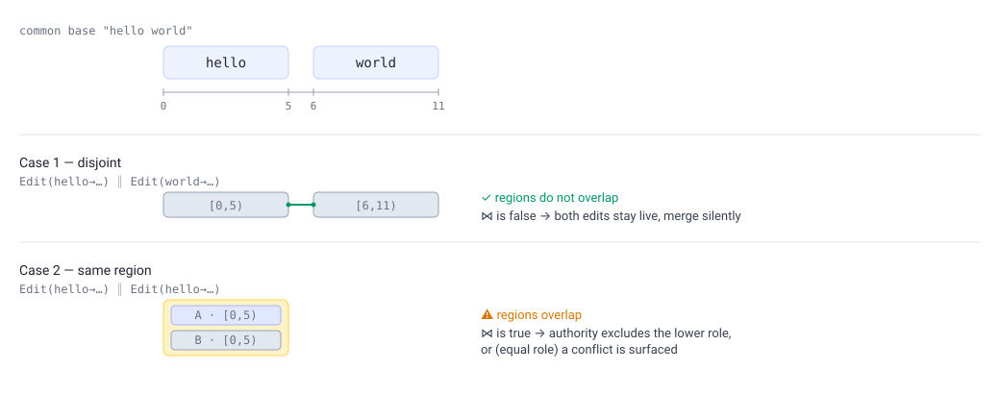
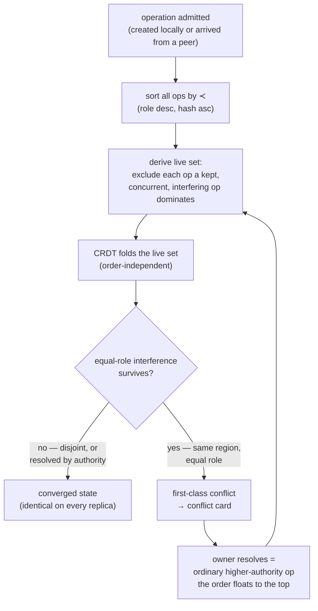
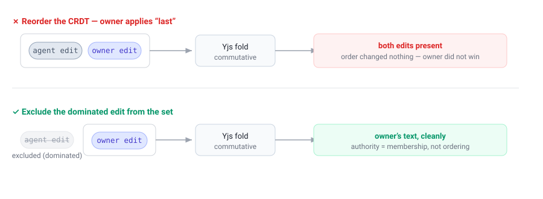

# Authority-Ordered Convergent Merge (AOCM)

*A merge layer for local-first collaboration between humans and AI agents.*

> This document explains the idea behind knock-knock's conflict layer the way a
> paper would: the problem, the core concept, the small amount of algebra that
> makes it work, worked examples, and an honest account of what we deliberately
> left out. It is a conceptual companion to the implementation in
> `ledger/artifacts/versionable.ts`, not a formal specification.

---

## 1. The setting

knock-knock lets several actors edit the same files at the same time. Some of
those actors are people; some are AI coding agents working on a person's behalf.
They do not share a screen and they do not take turns — an agent may be rewriting
a function while its owner edits the same file from a laptop, and a second agent
on a second machine edits a third copy. Each machine keeps its **own** local log
of what happened; there is no shared cloud database that everyone reads from.
(That was a deliberate goal: *local-first*, drop the hosted Postgres.)

The hard question this raises is the oldest one in collaborative editing:

> When two edits happen concurrently, what is the resulting document — and will
> every machine agree on it, even though no machine has authoritative state?

CRDTs (we use Yjs) answer the *mechanical* half: concurrent edits to **different**
parts of a file can be merged automatically and deterministically. But CRDTs are
deliberately egalitarian — they merge *everything*, commutatively, with no notion
of who made an edit or whether one edit should *win*. In a setting where an
**owner** and their **agent** edit the same line, "merge both" is the wrong
answer. The owner should win, quietly, without a popup. And when two *peer* agents
genuinely collide, a person should decide — not a coin flip.

AOCM is the thin layer that adds **authority** and **conflict** on top of the
CRDT, while keeping the one property the local-first setting cannot live without:
**every replica converges to the same document from the operations alone.**

---

## 2. The core idea in one paragraph

Treat the document's state as a **pure fold over an immutable log of edit
operations**. Order the operations by a deterministic **total order** — *authority
first, content-hash to break ties*. Walk that order and decide which operations
are **live**: an operation is dropped (excluded) if an earlier, higher-or-equal
operation both *overlaps the same region of text* and is *concurrent* with it.
Fold only the live operations through the CRDT. Because the order and the
exclusion test are computed purely from immutable fields every machine already
has, every machine derives the same live set — and therefore the same document —
with **no coordinator, no shared database, and no mutable "is this still alive"
flag**. A genuine collision between two equal-authority peers is the one case the
fold cannot silently resolve; it is surfaced as a first-class conflict, and is
later resolved by an ordinary higher-authority operation that the total order
simply floats to the top.

The single non-obvious move — the thing that makes it correct — is in §4.

---

## 3. The model and its small algebra

### 3.1 Operations

Every edit is an immutable, content-addressed **operation** `o`. The fields AOCM
reads are all fixed at creation time:

| Field | Meaning |
|---|---|
| `role(o)` | the social role of the actor: `owner`, `human`, or `agent` |
| `hash(o)` | the content hash of the operation (globally unique) |
| `parents(o)` | the operations this one was created *after* (its causal history) |
| `intent(o)` | *what* the edit does: `Write(content)` or `Edit(old → new)` |
| `ops(o)` | the CRDT (Yjs) update bytes that actually apply the change |

Roles carry a fixed numeric **rank**:

```
ρ(owner) = 3     ρ(human) = 2     ρ(agent) = 1
```

The operations of one artifact form a DAG via `parents` (knock-knock's
append-only "ledger"). Nothing here is ever mutated — operations are only ever
added.

### 3.2 The total order  ≺

Sort operations by **authority descending, then hash ascending**:

```
o₁ ≺ o₂   ⟺   ρ(o₁) > ρ(o₂)            (strictly higher authority wins)
              or  ρ(o₁) = ρ(o₂)  and  hash(o₁) < hash(o₂)   (else lower hash)
```

`o₁ ≺ o₂` reads "*o₁ outranks o₂*." Two properties matter:

- **It is total.** Because hashes are unique, *every* pair is comparable. There
  are no ties, and crucially **no antichains** — the failure mode of the
  partial-order design we abandoned (§7).
- **It uses only immutable, on-operation fields.** No timestamps, no "how deep in
  the history" counts, nothing that depends on which operations a machine happens
  to have seen so far. Two machines holding the same two operations always order
  them the same way.

> The order is used for *exactly two* things: deciding exclusion (§3.5) and
> rendering conflict branches in a stable order. **It is never used as the order
> in which the CRDT applies edits** — that would be both unnecessary and wrong
> (§4).

### 3.3 Concurrency  ∥

Two operations are **concurrent** if neither is in the other's causal history:

```
o₁ ∥ o₂   ⟺   o₁ ∉ ancestors(o₂)  and  o₂ ∉ ancestors(o₁)
```

Concurrency is what makes a contention *possible*. If you edited a line, saw my
edit, and then edited again, your second edit is a *descendant* of mine — not a
conflict, just history. Only concurrent operations can interfere.

### 3.4 Regions and interference  ⋈

This is the part that decides *whether two concurrent edits actually clash*. We
compute it on the **common base** — the text the two edits both started from
(the fold of their shared ancestors).

Each intent touches a half-open byte **region** of that base text `b`:

```
region(Write(_),     b) = [0, |b|)            a whole-file write spans everything
region(Edit(old→_),  b) = [i, i + |old|)      where i = b.indexOf(old)
                        = [0, |b|)             if old is not found (fail safe)
```

Two concurrent operations **interfere** iff their regions overlap (or both are
whole-file writes):

```
o₁ ⋈ o₂   ⟺   both are Write          (two whole-file rewrites are irreconcilable)
              or  region(o₁).lo < region(o₂).hi
                  and region(o₂).lo < region(o₁).hi    (half-open overlap)
```

A picture, on the base `"hello world"`:



Interference is a **pure function of immutable intents and the common base**, so
it too is replica-identical. (Adjacent regions that merely touch at a boundary —
`[4,9)` and `[9,15)` — do *not* interfere; the intervals are half-open.)

### 3.5 Dominance = exclusion, and the live set

Now the only decision rule. Operation `o₁` **dominates** `o₂` when it outranks it
*and* genuinely clashes with it:

```
o₁ dominates o₂   ⟺   o₁ ≺ o₂   and   o₁ ∥ o₂   and   o₁ ⋈ o₂
```

To compute the **live set** `L`, walk the operations in ≺ order and greedily keep
each one unless something already kept dominates it:

```
LIVE(O):                              # O = every operation for this artifact
  sort O by ≺                         # authority desc, hash asc
  kept ← [];  conflicts ← {}
  for o in O (in ≺ order):
    d ← the first y in kept with (y ∥ o) and (y ⋈ o)   # an interfering concurrent peer
    if d is none:
        kept.append(o)                # nothing clashes — o is live
    else if ρ(d) = ρ(o):
        conflicts.add({d, o})         # EQUAL authority → a genuine conflict
        # o stays excluded; the lower-hash branch d remains live
    else:
        pass                          # higher authority d wins — o excluded SILENTLY

  return kept, conflicts
```

The document state is then just the CRDT fold of the live set, **in any order**:

```
STATE(O) = fold_CRDT( LIVE(O).kept )
```

Three outcomes fall out of this single rule, with no policy knob:

| Situation | What `LIVE` does | What the user sees |
|---|---|---|
| **Disjoint** regions (any roles) | both kept | both edits merge, silently |
| Same region, **different** role | lower-role op excluded | higher role wins, silently |
| Same region, **equal** role | one kept, pair recorded in `conflicts` | a **conflict card** to resolve |

The whole pipeline, end to end:



---

## 4. The one subtle move: exclude, don't reorder

Here is the mistake that is easy to make and that we made first: *"sort the
operations by authority and let the CRDT apply them in that order, so the
owner's edit lands last and wins."*

It does not work, because **the CRDT is commutative**. Yjs merges a set of updates
to the same result *regardless of the order you apply them in* — that is the whole
point of a CRDT. Applying the owner's edit "last" changes nothing; the agent's
conflicting edit is still in the set, so the merged text still contains both. You
cannot make one edit win by *ordering* a structure that ignores order.

So authority cannot be expressed as an *ordering* of the CRDT. It has to be
expressed as **membership**: the dominated operation is *left out of the set the
CRDT folds at all*.



This is why the total order ≺ and the CRDT fold order are **two different
orders** that must never be conflated. ≺ decides *who is in the live set*; the
CRDT folds that set in whatever order it likes. The total order does the
*deciding*; the CRDT does the *merging*; and the two stay strictly separate.

A pleasant consequence: this is *already* what the codebase did when a draft was
manually "superseded" — it filtered the superseded edit out before folding. AOCM
keeps that exact mechanism and only changes its **persistence**: from a mutable
`superseded` flag written into a column, to a predicate **derived** on the fly
from immutable operations. "Overturn the merge gate" turned out to mean "keep the
gate's arbitration; change how it is stored."

---

## 5. Why it converges (the informal argument)

We want: *two machines holding the same set of operations produce the same
document.* The argument is short:

1. `LIVE(O)` reads only **immutable** fields — `role`, `hash`, `parents`,
   `intent`. None of them is mutated, and none depends on arrival order or on
   which subset a machine has seen.
2. The sort ≺ is **total** (unique hashes), so the walk visits operations in the
   same sequence on every machine. No antichains, no "it depends."
3. The interference test ⋈ is computed on the common base, itself a fold of the
   shared ancestor set — again immutable and shared.
4. Therefore `LIVE(O)` returns the **same** live set and the **same** conflict set
   on every machine that holds `O`.
5. The CRDT folds that identical live set to an identical document, *because it is
   order-independent*.

So convergence does not require a coordinator, a lock, a clock, or a shared
database. It requires only that the machines eventually hold the same operations —
which is the job of a separate **sync transport** (§7), not of the merge. A
machine missing one branch simply converges the moment that branch arrives; the
fold is recomputed and the answer is the same as a fresh replay.

Notably, there is **no mutable lifecycle flag in the merge path**. The original
divergence bug was exactly that a "this edit is superseded" UPDATE never
propagated between machines (Postgres `NOTIFY` fires on INSERT, not UPDATE). AOCM
removes the UPDATE entirely: supersession is *derived*, and the only thing that
ever crosses the wire is an immutable INSERT.

The same pattern now closes the divergence for the *other* superseding paths too
— turns, approvals, knowledge — which still keep a `lifecycle` column outside the
merge (§7). Those concepts can't drop the UPDATE (their liveness is genuinely
stateful), so instead the `apply-supersession` synchronization re-derives it on
each peer: the **winner** interaction carries its losers in an immutable
`supersedes` field, that INSERT crosses `NOTIFY`, and a peer receiving the winner
re-applies the lifecycle change locally. The local UPDATE stays for fast local
reads; convergence rides the operation the store already propagates. The one
residual limit is shared by all synced state, not specific to the merge: a
`NOTIFY` missed during a listener disconnect heals on the peer's next
restart-replay, not in the moment.

---

## 6. Worked examples

All examples start from the base text `"hello world"` (`|b| = 11`; `"hello"` is
`[0,5)`, `"world"` is `[6,11)`).

### AE1 — Disjoint edits merge silently
Agent A: `Edit(hello → HELLO)`, region `[0,5)`. Agent B: `Edit(world → WORLD)`,
region `[6,11)`.
`A ⋈ B`? `0 < 11` ✓ but `6 < 5` ✗ → **no interference**. Both live.
**State:** `"HELLO WORLD"`. No card. (This is the common case, and it is fully
autonomous — nobody is interrupted.)

### AE2 — Authority wins, silently
Agent: `Edit(hello → HI)`. Owner: `Edit(hello → HEY)`. Both region `[0,5)` → they
interfere. Order: `ρ(owner)=3 > ρ(agent)=1`, so the owner sorts first and is kept.
The agent is concurrent + interfering + lower rank → **excluded silently**.
**State:** `"HEY world"`. No card, no popup. The owner's intent simply stands.

### AE3 — Equal peers collide → a real conflict
Agent A: `Edit(hello → HI)`. Agent B: `Edit(hello → YO)`. Same region, equal rank.
The lower-hash branch (say A) is kept; the pair `{A, B}` is recorded as a
conflict. **State:** `"HI world"` *and* a **conflict card** offering "Take A / Take
B / Write your own." Each branch row shows what that branch actually contains
— the captured intent, e.g. the replacement text or a Write snippet, not an
opaque "~N bytes" — so Take A vs Take B is a real choice. The fold picked a
deterministic provisional text so every replica shows the same thing, but it
does not pretend the conflict is resolved. "Write your own" admits the owner's
own edit, which (being owner-role and concurrent) dominates both branches and
clears the region — the card closes (this is AE4 with the owner authoring a
fresh branch instead of copying one).

### AE4 — Resolution is just another operation
The owner picks branch A on the card. We do **not** flip any flag. We admit an
**owner-role operation that is a copy of A** — same intent, same parents, so it is
*concurrent* with both A and B. Now re-derive: the owner-copy outranks both
agents, is concurrent with and interferes with both → both agent branches are
**excluded silently**, and since the exclusions are by *higher* authority, the
conflict set is now empty. **State:** A's text; **conflict cleared**. A second
machine that later receives this same owner-copy operation re-derives the identical
result — no UPDATE, no message, just one more INSERT in the log.

### AE6 — The override still notifies a human
Because supersession is now derived rather than written, we must not *lose* the
"your draft was overridden" notice that used to ride on the flag. So a resolution
(or any authority exclusion that matters socially) also emits an ordinary
`knowledge.append` INSERT into the losing agent's inbox. That INSERT propagates
like any other operation and triggers the existing direct-message-the-owner path.
Derivation removed the flag; it did not remove the courtesy.

### AE7 — A whole-file Write clashes with everything
Agent A: `Edit(world → WORLD)`, region `[6,11)`. Agent B: `Write("totally new")`,
region `[0,11)` (a Write spans the file). They overlap → interfere. Equal rank →
**conflict card**. But if the Write were the *owner's*, it would dominate A
silently and the state would be `"totally new"`. A whole-file rewrite is honest
about being a whole-file rewrite: it contends with everything.

---

## 7. What we deliberately discarded (and why)

A core concept is only as trustworthy as its account of its own limits. These are
the things we considered and chose *not* to do — each is a real tradeoff, not an
oversight.

**Whole-file granularity (coarse exclusion).** Today an operation's region for
*exclusion* is whole-op: when a higher-role edit interferes, the *entire* lower
op is excluded, not just the overlapping span. The richer design — true
*interval anchors*, where exclusion is scoped to the exact overlapping bytes — is
deferred. The honest mitigation: the interference *test* is already
region-aware, so **disjoint edits still merge** regardless; only genuine
same-region collisions lose the whole lower op. We pay coarseness exactly where
two people are already fighting over the same span, which is the least surprising
place to pay it.

**Binary / non-text Writes.** Capture is for text. A Write of non-UTF-8 content
(detected by a NUL byte) would be mangled through Yjs's UTF-16 `Y.Text` and then
write-back would overwrite the real file with the corrupt round-trip — so capture
**skips** it rather than corrupt it. The scope is honestly Claude-Code-shaped text
Edit/Write; binary is out of scope, not silently handled.

**Causal chaining onto the *live* set only.** A new edit chains its `parents` onto
the artifact's current edits so a sequential edit is a *descendant* (history, not
conflict, per §3.3). Earlier this chained onto *every* slice hash — including
edits that were dominated or sitting in a conflict. That made the new edit a false
descendant of a loser, which could mask a real concurrency. It now chains onto the
**live (kept) hashes only**, so it descends from the live text and stays genuinely
concurrent with any peer it should contend with. (The fold, the conflict card, and
write-back all share one membership predicate for "what counts as a versionable
edit," so they can never silently disagree about the slice they each read.)

**The partial-order "containment lattice."** Our first cross-machine design
ordered operations by set-containment ("a superset of edits dominates a subset").
It failed: two agents extending the same history produce *maximal sets that are
neither a subset of the other* — an **antichain** — and an antichain has no
winner, so different machines could pick different text. We replaced the partial
order with a **total** order whose final key is the content hash, which makes
every pair comparable by construction. Telling this failure is the point: the
content-hash tiebreak is not arbitrary decoration, it is the thing that closes
the antichain.

**A mutable `lifecycle` flag for the merge.** We kept the `lifecycle` column for
the concepts that legitimately use it (turns, approvals, watches, …) and removed
it *only* from the merge path. The merge's liveness is derived. The reason is
exactly the local-first one: a mutated flag is per-machine state that does not
propagate, and the whole design is "converge from immutable operations alone."

**The `hold` / `auto` policy knob.** An earlier design had a per-room switch:
auto-merge concurrent edits, or hold them for the owner. Once interference became
*region-overlap*, the knob had nothing to decide — disjoint edits always merge,
same-region collisions always card — so we dropped it. Uniform behavior, one
fewer thing to configure or get wrong.

**Cryptographic trust.** The total order's authority key (`role`) is **unsigned**.
That is safe under our stated trust target — a *single operator* syncing only
their *own* machines, where there is no adversary to forge `role: owner`. In a
future where operations cross *between* operators, a forged owner role would win
silently; closing that needs signing, and signing belongs to the **paired sync
transport**, not to the merge. We left the order key signing-ready and the
boundary explicit rather than pretending the merge is Byzantine-tolerant.

**Snapshots / bounded replay.** We re-fold the whole operation slice for an
artifact on every change. A snapshot/checkpoint scheme would bound replay cost,
but it is a *performance* optimization, not a *correctness* one, and we have not
measured a replay-latency problem. Deferred until it is one.

**The sync transport itself.** AOCM is the *merge* layer. *How* operations travel
between local stores (anti-entropy have/want exchange, an optional dumb
store-and-forward relay for the closed-laptop case) is a separate, paired
concern. AOCM assumes only that operations eventually arrive; it is otherwise
transport-agnostic. Dropping the hosted database is finished by that transport,
not by this layer.

---

## 8. Relation to prior art

AOCM is a deliberately small synthesis of ideas that already exist, chosen to fit
a human + AI-agent collaboration setting:

- **Matrix State Resolution v2** is the closest relative: authority-weighted
  conflict resolution over an append-only hash-DAG, convergent on every replica
  with no coordinator, via a total order `(power, origin_ts, event_id)`. We
  *simplify* it — static roles instead of mutable power levels (no
  duelling-admins failure class), and we **card** equal-authority collisions
  instead of auto-picking, which removes the need for a recency tiebreak.
- **eg-walker** (Gentle & Kleppmann, 2025) — a deterministic order over
  concurrent operations via a stable, operation-carried tiebreak; its
  critical-version snapshots are the bounded-replay idea we deferred.
- **Categorical patch theory / Pijul** (Mimram & Di Giusto, 2013) — conflicts as
  first-class objects resolved by ordinary *later* patches, with order-independent
  merge. Our "resolution is just another operation the order floats to the top"
  is the same shape.
- **Fugue / FugueMax** (Weidner & Kleppmann, 2023) — informs *why* a pre-merge
  region-overlap test is the sound notion of interference, rather than comparing
  text after a merge.
- **Byzantine / signed CRDTs** (Kleppmann, 2022) — signing closes the
  forgeable-role gap, which is precisely the boundary we pushed to the paired
  transport.

The contribution is not a new CRDT or a new consistency proof. It is the
**framing**: in a world where collaborators are humans *and* their agents, *social
authority is a first-class, immutable merge primitive*, expressible as exclusion
from a commutative CRDT's input set, ordered by a hash-completed total order, so
that autonomy is automatic for the common case and human judgment is reserved for
genuine peer conflict — all converging locally, from immutable operations, with no
shared database.

---

## 9. Pointers into the implementation

| Concept here | Where it lives |
|---|---|
| Total order ≺, `ROLE_RANK` | `ledger/interaction.ts`, `ledger/artifacts/versionable.ts` (`projectVersionable`) |
| Region + interference (`region`, `⋈`) | `ledger/artifacts/versionable.ts` (`regionOf`, `interferes`) |
| Live set / exclusion (`LIVE`) | `ledger/artifacts/versionable.ts` (`projectVersionable`) |
| "Admit, don't arbitrate" for edits | `ledger/admit.ts` |
| Conflict surfacing | `ledger/synchronizations/conflict-card.ts` |
| Resolution as an ordinary op | `ledger/resolve-conflict.ts` |
| Override notice (the INSERT) | `ledger/admit.ts` (`surfaceToInbox`), `ledger/synchronizations/dm-on-supersede.ts` |
| Convergence / corpus / fuzz battery | `ledger/aocm.test.ts`, `ledger/fold.test.ts` |
| Requirements of record | `docs/brainstorms/2026-06-09-anchored-patch-category-conflict-layer-requirements.md` |
