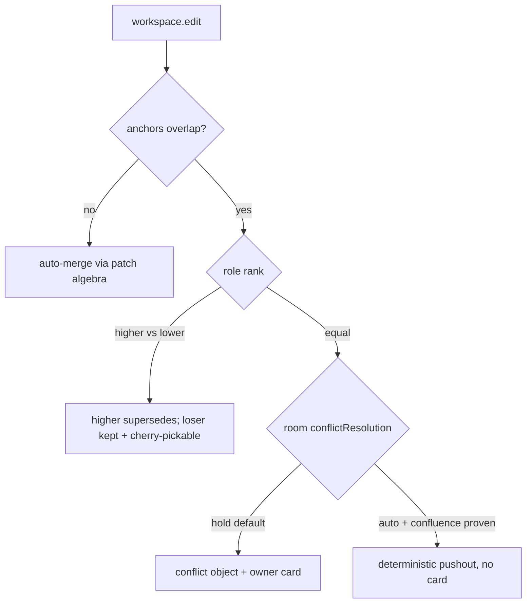

# Anchored patch-category for the conflict layer

## Summary

Rework knock-knock's version-control/conflict layer into an **anchored patch-category** — a rigorous algebra (lattice anchors, role-priority pushout, typed patch ops, a coordination frontier) delivered alongside a sequenced build plan. The first slice ships the two net-simplifying legs: replace strict-equality anchor matching with interval-overlap, and make lifecycle a derived fold. Conflict resolution becomes room-configurable — owner-in-the-loop by default, autonomous pushout opt-in.

## Problem Frame

The substrate (content-addressed operation DAG + pure folds) is sound, but the conflict layer that sits on it has a coherent set of loopholes, all tracing to three roots:

- **Anchors are scalars, not regions.** `anchorMatches` is strict equality, so the whole-file sentinel `{range,0,0}` is forced to do double duty — it produces a *false conflict* on non-overlapping edits, and the deferred fine-grained ranges would silently *both-apply* overlapping edits (value corruption, no conflict). This is the central gap.
- **Lifecycle is the one mutable column that escaped the fold.** Supersession is an in-place write that does not re-notify live subscribers, so the running projection drifts from a fresh replay ("replay-correct, live-stale").
- **Convergence is not correctness.** A genuine equal-role overlap is held as a `proposed` flag awaiting an owner, and the loser's content never reaches the projected artifact even though the log keeps it.

The redesign makes the conflict layer as principled as its substrate, and treats the algebra itself as a contribution worth specifying precisely — not just a patch.

## Key Decisions

- **Both layers, sequenced.** The doc is a rigorous algebra spec *and* a buildable plan. The low-risk simplifications ship first; the pushout and frontier follow behind them.
- **Lifecycle-as-fold precedes the pushout leg.** Deriving lifecycle removes the stale flag the first-class-conflict-object model would otherwise inherit — Phase 1 de-risks the later phase, so it is a sequencing dependency, not a parallel track. (The two Phase 1 legs are independent of *each other* and parallelizable.)
- **Room-configurable conflict policy, owner as the floor.** A room chooses `hold` (default, owner resolves the card) or `auto` (autonomous pushout). The autonomy call belongs to each room's owner, matching the room-keyed permission model.
- **Signing dropped under single-operator trust.** The frontier is a coordination primitive only (snapshot, branch/undo, anti-entropy backfill). Byzantine resistance, object-capabilities, and forgeable-role defense are out.
- **`auto` is gated on a confluence obligation.** The autonomous path cannot be enabled until the role-priority pushout is established as confluent and deterministic. This is the one hard correctness gate; `hold` ships without it.

## Requirements

**Algorithm spec (the contribution)**

- R1. Specify the conflict layer as an *anchored patch-category*: artifacts are objects, admitted patches are morphisms, and the merge of concurrent patches from a common base is their pushout. Define it concretely for the versionable artifact and state how it extends to other artifact kinds.
- R2. Define anchors as a lattice with an `overlap` (meet) relation that replaces strict-equality matching: range = interval intersection in a stable coordinate space, key = path-prefix containment, `none` = never overlaps, `whole` = always overlaps. State the law: two patches conflict iff their anchors overlap and neither causally precedes the other.
- R3. Define a typed patch algebra per artifact kind — `apply`, `invert`, `compose`, `commute` — where `commute` is the overlap test, `compose` is the pushout, and `invert` is undo. State the algebraic laws each implementation must satisfy.
- R4. Define role-priority pushout: an overlapping concurrent pair yields a conflict object carrying both intents, and role rank (owner > human > agent) labels which residual is canonical without discarding the loser. Name the correctness obligations — determinism, confluence, associativity — and identify where they hold and where they are not yet proven.

**Phase 1 build — the shippable slice (two independent, parallelizable legs)**

- R5. Replace strict-equality anchor matching with interval-overlap detection, so concurrent edits to overlapping regions contend at the merge gate and genuinely disjoint edits merge with no false conflict. Retire the whole-file sentinel.
- R6. Make lifecycle a derived projection — a dominance fold over the immutable DAG — rather than a mutated column, so a superseded interaction disappears from live folds and from replay identically, with no in-place lifecycle write.
- R7. Preserve the cross-machine determinism contract: the reconstructability test (byte-identical fold rebuild) and the existing merge/conflict tests stay green across both Phase 1 legs.

**Later phases — gated on Phase 1 and the R4 obligations**

- R8. Make conflicts first-class artifact objects (the pushout result) with their own derived lifecycle, replacing the held `proposed`-flag model. The losing branch stays live and cherry-pickable.
- R9. Introduce a named frontier — a content-addressed cut over the operation DAG — serving three coordination roles: a snapshot boundary, a unified ref for rewind/undo/checkpoint/branch, and an anti-entropy watermark that backfills missing interactions on reconnect. No signing.
- R10. Use frontier snapshotting to bound fold rebuild to O(interactions since the latest covering frontier), not O(all-time).

**Conflict resolution policy**

- R11. A room's permission profile carries `conflictResolution: hold | auto` (default `hold`). `hold` surfaces an owner conflict card for genuine overlapping equal-role clashes (today's behavior). `auto` resolves them via the deterministic pushout with no human.
- R12. `auto` may not be enabled until the role-priority pushout is established as confluent and deterministic (R4). Until then the setting is recognized but the `auto` path stays disabled and falls back to `hold`.

## Key Flows

- F1. Edit lands and is routed by overlap.
  - **Trigger:** an agent's Edit/Write surfaces as a `workspace.edit`.
  - **Steps:** capture builds the patch with an interval anchor in stable coordinates; the merge gate finds concurrent peers by anchor *overlap*; disjoint peers auto-merge via the patch algebra; an overlapping equal-role peer produces a conflict object.
  - **Covered by:** R2, R3, R5, R8.

- F2. Conflict resolution under `hold` vs `auto`.
  - **Trigger:** an overlapping equal-role conflict object exists for an artifact.
  - **Steps:** read the room's `conflictResolution`; `hold` posts the owner card and resolution flips precedence while keeping the loser branch; `auto` (when R12's gate is satisfied) applies the deterministic pushout and posts no card.
  - **Covered by:** R8, R11, R12.

## Acceptance Examples

- AE1. **Covers R5, R11.** Two agents concurrently edit disjoint regions of the same file → both merge, no card, in either room mode.
- AE2. **Covers R5, R8, R11 (hold).** Two agents concurrently edit overlapping regions, room = `hold` → a conflict object forms and the owner card posts; the unchosen branch stays live and cherry-pickable after resolution.
- AE3. **Covers R11 (auto), R12.** Same overlap, room = `auto` and confluence established → deterministic pushout merge, no card, every replica converges to the identical result.
- AE4. **Covers R6.** Owner supersedes an agent's edit → the superseded interaction disappears from the *live* projection immediately, not only on a fresh replay.
- AE5. **Covers R12.** Room = `auto` but confluence not yet established → `auto` is disabled and the conflict falls back to the `hold` card.

## Scope Boundaries

**Deferred for later (eventually, not the first slice)**
- Pushout + first-class conflict objects (R8) and the frontier (R9–R10) — phases after the Phase 1 simplifications.
- Intent-witness / converge-to-intended (ideation idea #6) — complementary, but a separate brainstorm.
- Capture wiring for non-Claude ACP edit formats — stays deferred as it is today; the lattice spec covers the anchor model regardless.

**Outside this product's identity (single-operator trust)**
- Signed frontiers, object-capability authority, Byzantine-fault tolerance, forgeable-role defense — revisit only if a multi-operator deployment arrives.
- External-effect exactly-once / claim-TTL idempotency — a separate concern, not this layer.

## Dependencies / Assumptions

- **Single-operator trust.** Relays sharing a Postgres DAG are run by one operator; mutual distrust between relays is out of scope, which is what licenses dropping signing.
- **The cross-machine determinism contract is load-bearing.** The hash-order tiebreak and canonical-JSON stability (sorted keys, `caused_by` sorted+deduped, non-finite numbers rejected) must be preserved by every leg; only the reconstructability test enforces it at runtime.
- **Yjs remains the text CRDT.** The lattice's stable coordinate space for range overlap builds on Yjs positions.

## Outstanding Questions

**Resolve before planning**
- Is the role-priority pushout confluent and associative, and under what conditions? This gates R12 / `auto` and the entire pushout leg — a proof sketch or a counterexample is needed before that phase is planned.

**Deferred to planning**
- The stable coordinate space for interval-overlap (Yjs `RelativePosition` vs alternatives) and how it threads the determinism contract.
- Frontier cadence and storage — when to checkpoint, and eviction of superseded snapshots.
- Migration: how existing whole-file-sentinel edits coexist with interval-anchored edits during rollout.

## Sources / Research

- `docs/ideation/2026-06-09-version-control-crdt-conflict-ideation.md` — full grounding, worked examples, the six component ideas, and rejection rationale.
- Core code: `ledger/merge.ts`, `ledger/admit.ts`, `ledger/concurrency.ts`, `ledger/artifacts/versionable.ts`, `ledger/canonical.ts`, `ledger/interaction.ts`.
- Literature: Pijul / Mimram & Di Giusto 2013 (categorical patch theory — pushout, conflicts-as-objects); eg-walker (Gentle & Kleppmann, EuroSys 2025 — frontier + transient reconstruction); Peritext (CSCW 2022 — stable-ID anchoring); Merkle-CRDTs (Psaras 2020 — anti-entropy frontier).
