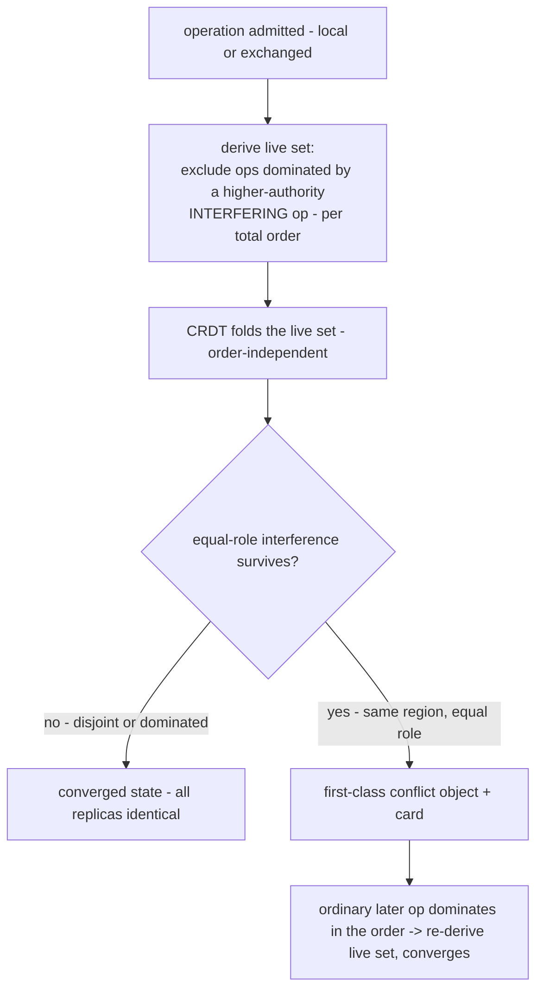

# Authority-ordered convergent merge for the conflict layer

> **History (topic slug kept stable for resume; title evolved to the realized mechanism).** This doc was re-decided across several rounds: a cross-machine "set-containment lattice" (2026-06-14) was found unsound in plan review (antichains, self-contradiction, owner-precedence on a non-propagating UPDATE) and replaced with a deterministic **total order + pure fold** — *Authority-Ordered Convergent Merge (AOCM)*. A requirements-review round then caught and fixed the central mechanism (dominance is **exclusion**, not CRDT-reordering — Yjs is order-independent) and three open decisions, all now resolved below:
> - **Local-first, no shared cloud Postgres (Supabase dropped).** Each replica keeps its own local store; AOCM is transport-agnostic and converges from the immutable operations alone. The local-first **sync transport** (have/want anti-entropy + optional dumb relay) is a **paired, separate brainstorm**, not this doc.
> - **Total order = `(role_rank DESC, content_hash ASC)`** — middle key dropped (never load-bearing; eliminates the op-stamp-divergence hazard).
> - **Interference = region-overlap on the common base.** This made the `hold`/`auto` policy a no-op (disjoint always merges, overlap always cards), so **the policy is dropped** — behavior is uniform, autonomy is automatic for the common (disjoint) case.
>
> The on-hold 2026-06-14 plan (`docs/plans/2026-06-14-001-...`) must be rewritten against this.

## Summary

Recast the conflict layer as **Authority-Ordered Convergent Merge**: an artifact's state is a **pure fold over the immutable operation DAG**. Concurrent edits that touch **disjoint regions** merge automatically; edits that touch the **same region** interfere, and interference is resolved by **authority** (a higher-role op excludes a lower-role one) or, when roles are equal, surfaced as a **first-class conflict card**. Dominance is realized by **excluding** the dominated operation from the set the artifact's CRDT folds — never by reordering the CRDT (which is order-independent). A deterministic **total order** `(role rank → content-hash)` makes every dominance/exclusion decision and every conflict-card rendering replica-identical. Because the resolved state is a pure function of immutable, content-addressed operations, **every replica converges from the operations alone** — no coordinator, no shared cloud database, no mutable lifecycle column for the merge. This is the merge layer that lets knock-knock be **local-first** (drop Supabase); the sync transport that carries the operations between local stores is a paired concern.

## Problem Frame

The goal is **local-first**: each replica keeps its own local store, with no shared cloud Postgres as the source of truth (the original "drop Supabase" question). For collaborative editing in that world, two replicas must converge to identical state **purely from the immutable operations they have exchanged** — there is no shared mutable state to consult. The mutable `lifecycle` column is exactly what breaks this (it is per-replica mutable state; the symptom that exposed it is that Postgres `NOTIFY` never propagates the UPDATE — `ledger/store-pg.ts:349-369`). A prior fix that derived liveness from a **partial-order** lattice failed (antichains have no convergent winner). The structural fix is a **total order** (a content-hash final key makes every pair comparable → no antichains) with the resolved state computed as a **pure fold over immutable operations** — identical on every replica by construction.

One correction the requirements-review forced and this doc bakes in: a total order alone cannot make a higher-authority edit *win* over a CRDT, because the CRDT merges commutatively regardless of application order. Dominance is **exclusion** — the dominated operation is left *out* of the set the CRDT folds (exactly what the current `superseded` filter does today). AOCM keeps that exclusion but makes it a **derived predicate over the immutable DAG** instead of a mutated column. So "overturn the merge gate" really means "keep the gate's arbitration; change its persistence from a written column to a derived projection."

## Key Decisions

- **Dominance is exclusion, not fold-ordering.** A dominated operation is excluded from the live set the CRDT folds; the CRDT folds the live set in any order (safe — losers are already excluded). Re-sorting a commutative CRDT cannot produce dominance.
- **Interference = region-overlap on the common base.** Two concurrent edits interfere iff the regions they touch in their common-base text overlap (each region derived from its `EditIntent`; a whole-file `Write` spans the whole file). This is a pure function of immutable operations → replica-identical, and is the lightweight edit-time form of interval-overlap (a stepping stone to R5 interval anchors, deferred).
- **Uniform outcomes, no policy knob.** Disjoint edits (any role) merge automatically; same-region different-role edits resolve by authority (higher excludes lower); same-region equal-role edits surface a conflict card. The earlier `hold`/`auto` policy is **dropped** — region-overlap left it nothing to decide, and the autonomy goal (don't block the owner on concurrent edits) is met automatically for the disjoint case.
- **Total order = `(role_rank DESC, content_hash ASC)`.** Two immutable on-op fields; no antichains; replica-identical. Consumed only for dominance/exclusion and deterministic conflict-card rendering — never as the CRDT apply order. No re-derived ancestry depth (partial-view-dependent).
- **Liveness is derived for the merge case only.** The `lifecycle` column persists for the concepts that legitimately use it (turn, approval, channel, watch, knowledge-staleness, loop-guard); AOCM only stops the *merge gate* from mutating it. Derived supersession must still emit a notification so the "your draft was overridden" inbox/DM path fires.
- **Local-first, single-operator trust.** No shared cloud DB; each operator syncs only their own stores, so the unsigned `role` key is safe. Cross-operator op-exchange (where a forged role would matter) is the paired transport's concern; the total-order key is left signing-ready.

## Requirements

**The algorithm — Authority-Ordered Convergent Merge (the contribution)**

- R1. An artifact's state is a **pure fold over its immutable operations**. For the merge, dominance/liveness/conflict is **derived**, not a mutated column; authority dominance is realized by **excluding** the dominated operation from the live set the CRDT folds — the fold order is never used to produce dominance.
- R2. Dominance follows a deterministic **total order** `(role_rank DESC, content_hash ASC)`, both immutable values carried on the operation; the hash makes every pair comparable, so the order has no antichains and is identical on every replica. It is consumed only for the exclusion decision and replica-identical card rendering — never as the CRDT apply order, and never via a re-derived ancestry depth.
- R3. The **interference test**: two concurrent operations interfere iff the regions they touch in their common base overlap (each region computed from its `EditIntent`; a whole-file `Write` spans the whole file). It is a pure function of the immutable `EditIntent`s and the common-base text (itself a fold over the immutable ancestor set), hence replica-identical.
- R4. **Outcomes (uniform — no policy):** *no interference* (disjoint regions, any role) → both operations apply via the CRDT, no card; *interference, different role* → the higher-role operation dominates (the lower is excluded; see R5 for the v1 granularity); *interference, equal role* → a **genuine conflict**, rendered as a first-class conflict object and surfaced via the existing conflict card, resolved by an ordinary later operation the total order floats to the top.

**Granularity, convergence, trust, and the gate**

- R5. In v1 (whole-file anchor retained), different-role exclusion removes the **whole** lower-role operation when it interferes — the status-quo behavior today. Interval anchors (deferred, origin R5) later refine exclusion to the overlapping region only; until then, disjoint edits still merge (the interference test is region-aware even on the whole-file anchor), so only genuine same-region collisions lose the lower op.
- R6. **Local-first, coordinator-free convergence:** each replica keeps its own local store; the same operation set yields byte-identical artifact state on every replica, computed from the operations alone, **given the replica holds the full contended set**. A replica missing a conflicting branch converges once it arrives. The merge makes no assumption about *how* operations are exchanged (transport-agnostic).
- R7. Derived supersession/exclusion must still **emit a supersession signal** (an ordinary INSERT) so the existing inbox surface-back / `dm-on-supersede` notification fires — making supersession derived must not silently drop the override notice.
- R8. **Trust target: single-operator, local-first.** No shared cloud DB; an operator exchanges operations only among their own machines, so the primary `role` key stays unsigned. Cross-operator op-exchange — where a forged `role:'owner'` would win silently — is the **paired sync transport's** concern (signing required there), out of scope here; the R2 key is signing-ready.
- R9. The **acceptance gate**: a coverage-enforced property-test battery — a fixed corpus (all acceptance examples as cases) plus seeded multi-replica fuzz modeling **operation-arrival skew** (separate local stores, shuffled/staggered delivery) — validated against a **hand-authored ground-truth oracle** (expected resolved text per scenario, not a re-implementation of the fold). Exit criterion: zero state divergence across replicas and zero authority-dominance failures across the corpus + N seeded fuzz runs over K≥2 replicas. The merge ships when the battery is green.

## Key Flows

- F1. An operation lands and the artifact re-projects.
  - **Trigger:** a `workspace.edit` is admitted, locally or exchanged from a peer.
  - **Steps:** derive the live set (exclude operations dominated, per R2, by a higher-authority *interfering* op); fold the live set through the CRDT; a surviving equal-role interference renders as a first-class conflict (card).
  - **Covered by:** R1, R2, R3, R4, R5.

- F2. Resolution.
  - **Trigger:** an owner resolves a conflict (or a higher-authority edit lands).
  - **Steps:** the resolution is an ordinary operation; the total order floats it above the conflicting branches so it dominates them in the live-set derivation; a replica holding the resolution **and** the conflicting branches re-derives the same resolved state — no lifecycle UPDATE; a supersession signal (R7) fires the override notice.
  - **Covered by:** R1, R2, R6, R7.

## Acceptance Examples

- AE1. Two agents edit **disjoint** regions of a file (any roles) → no interference → both apply via the CRDT; no card; all replicas byte-identical. (R3, R4, R6)
- AE2. Owner edit **interferes** with an agent edit (different role) → the agent op is **excluded**; the owner's edit is the state, silently, no card; every replica derives the same exclusion from the operations alone. (R2, R4, R5, R6)
- AE3. Two agents edit the **same region** — `foo→bar` ∥ `foo→baz` (equal role) → interference → genuine conflict → conflict card; resolved by the owner. (R3, R4)
- AE4. Owner resolves a held conflict → the resolution dominates in the total order; **a peer holding the resolution and the conflicting branches** re-derives the identical state with no lifecycle UPDATE; a peer missing a branch converges once it arrives. (R1, R2, R6)
- AE5. Three agents edit one file as concurrent siblings → the total order orders all three identically on every replica via role-rank + content-hash; no divergence. (R2, R6)
- AE6. Owner overrides an agent edit → the agent's superseded draft still triggers the inbox/DM override notice, even though supersession is now derived (no lifecycle UPDATE). (R7)
- AE7. Two agents edit the same file, disjoint regions, but one is a whole-file `Write` → the `Write` spans the file, so it interferes with the other edit → resolved by authority (different role) or carded (equal role). (R3, R4)

## Scope Boundaries

**In scope**
- The total-order, exclusion-based, region-overlap pure-fold merge (R1–R4), replacing the merge gate's lifecycle mutation. Uniform behavior, no policy knob.

**Deferred for later**
- **Interval-overlap anchors (origin R5).** The whole-file anchor stays, so different-role exclusion is whole-op (R5) rather than region-scoped. The interference test is already region-aware, so disjoint edits merge regardless — only same-region collisions are coarse. Interval anchors refine exclusion and contention to the region level later.
- **Critical-version snapshots.** Bounded replay is a performance optimization, not a correctness requirement (full-slice re-fold already works); net-new infrastructure, deferred until replay latency is a measured problem.

**Paired (separate brainstorm, not this doc)**
- The **local-first sync transport** (drop Supabase): content-addressed have/want anti-entropy op-exchange between local stores + an optional dumb store-and-forward relay for the closed-laptop case (ideation idea #1). AOCM is the merge layer it carries. Cross-operator op-exchange + signing live here.

**Outside this product's identity**
- Federated untrusted relays, object-capability authority, full Byzantine tolerance.

**Dropped this revision**
- The `conflictResolution: hold | auto` policy, its synced ledger fact, and its owner-identity admission gate. Region-overlap left the policy nothing to decide; behavior is now uniform.

## Dependencies / Assumptions

- **Roles are immutable** (snapshotted at admission) — the premise that makes authority a valid total-order key and eliminates Matrix's duelling-admin failure class. The merge must never re-derive role from ambient state.
- **The total order uses only `role` and `content_hash`** — both immutable, on the op, no derived/walked state — which is what guarantees replica-identical ordering under partial op-exchange.
- **The CRDT layer provides deterministic merge of the live set** (Yjs today). Dominance is the exclusion layer above it; the interference test (region-overlap) is a pre-merge predicate, not a post-merge comparison.
- **AOCM is transport-agnostic and assumes no shared cloud DB.** The local-first sync transport (how ops are exchanged) is a paired brainstorm and a prerequisite for the local-first deployment, out of scope here.

## Outstanding Questions

**Resolve before planning** — none. The three open items (trust target, order key, interference predicate) are resolved above, and the `hold`/`auto` policy is dropped.

**Deferred to planning**
- Exact region computation for the interference test (whitespace handling, multi-edit ops, locating `old_string`), and the common-base derivation.
- How the existing manual `resolveConflict` path moves onto the derived-exclusion fold while preserving the R7 supersession notification — manual and automatic resolution unify under one derivation.
- The R9 exit-criterion constants (N fuzz runs, K replicas) and whether a true two-store integration test supplements the in-process skew fuzz.
- Affected code surfaces: `admit.ts`, `merge.ts`, `concurrency.ts`, `versionable.ts` (`versionableFold`/`projectVersionable`), `fold.ts` (the merge-case re-fold path), `conflict-card.ts`, `resolve-conflict.ts`.

## Sources / Research

- **Matrix State Resolution v2** (spec.matrix.org rooms/v6; gomatrixserverlib) — authority-weighted conflict resolution over an append-only hash-DAG, convergent on every replica with no coordinator; its `(power, origin_ts, event_id)` total order is the model. We simplify to `(role_rank, content_hash)`: static roles remove Matrix's mutable-power-level machinery, and carding (not auto-picking) equal-role collisions removes the need for a recency tiebreak.
- **eg-walker** (Gentle & Kleppmann, EuroSys 2025; arXiv:2409.14252) — deterministic order on concurrent ops via a stable op-carried tiebreak; critical-version snapshots (deferred here as perf-only).
- **Categorical patch theory / Pijul** (Mimram & Di Giusto 2013, arXiv:1311.3903) — first-class conflicts as graph regions resolved by ordinary later patches; order-independent merge.
- **Fugue / FugueMax** (Weidner & Kleppmann 2023, arXiv:2305.00583) — non-interleaving merge; informs why region-overlap (not post-merge comparison) is the sound interference test.
- **Authority-weighted resolution as a valid CRDT** (Weidner CRDT survey pt. 2) — any stable, immutable, globally-computable total order yields convergence; authority may be the primary key. Caveat honored: dominance is realized by excluding the dominated op, since ordering a commutative CRDT does not produce dominance.
- **Byzantine/signed CRDTs** (Kleppmann PaPoC 2022) — signing closes the forgeable-role gap; lives in the paired transport for the cross-operator case.
- Code: `ledger/merge.ts`, `ledger/admit.ts`, `ledger/concurrency.ts`, `ledger/artifacts/versionable.ts` (`versionableFold` exclusion filter is today's dominance mechanism; `applyEdits` is order-independent; `parseEditIntent`/`applyEditIntent` feed the interference test), `ledger/fold.ts`, `ledger/synchronizations/conflict-card.ts`, `ledger/resolve-conflict.ts`, `ledger/store-pg.ts:349-369`.
- Prior internal artifacts: `docs/ideation/2026-06-14-local-first-hosting-version-control-ideation.md` (idea #1 = the paired local-first transport; idea #3/#5 = this merge + the intent test), `docs/ideation/2026-06-09-version-control-crdt-conflict-ideation.md`, and the on-hold plan `docs/plans/2026-06-14-001-feat-auto-conflict-resolution-plan.md` (to be rewritten against this).
