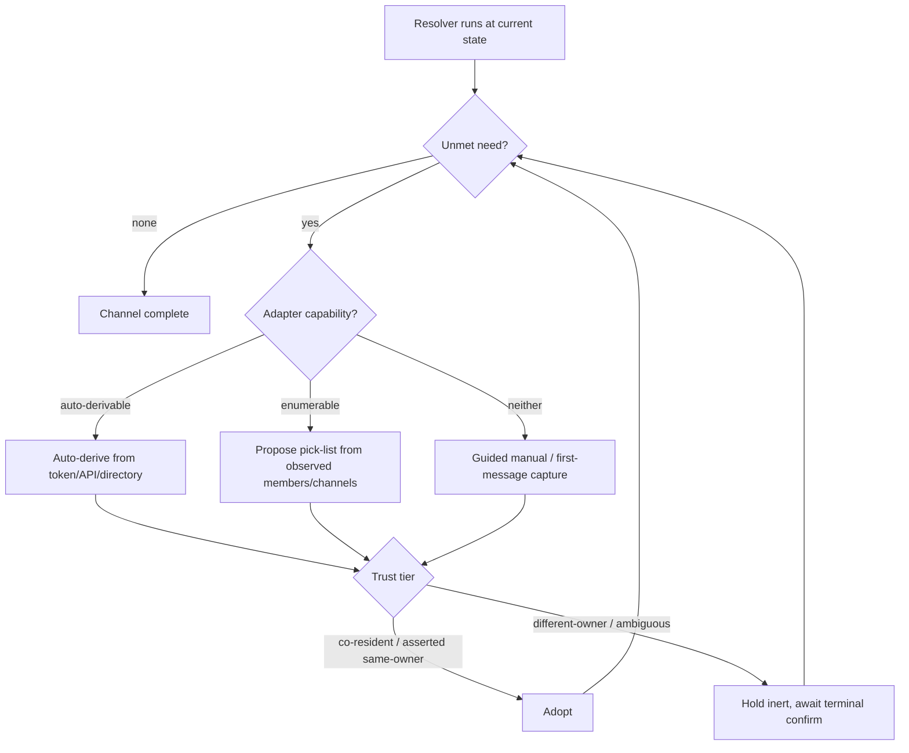

# Auto-Configuring Onboarding

## Summary

Replace knock-knock's linear setup wizard with a single **gap-resolver**: it knows what a complete `bot ↔ channel ↔ roster (↔ transport)` configuration needs, discovers whatever it can from the bot token, the channel, and the mesh directory, and proposes the rest for terminal confirmation. Every entry flow — and `kk doctor` — is the same resolver entered at a different starting state. The default posture is the careful different-owner one: discover and propose, never silently adopt.

## Problem Frame

Cold-start is the sharpest pain in knock-knock today. A first-time user must hand-gather opaque IDs across every platform — right-click "Copy ID" in Discord, dig a `U…` member ID out of a Slack profile, message `@userinfobot` for a Telegram chat ID — then hand-enter them into a local roster that is *separate from* inviting someone to the channel. The "I added them to the channel, why don't they work?" confusion comes straight from that split. Cross-machine makes it worse: users don't learn they need a delegated transport channel until coordination noise (`⟦kk-mesh⟧`) has already leaked into a human channel.

The friction is avoidable. The adapters already self-identify at connect (`src/adapters-msg/slack.ts:128` calls `auth.test()` and discards all but the user ID), and the mesh already converges peer identities into `peerDirectoryParticipants` with "no manual roster" (`src/lib.ts:327`, `src/ledger/concepts/agent-directory.ts`). `CONCEPTS.md` states the design intent outright — Peer bots are "discovered automatically rather than manually rostered." The setup wizard is the only layer still treating IDs as data the human must produce. The cost is paid by every new user and every new machine, repeatedly.

## Key Decisions

- **One resolver, many entry points.** The capability ladder and trust tiers are encoded once in a single engine. First-run setup, add-channel, add-bot, cross-machine join, and `kk doctor` all invoke it; they differ only in starting state and whether the engine writes config or reports on it. This avoids the drift that a wizard-per-flow would accrue as the flow list grows.
- **Different-owner is the default posture.** Discovered config is *proposed*, not applied. It stays inert — excluded from routing, permissions, and the allowlist — until the owner confirms it in the terminal. Aggressive auto-adopt is an opt-in for looser topologies, not the baseline.
- **Topology sets the trust tier; ambiguity defaults to careful.** Co-resident siblings (same machine, shared state) can be adopted automatically. Same-owner-cross-machine auto-adopt applies only to machines the owner has marked as trusted once in the terminal (by agent-key) — a stopgap that signing later subsumes, chosen over a pre-shared secret because it needs no matching credential and over deferring entirely because it gives solo multi-machine users real convenience now. When the topology is unknown, the resolver uses the confirm-gated tier.
- **Fill each gap by the cheapest legal rung.** For every unmet need: auto-derive (token / platform API / directory) → pick from a discovered list → guided manual entry. The chosen rung is a function of platform capability and trust tier.
- **`kk doctor` owns the pending-confirmation surface.** It is not only pass/fail verification; it also lists discovered-but-unconfirmed items. Without this, discovery-first plus confirm-gating can leave a bot that discovered everything and configured nothing — silently broken.
- **Token acquisition stays manual and terminal-only.** OAuth-based token capture is deferred; secrets are never set from chat.

## Actors

- A1. **Bot owner** — runs knock-knock locally and operates the terminal. The only actor who can confirm proposed config.
- A2. **Collaborator (peer-bot owner)** — another person on another machine sharing the channel. The different-owner case the defaults are tuned for.
- A3. **Peer bot** — someone else's agent, discovered via the directory; addressable but not run on this machine.
- A4. **Gap-resolver** — computes unmet needs and proposes fills; the shared engine behind every flow.
- A5. **Messaging adapter** — per-platform surface (Discord, Slack, Telegram, GitHub, Notion) that declares which discovery capabilities it supports.

## Key Flows

- F1. **Greenfield — create a bot and add it to a channel**
  - **Trigger:** Owner has a fresh token and nothing else configured.
  - **Actors:** A1, A4, A5
  - **Steps:** Owner enters the token → resolver derives self-ID → proposes a channel pick-list → on channel choice, proposes collaborators and asks "which of these is you?" for owner-ID → owner confirms.
  - **Outcome:** A complete, confirmed `(bot, channel)` with zero IDs copied by hand (on enumeration-capable platforms).

- F2. **Existing bot invited to a new channel**
  - **Trigger:** Token, self-ID, and owner-ID already on disk; bot was just invited somewhere new.
  - **Actors:** A1, A4, A5
  - **Steps:** Resolver detects the only unmet needs are channel binding + collaborators → proposes both from observation → owner confirms.
  - **Outcome:** The new channel is configured without re-entering identity.

- F3. **Collaborator joins the chat without a bot yet**
  - **Trigger:** A person is in the channel but has not run knock-knock.
  - **Actors:** A1, A2, A4
  - **Steps:** Their presence already appears in others' member/directory lists. When they later run knock-knock, the resolver finds the channel already knows them and they adopt what the channel holds rather than authoring from scratch.
  - **Outcome:** Joining is "confirm what's already discovered," not a fresh setup.

- F4. **Add a second bot to an existing setup**
  - **Trigger:** One bot is complete; a second is introduced.
  - **Actors:** A1, A3, A4
  - **Steps:** Resolver classifies the second bot — co-resident sibling (auto-adopt) versus someone else's peer (confirm-gated, shown as claimed/unverified).
  - **Outcome:** The second bot is wired with the trust tier its topology implies.

- F5. **Cross-machine connect**
  - **Trigger:** Machine B comes up sharing a channel with machine A's bot.
  - **Actors:** A1, A2, A3, A4
  - **Steps:** Resolver detects A's beacon on the directory → proposes A as a peer (confirm-gated) → on confirm, detects a cross-machine peer with no transport and proposes creating/designating one.
  - **Outcome:** Cross-machine coordination is set up at the moment intent appears, before mesh noise leaks.

## Requirements

**Resolver core**

- R1. Define the complete-config target for a `(bot, channel)` pairing: token, self bot-ID, owner-ID, channel binding, collaborators, and a transport channel when a cross-machine peer exists.
- R2. The resolver computes the set of unmet needs from combined on-disk and live state, and the cheapest legal fill rung for each.
- R3. First-run setup, add-channel, add-bot, cross-machine join, and `kk doctor` all invoke the same resolver, differing only in starting state and whether they write config or report on it.

**Discovery and fill ladder**

- R4. Each unmet need is filled by the first available rung: auto-derive → pick from a discovered list → guided manual entry.
- R5. Self bot-ID is auto-derived from the token on every platform and never prompted.
- R6. Channel binding and collaborators render as pick-lists drawn from what the bot can observe, on platforms that support enumeration.
- R7. Owner-ID is set by the owner selecting themselves from the discovered member list, or by first-message capture; it is never auto-assumed and never typed when discovery is available.

**Trust and topology**

- R8. Discovered config is proposed, not applied: it is excluded from routing, permissions, and the allowlist until confirmed in the terminal.
- R9. The default posture is different-owner — every discovered peer, collaborator, and transport channel requires explicit terminal confirmation.
- R10. Looser auto-adopt is opt-in: co-resident siblings may be adopted automatically; same-owner-cross-machine auto-adopt applies only to machines (by agent-key) the owner has marked once as trusted in the terminal, persisted for reuse.
- R11. When topology is ambiguous, the resolver uses the confirm-gated tier.
- R12. A discovered peer's identity is shown as claimed (unverified) at confirmation time, because directory beacons are currently unsigned.

**Cross-platform capability**

- R13. Each adapter declares which discovery capabilities it supports: self-ID, channel enumeration, member enumeration, channel creation.
- R14. The resolver picks the fill rung per need from the adapter's declared capabilities; an unsupported rung falls through to the next.
- R15. On capability-degraded platforms the resolver uses guided first-message capture and signposts why the richer flow is unavailable.

| Need | Discord | Slack | Telegram | GitHub | Notion |
|---|---|---|---|---|---|
| Self bot-ID | ✓ derive | ✓ derive | ✓ derive | ✓ derive | ✓ derive |
| Owner-ID | pick / 1st-msg | pick / 1st-msg | 1st-msg only | repo collaborators | user list |
| Channel binding | ✓ enumerate | ✓ enumerate | 1st-msg only | manual `owner/repo` | manual page ID |
| Collaborators | members (privileged intent) | ✓ members | admins only | repo collaborators | user list |
| Transport create | ✓ create | ✓ create | designate only | n/a | n/a |

**Verification and guidance**

- R16. `kk doctor` runs the resolver in report-only mode: per channel it checks token validity, channel membership, owner-ID resolution, workspace existence, and — if a peer exists — a mesh round-trip, each with a specific fix.
- R17. `kk doctor` surfaces pending discoveries awaiting confirmation as first-class output and marks the channel not-yet-complete while any remain.

**Just-in-time transport**

- R18. Transport is not prompted upfront; the resolver surfaces it only when a cross-machine peer is detected without a configured transport channel.
- R19. Where the platform allows channel creation the resolver offers to create the transport channel; otherwise it guides the owner to designate one — before mesh traffic would post to a human channel.

## Acceptance Examples

- AE1. Different-owner peer discovered. **Covers R8, R9, R12.** **Given** a peer beacon on the directory from another owner, **when** the resolver runs, **then** the peer is listed as a claimed/unverified proposal and is kept out of the allowlist until the owner confirms in the terminal.
- AE2. Co-resident sibling. **Covers R10.** **Given** a second bot on the same machine sharing state, **when** it connects, **then** it is adopted as a co-resident peer with no confirmation prompt.
- AE3. Telegram owner-ID. **Covers R7, R15.** **Given** a Telegram bot in a group that blocks member enumeration, **when** owner-ID is needed, **then** the resolver asks the owner to send one message, captures their ID from the update, and explains that member-pick is unavailable on this platform.
- AE4. Pending discoveries in doctor. **Covers R17.** **Given** discovered-but-unconfirmed collaborators, **when** `kk doctor` runs, **then** it lists them as pending-confirmation with the command to confirm and marks the channel not-yet-complete.
- AE5. Just-in-time transport. **Covers R18, R19.** **Given** a confirmed cross-machine peer and no transport channel, **when** the resolver runs, **then** it proposes creating or designating a transport channel before any `⟦kk-mesh⟧` traffic posts to a human channel.

## Scope Boundaries

**Deferred for later**
- `kk pair` short-code cross-machine bootstrap and OAuth-based token install — the two ideation survivors left Unexplored.
- Beacon signing — this brainstorm builds the confirm-gating that lives *around* unsigned beacons; signing is the separate Phase 3 provenance track.

**Outside this product's identity**
- Setting any secret from chat — the terminal-only invariant is unchanged. The bot may discover and propose, but confirmation and secrets stay in the terminal.

## Dependencies / Assumptions

- The mesh directory (`agent-directory` → `peerDirectoryParticipants`, `src/lib.ts:327`) exists and converges peer identities; the resolver reads it rather than building discovery from scratch.
- Directory beacons are unsigned today (Phase 3 signing pending). Confirm-gating is designed around that assumption; the design tightens, not breaks, when signing lands.
- Adapters need a declared capability descriptor. Some discovery calls are not made today — member enumeration (`conversations.members`, guild members) is not currently called in `src/adapters-msg/`.
- Discord member enumeration requires a privileged gateway intent that may not be granted; the resolver must degrade when it is absent.
- Token acquisition stays manual; OAuth capture is out of scope.

## Outstanding Questions

**Deferred to planning**
- The exact shape of the adapter capability descriptor and which new adapter methods it requires.
- How proposed/pending state and the trusted-machines list (R10) are persisted and represented in `~/.knock-knock/access.json` so proposals stay inert until confirmed.
- Where the resolver lives relative to the existing wizard (`src/setup.ts`) and the running relay.

## Success Criteria

- A different-owner collaborator holding only a bot token reaches a verified, working bot-in-channel without copying any platform ID by hand, on enumeration-capable platforms.
- On capability-degraded platforms the manual fallback is reached through guided capture with a stated reason, never a dead end.
- No discovered config affects routing, permissions, or the allowlist before terminal confirmation.
- `kk doctor` reporting green corresponds to a channel that actually works under live checks, and any pending confirmations are visible rather than silent.
