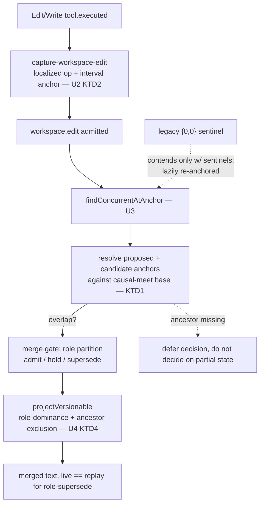

# refactor: interval-overlap anchors + lifecycle-as-dominance-fold (Phase 1)

> **Re-scoped after two review rounds (2026-06-09).** The lifecycle leg (R6) is replaced by the simpler, correct re-notify fix in `docs/plans/2026-06-09-002-fix-fold-renotify-on-lifecycle-plan.md` (the dominance-deriving projection here could not be a pure fold and assumed a `caused_by` topo-sort the engine doesn't perform). The interval-overlap leg (R5) is **deferred to a fresh `ce-brainstorm` pass** — correct cross-machine overlap needs a real determinism design (no topo-sort, replica-deterministic base, replica-identical capture coordinates). This document is kept as the design record of why. Do not implement it as written.

## Summary

Ship the two Phase-1 legs of the anchored-patch-category redesign: replace strict-equality anchor matching with an interval-**overlap** predicate, and make the versionable projection **derive role-dominance** so a role-superseded edit drops from the live view immediately. A document review surfaced that neither leg is a drop-in swap — overlap detection must be **replica-deterministic** (resolved against a common base, not live fold state), capture must emit **localized** ops (so the anchor describes what the CRDT actually does), and the dominance projection must reproduce the gate's **full** concurrency predicate (including `caused_by` ancestor exclusion). This revision bakes those in as decisions and gates. Owner-conflict-resolution live-staleness stays out of scope; the pushout, frontier, and room-config phases remain deferred (see origin).

## Problem Frame

The conflict layer has two loopholes that trace to one shape — a scalar standing in for a region.

`anchorMatches` (`ledger/concurrency.ts:21`) is strict equality on `{from,to}`, so the whole-file sentinel `{range,0,0}` (`ledger/artifacts/versionable.ts:110`) does double duty: a *false* conflict on non-overlapping edits, and — under any move to fine-grained ranges with strict equality — a silent *both-apply* of overlapping edits (value corruption, no conflict) (`concurrency.ts:8-15`).

`lifecycle` is mutated in place (`ledger/admit.ts:100`) and the fold engine runs `applyTo` only on `append`, never on `updateLifecycle` (`ledger/fold.ts:52,106`). A role-superseded loser stays in a live fold's accumulated state, so the live projection includes it while a fresh replay excludes it via the `admitted|applied` key (`versionable.ts:166`) — replay-correct, live-stale.

The review's sharpest finding: granularizing anchors is not localized. The existing concurrency machinery (the `caused_by` ancestor pre-filter, the per-machine fold state) was correct *because* every edit on a file shared one sentinel anchor. Splitting anchors into intervals decouples "same region" from "causally ordered," so every consumer of the contend decision — the gate, the conflict card, and the new dominance projection — must carry both halves with replica-deterministic, ancestor-aware inputs. This plan treats that as the core work, not a detail.

---

## Key Technical Decisions

- **KTD1 — Replica-deterministic overlap resolution.** Resolve anchor positions against a *replica-reproducible base* — the doc materialized from the causal meet (shared ancestors) of the contending edits — never the live fold state, which differs by what each machine has folded. Two relays evaluating the same edit must build the same base and reach the same overlap verdict. If a machine lacks an ancestor needed to build the base, it **defers** the merge decision rather than deciding on partial state. (Closes review P0: non-deterministic verdict.)
- **KTD2 — Capture emits localized ops; anchor span equals op span.** Replace the whole-document `delete(0,len); insert(0,newText)` (`capture-workspace-edit.ts:85-88`) with a localized delete/insert matching the `EditIntent`, so the Yjs update touches only the edited region. Invariant: the captured anchor interval equals the span of the emitted Y.update. Without this, the overlap test gates on anchors that don't describe what the CRDT does, and two "disjoint" edits still clobber. (Closes review P0: whole-doc rewrite.)
- **KTD3 — Anchor coordinates are replica-deterministic by construction.** The encoded anchor feeds the content hash via `target`, so two relays capturing the identical edit must produce a byte-identical anchor — including own-insert spans (Yjs `RelativePosition` bytes embed the capturing doc's random `clientID`). Pin this with a cross-relay test; if `RelativePosition` cannot satisfy it, store capture-time integer offsets against the recorded base instead (Alternative A3). (Closes review P1: hash/dedup divergence.)
- **KTD4 — Dominance reproduces the gate's full concurrency predicate.** U4's projection derivation must apply the same `caused_by` ancestor exclusion the gate uses (`concurrency.ts:67-68`), not a flat scan over the accumulated set — otherwise it dominates an edit by its own causal descendant and diverges from the gate (`live ≠ gate`). This requires ancestry access inside the projection, a materially larger change than a pure scan. (Closes review P1: U4 divergence.)
- **KTD5 — Legacy sentinel coexistence (corrected).** A legacy `{0,0}` sentinel overlaps other sentinels (unchanged legacy contention) but does **not** auto-contend with new interval anchors; a file's legacy sentinel edits are lazily re-anchored on its next edit. This supersedes the earlier "sentinel overlaps everything" lean, which the review showed forces a permanent false conflict on every pre-existing file. Worst case is a brief missed conflict against a stale legacy edit (the module's stated safe direction, `concurrency.ts:15`), never corruption.
- **KTD6 — R6 scope, stated honestly.** Phase 1 closes live-staleness for *role-based* supersession only. Owner conflict-resolution supersession (`ledger/resolve-conflict.ts`) stays live-stale until a fold re-notify lands — it already is, and Phase 1 neither regresses nor fixes it. This is a targeted correctness fix with the in-place lifecycle write retained, not a "net simplification."
- **KTD7 — Unresolvable anchor resolves to lattice top (fail-safe).** When resolution yields `undefined` (missing item, empty doc, corrupt bytes), treat the anchor as overlapping everything, so the worst case is a missed merge, never silent corruption. `findConcurrentAtAnchor` must catch resolution errors — it is `await`ed inside `admit` (`admit.ts:70`) with no try/catch today, so a throw fails the whole admission.
- **KTD8 — Overlap predicate delegates non-`range` kinds to `anchorMatches`.** `none`/`key`/`crdt`/`proxy` keep equality semantics by delegation, not re-implementation — they have no Phase-1 consumers, so the new predicate carries zero dead arms.
- **KTD9 — Preserve the hash-order determinism contract.** No arrival-order or wall-clock ordering anywhere; the lower-hash tiebreak and canonical-JSON stability (`ledger/canonical.ts`) are unchanged and load-bearing.

---

## Requirements

**Anchor overlap (origin R5)**

- P1. Concurrent edits whose anchors overlap contend at the merge gate; genuinely disjoint concurrent edits merge with no conflict.
- P2. Edits capture localized interval anchors in replica-deterministic coordinates, and the emitted Y.update span equals the anchor span.
- P3. Legacy `{0,0}` sentinel edits contend only with other sentinels, are lazily re-anchored on a file's next edit, and never force a false conflict against a new interval edit.

**Lifecycle dominance (origin R6, Part A)**

- P4. The versionable projection derives role-dominance reproducing the gate's full concurrency predicate (overlap + `caused_by` ancestor exclusion), so a higher-role edit's supersession of a lower-role edit at an overlapping anchor is reflected in the live view immediately, identical to a fresh replay.
- P5. No new in-place lifecycle write is introduced; the existing `superseded` write is retained as audit, and owner-resolution live-staleness is explicitly out of Phase-1 scope (origin R6 Part B — full write removal + gate rework — deferred).

**Determinism guardrail (origin R7)**

- P6. Two relays compute identical overlap verdicts and byte-identical projections — including a scenario where the two relays have folded *different subsets* of edits when the verdict is computed — the lower-hash tiebreak is preserved, and fold rebuild reproduces the live view.

---

## High-Level Technical Design

Two seams, both now gated on a determinism rule. Capture emits a localized op plus a matching interval anchor. The concurrency query resolves both the proposed and candidate anchors against a **common base** (the causal meet), compares integer intervals, and feeds the unchanged role partition. The projection derives role-dominance over the accumulated set, filtered by the same ancestor exclusion the gate applies.

The two invariants an implementer must hold: the **base state** both anchors resolve against is replica-reproducible (never "current fold state"), and the projection's dominance derivation sees the **same candidate set** the gate saw (overlap AND not-an-ancestor), not a flat scan of every accumulated edit.

---

## Alternatives Considered

- **A1 — Resolve against live fold state (rejected).** The obvious reading of "materialize the artifact doc" resolves `RelativePosition`s against whatever each machine has currently folded. The review reproduced that the same anchor resolves to different integers across fold states, so two relays reach different admit/hold/supersede verdicts — a divergence. Rejected; it is the P0 this revision exists to close.
- **A2 — Resolve against the causal-meet base (chosen).** Both contending anchors resolve against the doc built from their shared ancestors, a state every replica reproduces identically. Deterministic, drift-correct. Cost: materializing the meet doc per anchored admission (perf — see Risks).
- **A3 — Capture-time integer offsets against the recorded base (fallback).** Resolve the edited span to integers at capture against the editing agent's base and store them; overlap becomes a pure structural integer compare with no per-decision resolution. Structurally deterministic and cheaper, and correct for the concurrency case (two concurrent edits branch from near-identical bases, so their base-relative intervals are directly comparable). Adopted in place of A2 if KTD3's byte-identical-capture proof fails for `RelativePosition`. A2 and A3 converge on "compare in a common base"; the choice is realization, gated by KTD3.

---

## Implementation Units

### U1. Interval-overlap predicate (the lattice meet)

**Goal:** Replace strict-equality anchor comparison with an `anchorOverlaps` predicate over resolved integer intervals.
**Requirements:** P1, P3
**Dependencies:** none
**Files:** `ledger/concurrency.ts`, `ledger/concurrency.test.ts` (new)
**Approach:** Add `anchorOverlaps(a, b, resolve)` returning whether two anchors' regions intersect. For `range`, overlap = integer-interval intersection over the `resolve`-produced intervals; a legacy `{0,0}` sentinel contends only with other sentinels (KTD5); non-`range` kinds delegate to `anchorMatches` (KTD8); an unresolvable endpoint resolves to top → overlaps everything (KTD7). `resolve` is injected so the predicate is pure and unit-testable. Overlap is symmetric and order-independent.
**Patterns to follow:** the per-kind switch in `ledger/concurrency.ts:21`.
**Test scenarios:**
- Intersecting `range` intervals → overlap true. Covers origin AE2.
- Disjoint `range` intervals → overlap false. Covers origin AE1.
- Sentinel vs sentinel → overlap true; sentinel vs interval → overlap false (KTD5). Covers plan AE-P4.
- Unresolvable endpoint (resolver returns nil) → overlap true (fail-safe, KTD7).
- `none` vs anything → false; equal `key`/`proxy` → true via delegation; unequal → false.
- Symmetry: `overlap(a,b) === overlap(b,a)` across kind pairs.
**Verification:** unit-tested with a stubbed resolver, no store/doc; non-`range` behavior is identical to `anchorMatches`.

### U2. Localized capture + replica-deterministic interval anchors

**Goal:** Emit a localized Yjs op whose span equals a captured interval anchor, in coordinates that hash identically across relays.
**Requirements:** P2
**Dependencies:** none (shares the anchor-representation decision with U1/U3)
**Files:** `ledger/synchronizations/capture-workspace-edit.ts`, `ledger/artifacts/versionable.ts`, `ledger/interaction.ts`, `ledger/synchronizations/capture-workspace-edit.test.ts`
**Approach:** Replace the whole-document delete-all/insert-all (`capture-workspace-edit.ts:85-88`) with a localized `delete(idx, oldLen); insert(idx, newString)` for an Edit (whole-file span for a Write), so the op touches only the changed region (KTD2). Capture the interval anchor as the span of that op. Choose the anchor representation (extend `range` with encoded positions vs a new `interval` kind) so it canonical-JSON-serializes deterministically (`ledger/canonical.ts`). Before committing the representation, prove the byte-identical-capture invariant (KTD3) — if `RelativePosition` fails it for own-insert spans, store capture-time integer offsets against the recorded base (Alternative A3). Stop emitting the sentinel for new edits.
**Patterns to follow:** the live-doc priming in `capture-workspace-edit.ts:45-79`; `mutateAndEncode` in `versionable.ts`.
**Test scenarios:**
- Edit captures a localized op whose span equals the anchor interval (KTD2 invariant); the op does not touch unedited regions.
- Two relays capturing the identical Edit/Write produce a byte-identical encoded anchor and hash, including an own-insert end span (KTD3). Covers origin AE… cross-machine dedup (`cross-machine.test.ts:179`).
- Write captures a whole-file interval; Edit captures the first-occurrence span of `oldString`.
- Encoded anchor round-trips canonical JSON to a stable string (no `-0`, no non-finite).
- No new edit carries `{0,0}`; non-Edit/Write tools and no-op edits still ignored.
**Verification:** captured edits carry localized ops + matching interval anchors; identical edits hash identically on two relays.

### U3. Replica-deterministic resolver wired into the concurrency query

**Goal:** Make `findConcurrentAtAnchor` decide overlap against a replica-reproducible base, deferring when an ancestor is missing, so the gate and conflict-card inherit a deterministic verdict.
**Requirements:** P1, P3
**Dependencies:** U1, U2
**Files:** `ledger/concurrency.ts`, `ledger/admit.ts`, `ledger/synchronizations/conflict-card.ts`, `ledger/concurrency.test.ts`, `ledger/admit.test.ts`
**Approach:** Build the resolver to materialize the **causal-meet** doc of the proposed edit and each candidate (their shared ancestors) and resolve both anchors against it (KTD1) — hoist the doc build out of the candidate loop (one build per call, not per candidate). When a required ancestor is absent locally, defer the decision rather than deciding on partial state. Wrap resolution in error handling; a resolution failure resolves to top (KTD7). Keep the `caused_by` ancestor pre-filter and the `admitted|applied` filter. Thread the resolver/engine into the two consumers (`admit.ts:70`, `conflict-card.ts:52`); their decision logic is untouched.
**Patterns to follow:** doc priming from fold state in `capture-workspace-edit.ts:67-79`; ancestor walks in `concurrency.ts:78-88`.
**Test scenarios:**
- Two engines that have folded *different subsets* of edits compute the **same** overlap verdict for a new edit (resolution against the meet, not live state). Covers origin AE… determinism (the divergent-frontier case the prior guardrail missed). Covers P6.
- Overlapping concurrent edits → conflict (equal role) or supersede (cross role). Covers origin AE2.
- Disjoint concurrent edits → both admit, no conflict. Covers origin AE1.
- A missing ancestor → the decision defers (no admit/hold on partial state).
- A resolution error/corrupt anchor → resolves to top, admission does not throw.
- Sequential edit (caused_by-chained) still excluded by the ancestor pre-filter.
**Verification:** `admit` and conflict-card produce identical verdicts on two engines regardless of fold-subset timing.

### U4. Ancestor-aware dominance projection

**Goal:** Derive role-dominance in the projection using the gate's full concurrency predicate, so a role-superseded edit drops from the live view immediately and live equals replay — without dominating an edit's own ancestor.
**Requirements:** P4, P5
**Dependencies:** U1; requires ancestry access (`store.isAncestor` or a precomputed ancestor closure threaded into the fold)
**Files:** `ledger/artifacts/versionable.ts`, `ledger/artifacts/versionable.test.ts`
**Approach:** In `projectVersionable`, exclude an edit when a higher-role edit dominates it at an **overlapping, non-ancestor** anchor — applying the same overlap (U1) and `caused_by` ancestor exclusion the gate uses (KTD4), not a flat scan. Reuse the role partition from `ledger/merge.ts` (`ROLE_RANK`); keep the hash-order apply. Leave the fold `key` on `admitted|applied` and the `updateLifecycle(superseded)` write in place (KTD6). Equal-role overlaps never reach the fold (the gate holds them `proposed`), so conflict-holding is unchanged. Owner-resolution supersessions remain live-stale (KTD6) — do not claim otherwise.
**Patterns to follow:** `ROLE_RANK` + role partition in `ledger/merge.ts`; hash-sorted apply in `versionable.ts:186`.
**Test scenarios:**
- Higher-role edit overlapping a lower-role *concurrent* applied edit → projection excludes the lower-role edit in the live fold (not only after rebuild). Covers origin AE4 (plan AE-P3).
- Sequential cross-role overlapping chain (e1 → e2, e2 owner, caused_by ⊇ {e1}) → both stay live; derivation does **not** dominate an ancestor (the gate didn't supersede e1). This is the divergence the prior plan would have hit.
- Same role-supersession scenario: rebuild the fold from scratch → byte-identical to the live view.
- Two non-overlapping applied edits → both applied, neither dominated.
- Owner-resolution supersession (deferred path) → still drops only on replay via the lifecycle filter; the test asserts the known live-stale boundary, not a fix.
**Verification:** live and rebuilt projections match for role-supersession; the sequential-ancestor case keeps both edits; no fold re-notify was added.

### U5. Determinism and integration guardrail

**Goal:** Prove P6 with the scenarios the prior guardrail omitted — divergent fold subsets, whole-doc clobber regression, ancestor non-domination, reconstructability.
**Requirements:** P6
**Dependencies:** U1, U2, U3, U4
**Files:** `ledger/cross-machine.test.ts`, `ledger/artifacts/versionable.test.ts`, `ledger/synchronizations/capture-workspace-edit.test.ts`
**Execution note:** write these assertions RED first, then implement U1–U4 against them.
**Approach:** Extend the determinism suite to construct two engines with *different folded subsets* at verdict time and assert identical overlap verdict and identical projection; add a regression that two genuinely-disjoint localized edits merge without clobber (the failure the prior whole-doc rewrite caused); assert the sequential-cross-role chain keeps both edits; assert lower-hash tiebreak and bootstrap reconstructability hold.
**Test scenarios:**
- Two engines, divergent folded subsets, same new edit → identical verdict and projected text.
- Two disjoint localized edits → merged text contains both regions, no card, no clobber.
- Equal-role overlap → identical hash-sorted conflict-card branch order on both engines. Covers origin AE2.
- Rebuild folds from the log → byte-identical to live for interval-anchored + dominance-derived artifacts.
- Lower-hash tiebreak selects the same multi-peer winner across engines.
**Verification:** pre-existing cross-machine tests (`cross-machine.test.ts:157,204,238`) stay green; new cases pass.

### U6. Lazy legacy-sentinel re-anchoring

**Goal:** Re-anchor a file's legacy `{0,0}` sentinel edits to interval anchors the next time the file is edited, so legacy history stops being a special case without an upfront migration.
**Requirements:** P3
**Dependencies:** U2, U3
**Files:** `ledger/synchronizations/capture-workspace-edit.ts`, `ledger/synchronizations/capture-workspace-edit.test.ts`
**Approach:** On the next capture for a file that still has sentinel-anchored applied edits, resolve their spans against the current merged doc and supersede them with interval-anchored equivalents (an in-band, role-preserving rewrite), so subsequent overlap detection sees only interval anchors. Bounded to the touched file; no global pass.
**Test scenarios:**
- A file with legacy sentinel edits, edited again → the sentinel edits are superseded by interval-anchored equivalents; projected text is unchanged.
- A new edit concurrent with a not-yet-re-anchored sentinel edit → no false whole-file conflict (KTD5).
**Verification:** after a file's next edit, its versionable fold carries interval anchors only; projected text is stable across the re-anchor.

---

## Acceptance Examples (Phase 1)

- AE-P1. **Covers origin AE1 (overlap leg).** Two agents concurrently edit disjoint regions of one file → both localized ops merge, no conflict card, no clobber.
- AE-P2. **Covers origin AE2.** Two agents concurrently edit overlapping regions, equal role → held conflict + the existing conflict card (first-class conflict objects deferred).
- AE-P3. **Covers origin AE4.** A higher-role edit overlapping a lower-role *concurrent* applied edit → the lower-role edit drops from the live projection immediately, not only after restart.
- AE-P4. A legacy `{0,0}` sentinel edit and a new interval-anchored edit on the same file, concurrent → no false whole-file conflict; the sentinel is lazily re-anchored on the file's next edit (KTD5).
- AE-P5. Two relays with different folded subsets evaluate the same new edit → identical overlap verdict (KTD1) — no machine-dependent admit-vs-hold split.
- AE-P6. A sequential cross-role overlapping chain (lower-role edit, then a higher-role edit causally after it) → both stay live; the projection does not dominate the ancestor (KTD4).

---

## Scope Boundaries

### Deferred for later (origin deferred phases)
- Pushout merge / first-class conflict objects (origin R8), the frontier (origin R9–R10), and room-configurable `hold|auto` resolution (origin R11–R12).
- The full anchor lattice beyond `range` overlap — `key` prefix-containment and `crdt`/`proxy` region semantics (origin R2 beyond Phase-1 needs).
- Origin R6 Part B: fully removing the in-place lifecycle write and deriving dominance inside the gate's concurrency query.
- Closing owner-conflict-resolution live-staleness (a fold re-notify on `updateLifecycle`) — it is pre-existing and untouched here.

### Outside this product's identity (origin, single-operator trust)
- Signed frontiers, object-capability authority, Byzantine-fault tolerance, forgeable-role defense.

### Deferred to follow-up work
- A one-time bulk re-anchoring migration of all historical sentinel edits (Phase 1 does this lazily per-file instead, U6).
- Interval-anchor capture for non-Claude ACP edit formats (capture stays Claude-Code-shaped).

---

## Risks & Dependencies

- **Determinism is enforced only by tests.** Overlap and dominance must not introduce arrival-order or wall-clock ordering. Mitigation: U5 constructs the divergent-folded-subset case the prior guardrail omitted and runs RED first.
- **Causal-meet materialization cost.** KTD1 builds a doc from shared ancestors on every anchored admission (twice — gate and conflict-card). Cost on hot artifacts is unmeasured; mitigation is to build once per call and cache per artifact, and to prefer Alternative A3 (capture-time integers, no per-decision resolution) if A2's cost or KTD3 proof fails.
- **U4 needs ancestry in the projection.** Reproducing the gate's ancestor exclusion (KTD4) means the projection can no longer be a pure scan of the fold's edit map; it needs `isAncestor`/closure access. This is the largest single change and the most likely place live/gate parity breaks if under-specified.
- **Anchor in the content hash.** The encoded anchor changes the interaction hash (the dedup key); KTD3's byte-identical-capture proof is a prerequisite, not a detail. If it fails for `RelativePosition`, A3 (capture-time integers) is the fallback.
- **Two liveness mechanisms coexist** (lifecycle filter + dominance derivation). KTD6 bounds them: they must agree for role-supersession; owner-resolution is explicitly the filter's domain and stays live-stale. U4 tests assert this boundary rather than papering over it.

---

## Open Questions

**Deferred to implementation**
- Exact ancestry-access mechanism for U4: a `store.isAncestor` call per candidate pair vs a precomputed ancestor closure threaded into the fold. Decide against the perf budget when implementing U4.
- Whether the causal-meet base is the meet of {proposed, candidate} pairwise or of the whole candidate set at once — pick the formulation that both replicas reproduce identically and that minimizes doc rebuilds.
- Measured cost of meet-materialization on a hot artifact, and whether it forces Alternative A3.

---

## Sources / Research

- Origin: `docs/brainstorms/2026-06-09-anchored-patch-category-conflict-layer-requirements.md` (Phase 1 = R5 + R6 + R7; deferred phases; single-operator trust).
- Document review (2026-06-09) findings that shaped this revision: non-deterministic overlap resolution (P0), whole-document-rewrite capture (P0), U4-vs-gate divergence via the ancestor pre-filter (P1), sentinel-as-top false conflicts on legacy files (P1), two-sources-of-truth framing (P1), unresolvable-anchor and hash-determinism gaps. Reviewers reproduced the resolution non-determinism and the own-insert clientID divergence with Yjs experiments.
- Anchor/overlap seam: `ledger/concurrency.ts:21` (`anchorMatches`), `:51-72` (`findConcurrentAtAnchor`, incl. `:67-68` ancestor exclusion); consumers `ledger/admit.ts:70`, `ledger/synchronizations/conflict-card.ts:52`; sentinel `ledger/artifacts/versionable.ts:110`, stamped `ledger/synchronizations/capture-workspace-edit.ts:85-98`.
- Lifecycle/dominance seam: `ledger/admit.ts:96-100`; `ledger/fold.ts:52,106` (append-only fan-out, no lifecycle re-notify); `ledger/artifacts/versionable.ts:162-188`; role logic `ledger/merge.ts`; bare-UPDATE no-notify `ledger/store-sqlite.ts:219`.
- Determinism guardrail: `ledger/cross-machine.test.ts:157,204,238` (note: today these test `mergeProposal` with hand-built peer lists and do not exercise divergent fold states — U5 closes that).
- Background: `docs/ideation/2026-06-09-version-control-crdt-conflict-ideation.md`.
