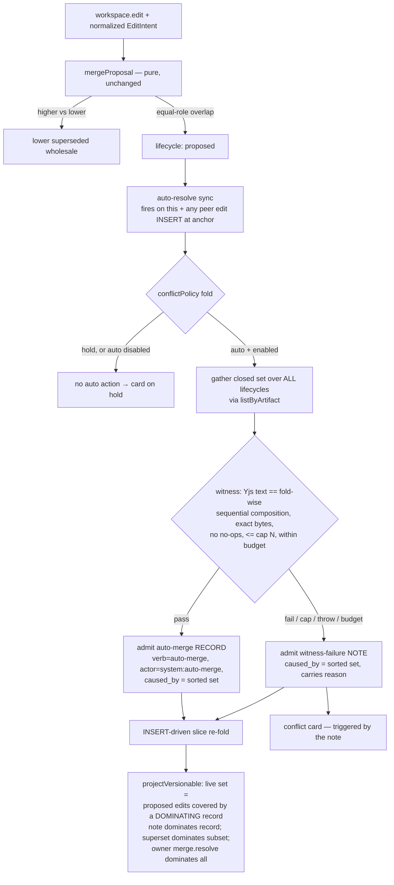

# feat: Auto v1 — autonomous conflict resolution for the ledger merge gate

> **On hold — approach under reconsideration (2026-06-15).** A second document-review round found
> the cross-machine containment lattice is not yet sound: maximal sets can form an antichain (no
> convergence), the dominance rules are self-contradictory (sticky vs re-converge), owner-precedence
> still rides a non-propagating lifecycle UPDATE, `write-back-versionable` is never wired to the
> auto-merge verb, widening the fold `key` disables the supersede re-fold, and the "scoped re-fold"
> seam doesn't exist. The core question — single-relay v1 vs. a properly-specified lattice vs.
> shipping R5 interval anchors first — is back in `ce-brainstorm`. **Do not implement this plan until
> the brainstorm resolves the approach.**

## Summary

Add a room-scoped `conflictResolution: hold | auto` policy. Under `auto`, two equal-role agents
editing the same file no longer block on an owner card: their edits merge via the existing Yjs
CRDT, an intent-witness checks the merge preserved both intents, and only a genuine garble demotes
back to the owner card. The feature is **cross-machine-correct by construction** — the merged state
is *derived at projection time* from propagating, content-addressed interactions over a
set-containment lattice, never from a lifecycle UPDATE that wouldn't cross relays — and stays
disabled behind a property-test battery with a defined exit criterion.

## Problem Frame

Today an equal-role overlapping edit pair is held as `lifecycle: 'proposed'` and surfaces a Discord
conflict card the owner must resolve (`ledger/merge.ts`, `ledger/synchronizations/conflict-card.ts`).
For an autonomous agent fleet — especially with the owner offline — that human-in-the-loop step is a
bottleneck. The brainstorm (origin R11–R18) re-scoped the long-stuck "role-priority pushout
confluence" proof into a tractable two-guard model: **agreement** (replicas converge) plus
**intent-preservation** (the merge isn't silently garbled), gated by a property-test battery.

Flow analysis then surfaced the load-bearing constraint this plan is built around: the brainstorm's
"agreement is inherited from Yjs for free" claim has a cross-machine hole. Making two `proposed`
edits *live* is a lifecycle flip, and lifecycle UPDATEs propagate **in-process only** (the Postgres
`NOTIFY` trigger fires on INSERT, not UPDATE — `ledger/store-pg.ts:349-369`). Two relays sharing the
DAG would silently diverge on any concurrently-edited file. Auto v1 therefore **derives** the
merged-applied state from propagating INSERTs rather than signaling it via a mutated column —
pulling a narrow slice of the deferred dominance-fold (origin R6) onto the critical path.

A document-review pass (2026-06-14) found the first draft located that derivation in the fold's
per-interaction `key`, which cannot see the covering record; it also left the cross-relay
**set-membership** of the merge undefined. This revision moves derivation to projection time, adds an
INSERT-driven re-fold trigger, and defines a set-containment precedence lattice so the cross-machine
guarantee actually holds.

**Trade weighed (not forced):** A single-relay-only auto — accepting the existing Postgres
UPDATE-propagation gap the codebase already tolerates for manual supersession — would ship sooner
without the projection-time derivation and the lattice. We chose cross-machine-correct because a
silent divergence of file contents across relays is the exact failure the owner asked to rule out,
and multi-relay (shared-Postgres) is a supported deployment. The cost is U11's projection-time derivation slice and
the U11 lattice; the alternative is recorded here so the bet is explicit, not implicit.

---

## Requirements

**Policy and gating**

- R1. A room carries a `conflictResolution` policy of `hold` (default) or `auto`, **stored as a
  synced ledger fact** (an owner-authored interaction read via a fold), not a per-machine settings
  file — so every relay serving the room reads the identical value. (origin R11)
- R2. `auto` stays recognized-but-disabled (falls back to `hold`) until the property-test battery
  (R10) meets its defined exit criterion (R11b). (origin R12)
- R3. An unreadable or absent policy resolves to `hold` — autonomy requires an affirmative,
  readable opt-in, mirroring the deny-floor's fail-restrictive invariant. The policy interaction is
  admitted only behind an owner-identity gate enforced **before** admission, not merely filtered by
  the fold. (origin R11; review SEC2)

**The intent-witness (correctness guard)**

- R4. Each `workspace.edit` patch carries its normalized `EditIntent` (the
  `parseEditIntent` output, not the raw tool args), included in the content hash so it is
  replica-identical. (origin R14; review feasibility/coherence)
- R5. The intent-witness holds iff the Yjs-merged text equals the **fold-wise sequential
  application** of all concurrent contributors' `EditIntent`s in some hash-sorted order, by **exact
  byte equality**, with **every** contributor's intent non-trivially applied (a no-op application
  counts as a dropped intent → fail). Whole-file `Write`∥`Write` overlap and any concurrent set
  larger than the contributor cap N always fail. Witness evaluation is bounded by a wall-clock /
  iteration budget; exceeding it fails to `hold`. (origin R14; review SEC5)

**The auto merge path (agreement guard + derivation)**

- R6. Under `auto`, an equal-role overlapping pair merges via the existing Yjs CRDT; both edits
  become live on **every** relay, derived **at projection time** from a propagating
  content-addressed auto-merge record — no lifecycle UPDATE and no fold-`key` change makes them
  live. (origin R13; review F1/F2)
- R7. The auto-resolve path admits, for a given concurrent set, either an auto-merge **record** or a
  witness-failure **note**, each keyed to the set by `caused_by`. Coverage is by **set-containment**:
  a note over set S poisons every superset of S (sticky hold); a record over S is dominated by any
  record or note over a strict superset of S (so a growing set re-converges); and a **note dominates
  a record** over an overlapping set (fail-safe to hold). The auto-merge record carries a non-owner
  system actor; the projection derives liveness from the record's **verb and `caused_by`, never its
  role**. (origin R14/R15; review A1/A2/A4/SEC1)
- R8. A higher-vs-lower overlapping pair supersedes the lower edit wholesale, deterministically
  (role rank + lower-hash tiebreak), unchanged from today. An owner `merge.resolve` (INSERT, role
  owner) **dominates** any auto-merge record for the same branches; a branch it supersedes is
  excluded from the live projection even if a record names it. (origin R16; review F2/SEC3)
- R9. On witness failure (or cap exceeded, or a thrown/​unreconstructable evaluation), `auto`
  demotes to `hold`: the conflict surfaces the existing owner card, triggered by the **witness-failure
  note** (so the card never fires before a verdict exists), and the note carries the reason so both
  relays' cards explain the fallback identically. (origin R15; review A3/G1/G2)

**Acceptance gate and determinism**

- R10. A coverage-enforced property-test battery exercises the corpus (disjoint, overlap-clean, the
  `barbaz` garble, moved-region, N-way) plus seeded multi-replica fuzz. The fuzz models **INSERT
  arrival skew** across relays (not only UPDATE non-propagation) — i.e. relays fold the same op-set
  at different completeness — so it exercises the set-containment convergence (R7), not just a shared
  store. (origin R17; review A1 residual)
- R11. The cross-machine determinism contract holds: byte-identical fold rebuild (the
  reconstructability test), the lower-hash tiebreak, and canonical-JSON stability stay green. The
  closed concurrent set is gathered over **all lifecycles** (including `proposed` peers), not via
  `findConcurrentAtAnchor` (which filters to admitted|applied); auto-resolve re-evaluates on any peer
  `workspace.edit` INSERT at the anchor, local or propagated. (origin R7/R18; review F3/SG1/A6)
- R11b. The R2 gate flips when: the named corpus passes AND M seeded fuzz iterations across K≥2
  relays (with INSERT-arrival skew) find zero counterexamples on CI. The flip is authorized by the
  maintainer in the same change that lands the battery green; `auto` may be enabled incrementally
  (e.g. for `claude-sdk` Edit/Write only) rather than waiting for universal confidence. (review PL1)

---

## Key Technical Decisions

- **Derive at projection time, not in the fold key (the load-bearing correction).** The versionable
  fold's `key` admits `proposed` `workspace.edit`s, auto-merge records, and witness-failure notes into
  the per-artifact slice unconditionally; `projectVersionable` computes the live set by checking which
  proposed edits are covered by a dominating record. The fold `key` is `(i: Interaction) => boolean`
  (`ledger/fold.ts:31`) and cannot consult a covering record, so the prior "key admits when a record
  references it" design was impossible — coverage logic lives in the projection, which sees the whole
  slice. (review F1)
- **INSERT-driven re-fold.** An INSERTed record/note does not re-evaluate already-folded `proposed`
  edits — the INSERT subscribe path applies only the new interaction, and only `subscribeLifecycle`
  (UPDATE) triggers a slice re-fold (`ledger/fold.ts:64-77`). U11 adds an INSERT-keyed re-fold trigger
  for the auto-merge verb (a store signal analogous to `subscribeLifecycle`, or the auto-resolve sync
  invoking a scoped slice re-fold) so liveness flips in-process, not only on restart. (review F2)
- **Set-containment precedence lattice.** Records and notes are keyed to a concurrent set via
  `caused_by`. A note over S poisons supersets of S (sticky); a record over S is dominated by any
  record/note over a strict superset (so late-arriving edits converge); a note dominates a record over
  an overlapping set (fail-safe). This makes the per-relay set-membership-at-fire-time difference
  benign: whichever relay reaches the maximal set last, the maximal-set verdict dominates on every
  relay once propagation completes. (review A1/A2/A4)
- **Auto-merge record authority is verb-scoped, not role-scoped.** The record uses a constrained
  system actor (`system:auto-merge`) with a non-owner role; the projection treats an interaction as an
  auto-merge record only when its **verb** matches the dedicated auto-merge verb, never because it
  carries `role:'owner'`. This avoids widening the blast radius of a forged owner-role interaction.
  (review SEC1)
- **The gate stays pure; the verdict is a synchronization over a derived set.** `mergeProposal`
  keeps returning `conflict` for equal-role pairs — no room-policy parameter. The
  `auto-resolve-conflict` synchronization (scoped to `verb === 'workspace.edit'` and `vers:` artifacts)
  reads the policy fold, gathers the closed set over all lifecycles via `listByArtifact`, computes the
  witness, and admits the dominating record or note. (review SEC4/F3)
- **conflict-card fires on the note, not on `proposed`.** The card's trigger is re-keyed to the
  witness-failure note (and `hold`-policy holds), so it is causally downstream of the verdict and
  cannot post in the window before a verdict exists. A passing record never produces the note, so no
  card fires. (review A3)
- **Policy is a ledger fact, not a settings file.** `conflictResolution` moves to an owner-authored
  interaction + a `conflictPolicy` fold so every relay reads the same value; a per-machine settings
  field would reintroduce cross-relay divergence. Tool-permission profiles stay in the local file as
  today; only this flag moves. Operators see one "room policy" surface in setup even though this flag
  persists differently — documented to avoid a split mental model. (review PL2)
- **Witness predicate: exact byte equality vs fold-wise sequential composition, no no-ops.**
  Contiguous-substring presence is unsound (`foo→bar ∥ foo→baz` → `barbaz`). The witness reuses
  `applyEditIntent` fold-wise in hash-sorted order, exact byte match, no contributor degraded to a
  no-op, bounded by an evaluation budget.

---

## High-Level Technical Design

The whole-file anchor is unchanged. The new path sits entirely *after* the gate emits `conflict`, as
derived interactions every relay computes — and converges on via the containment lattice.



Convergence: records/notes are INSERTs (propagate, dedup by hash). When relays fire at different set
completeness, they admit different-set records; the containment lattice makes the maximal-set verdict
dominate on every relay once propagation settles — so the projected text converges without any
lifecycle UPDATE.

---

## Implementation Units

Phased: **Phase 0** recovers the deleted test baseline. **Phase 1** establishes the propagating
substrates (policy fact, persisted intent, projection-time derivation + re-fold trigger, the
containment lattice). **Phase 2** adds the verdict logic and surfacing. **Phase 3** wires control +
the gate. **Phase 4** is the property-test battery that flips the switch.

### U10. Recover the deleted test baseline (Phase 0 prerequisite)
**Goal:** Restore the test patterns deleted in commit `a68eb05` to a green baseline so later units
extend known-good scaffolding rather than bundling debt recovery into the R10 battery.
**Requirements:** prerequisite for R10/R11
**Dependencies:** none
**Files:** `ledger/cross-machine.test.ts`, `ledger/artifacts/versionable.test.ts`, `ledger/merge.test.ts`,
`ledger/fold.test.ts` (recovered from `a68eb05^`)
**Approach:** Restore and run the recovered suites unchanged; fix only what drifted from current
source. This is debt recovery, explicitly separate from R10 so a recovered-test failure unrelated to
Auto v1 cannot masquerade as a gate failure. (review SG5)
**Test scenarios:** the recovered suites pass on current `main`.
**Verification:** `bun test` green on the recovered files before Phase 1 begins.

### U1. Conflict policy as a synced ledger fact
**Goal:** A room's `conflictResolution: hold | auto` is an owner-authored interaction projected by a
fold, readable identically on every relay.
**Requirements:** R1, R3
**Dependencies:** none
**Files:** `ledger/interaction.ts` (a dedicated `conflict.policy` verb — not an overload of the unused
`policy.classified`), `ledger/concepts/conflict-policy.ts` (new `conflictPolicyFold` +
`projectConflictPolicy(state, roomId)`), `relay.ts` (register), `ledger/concepts/conflict-policy.test.ts`
**Approach:** Project the latest owner-role `conflict.policy` per room; absent → `hold`. `effect: 'pure'`,
`anchor: { kind: 'none' }`. The fold's owner-role filter is defense-in-depth; the admission gate (U7)
is the primary control. (review SG6)
**Patterns to follow:** the concept folds in `ledger/concepts/` (e.g. `watch`).
**Test scenarios:**
- Happy path: owner `auto` → `projectConflictPolicy` returns `auto`; a later `hold` → `hold` (latest wins).
- Edge: no policy interaction → `hold`.
- Edge: a non-owner-role policy interaction is ignored by the fold (secondary defense).
- `Covers R1, R3.`

### U2. Persist the normalized EditIntent on the workspace.edit patch
**Goal:** Carry the normalized `EditIntent` (from `parseEditIntent`) on the `workspace.edit` patch,
included in the content hash.
**Requirements:** R4, R11
**Dependencies:** none
**Files:** `ledger/interaction.ts` (extend the versionable `Patch` with `intent`),
`ledger/artifacts/versionable.ts`, `ledger/synchronizations/capture-workspace-edit.ts` (attach the
already-parsed normalized intent instead of dropping it), `ledger/canonical.ts` (verify inclusion),
`ledger/artifacts/versionable.test.ts`
**Approach:** Persist the normalized `EditIntent` shape U3 consumes, not the raw `tool.requested`
args. Plain JSON → deterministic hash. Confirm two relays building the same edit hash identically.
**Test scenarios:**
- Happy path: an Edit → `patch.intent` round-trips `{kind:'edit', oldString, newString}`; a Write → `{kind:'write', content}`.
- Determinism: the same logical edit on two stores produces the identical hash.
- Regression: the reconstructability (byte-identical fold rebuild) test stays green.
- `Covers R4, R11.`

### U3. The intent-witness predicate (pure) + closed-set helper
**Goal:** A pure `evaluateWitness(branches): { ok: true } | { ok: false; reason }` (R5) plus the
closed-set gathering the auto-resolve sync needs.
**Requirements:** R5, R11
**Dependencies:** U2
**Files:** `ledger/artifacts/versionable.ts` (witness, I/O-free), `ledger/concurrency.ts` (a
**new** `closedConcurrentSet` helper built on `store.listByArtifact` — explicitly NOT
`findConcurrentAtAnchor`, which filters out the `proposed` peers a held conflict consists of),
`ledger/artifacts/versionable.test.ts`
**Approach:** Witness: Yjs merged text via `applyEdits`; enumerate hash-sorted orderings up to cap N;
apply fold-wise via `applyEditIntent` against the running result; reject any ordering with a no-op
application; pass iff a surviving ordering byte-equals the Yjs text; whole-file `Write`∥`Write` and
`>N` short-circuit to fail; wrap the loop in an iteration/wall-clock budget that fails to `hold`.
Closed-set helper gathers all-lifecycle branches sharing the base at the anchor. (review F3/SG1/SG2/SEC5)
**Technical design (directional, not spec):**
```
closedConcurrentSet(store, artifactId, anchor):
  peers = store.listByArtifact(artifactId)            # ALL lifecycles, incl. proposed
  return peers sharing the base at anchor (caused_by closure), NOT filtered by lifecycle

witness(branches):
  if anyTwoWholeFileWrites(branches): return fail("two whole-file writes")
  if branches.length > N: return fail("contributor cap N exceeded")
  yjs = applyEdits(branches)
  for ordering in permutations(sortByHash(branches)):   # within an eval budget
     text, dropped = base
     for intent in ordering:
        next = applyEditIntent(text, intent)
        if next == text: dropped = true; break          # no-op = dropped intent
        text = next
     if not dropped and text == yjs: return ok
  return fail("no sequential order reproduces the merge")
```
**Test scenarios (seed the R10 corpus):** pass — disjoint, overlap-clean, moved-region; fail —
`foo→bar ∥ foo→baz`→`barbaz`, `Write`∥`Write`, garbling `Write`∥`Edit`, N+1, no-op ordering,
two byte-identical edits (Yjs doubles → no match), budget-exceeded. Closed-set helper returns
`proposed` peers (regression against the `findConcurrentAtAnchor` filter).
**`Covers R5, R11.`**

### U11. The containment-lattice projection (derive liveness; define precedence)
**Goal:** Make `projectVersionable` derive the live set from records/notes over the containment
lattice, and add the INSERT-driven re-fold trigger.
**Requirements:** R6, R7, R8, R11
**Dependencies:** U2
**Files:** `ledger/interaction.ts` (auto-merge verb + witness-failure-note verb),
`ledger/artifacts/versionable.ts` (`versionableFold.key` admits proposed edits + records + notes into
the slice; `projectVersionable` computes coverage), `ledger/fold.ts` or `ledger/store*.ts` (an
INSERT-keyed re-fold signal for the auto-merge/​note verbs), `ledger/artifacts/versionable.test.ts`
**Approach:** Liveness rule in the projection: a `proposed` edit renders live iff covered by a
**dominating** record, where dominance follows R7 (superset > subset; note > record; owner
`merge.resolve` > all). The fold `key` only widens slice membership (no per-interaction coverage
decision). The INSERT-driven re-fold ensures a record/note arriving re-evaluates the prior proposed
edits in-process. (review F1/F2/A1/A2/A4/SEC1)
**Patterns to follow:** `versionableFold` / `projectVersionable` (`versionable.ts:162-188`); the
`affectedFolds` re-notify contract in `fold.ts` (encode slice membership in `key`; coverage in projection).
**Test scenarios:**
- Two proposed edits + a dominating record → both live; projected text is the Yjs merge.
- INSERT-driven re-fold: admitting the record flips liveness in-process (not only on restart).
- Containment: a record over `{e1,e2}` is dominated by a record over `{e1,e2,e3}`; a note over `{e1,e2}`
  poisons `{e1,e2,e3}` (stays held); a note dominates a coexisting record over the same set.
- Owner precedence: an owner `merge.resolve` superseding a branch excludes it even with a record present.
- Record is recognized by verb, not role: a forged `role:'owner'` non-auto-merge-verb interaction does
  not render proposed edits live.
- `Covers R6, R7, R8, R11.`

### U5. The auto-resolve-conflict synchronization
**Goal:** On a held conflict (or any peer edit at the anchor), read the policy, evaluate the witness
over the closed set, and admit the dominating record or note; fail-safe to `hold`.
**Requirements:** R6, R7, R9, R11
**Dependencies:** U1, U3, U11
**Files:** `ledger/synchronizations/auto-resolve-conflict.ts` (new), `relay.ts` (register),
`ledger/synchronizations/auto-resolve-conflict.test.ts`
**Approach:** `matches`: `verb === 'workspace.edit'` and `vers:` artifact and lifecycle in
{proposed, admitted, applied} — so a remotely-propagated peer INSERT re-triggers evaluation and the
set closes on every relay (review A6). `fire`: resolve room→policy via the fold; if not `auto` (or
disabled, U9) do nothing; else gather the closed set (U3 helper), run `evaluateWitness` in try/catch
(throw → fail), and admit the record (pass) or note (fail) keyed to the set. Sticky and convergence
are properties of the U11 lattice, not of this sync; this sync only admits the per-set verdict.
**Execution note:** Start with a failing two-engine test using **separate** stores with controlled
INSERT-arrival skew (not one shared store) asserting both relays converge to the same live text and
the maximal-set verdict dominates.
**Test scenarios:**
- Pass → admits record; both edits live; no card (U6).
- Fail → admits note; card fires; conflict held.
- Re-eval: a third concurrent edit (arriving as a peer INSERT) → witness re-runs over the closed set;
  a now-garbling set demotes; a previously-failing subset stays held (lattice).
- Skew determinism: two engines, separate stores, edits delivered in different orders/at different
  completeness → identical maximal-set verdict and identical live text after propagation.
- Fail-safe: witness throws / budget exceeded → note → hold; no half-applied state.
- Scope: a `proposed` `knowledge.append` at an overlapping key anchor does NOT trigger the sync.
- `Covers R6, R7, R9, R11.`

### U6. conflict-card triggered by the witness-failure note
**Goal:** The card fires only for genuine holds, downstream of the verdict, and shows why auto fell back.
**Requirements:** R9
**Dependencies:** U5
**Files:** `ledger/synchronizations/conflict-card.ts`, `ledger/synchronizations/conflict-card.test.ts`
**Approach:** Re-key the card trigger from bare `proposed` to: a witness-failure note exists for the
set (auto rooms), OR policy is `hold` (hold rooms fire on `proposed` as today). Render the note's
reason. Never post when a dominating record covers the set. (review A3)
**Test scenarios:**
- `auto` + pass → no card.
- `auto` + fail → card posts with the recorded reason; never posts in the pre-verdict window.
- `hold` → card posts as today (no regression).
- `Covers AE6. Covers R9.`

### U7. Owner control to set the policy (gated before admit)
**Goal:** An owner can set a room's `conflictResolution` (admitting the U1 fact), with the owner gate
enforced before admission.
**Requirements:** R1, R3
**Dependencies:** U1
**Files:** `setup.ts` (`collectPermissions` prompt → admit the policy fact; this is a new
ledger-admission seam in setup — wire it to a live store)
**Approach:** **Setup-only for v1.** The owner sets the policy via setup, which gates on owner
identity and admits the `conflict.policy` interaction. An in-chat `!conflict` owner command is
deferred (see Follow-Up Work) to keep v1's surface minimal and consistent with "policy is written by
setup, never from chat." Setup must construct the owner-role interaction and admit it to a live store
(a seam `setup.ts` does not have today — it writes local files via `saveAccess`/`saveSettings`).
(review SG3/SEC2)
**Test scenarios:**
- Setup admits the chosen policy; the fold reflects it.
- The admission path constructs an owner-role `conflict.policy` interaction (not a local-file write).
- `Covers R1, R3.`

### U8. Property-test battery (the R10 gate)
**Goal:** The coverage-enforced corpus + multi-replica fuzz with INSERT-arrival skew that, when green,
authorizes enabling auto.
**Requirements:** R10, R11
**Dependencies:** U3, U11, U5, U10
**Files:** `ledger/merge.test.ts`, `ledger/artifacts/versionable.test.ts`, `ledger/cross-machine.test.ts`
(extend the U10-recovered baseline), `ledger/auto-resolve.test.ts` (new fuzz harness)
**Approach:** Fixed corpus = U3's pass/fail cases as named tests. Fuzz: K≥2 relays modeled as
**separate stores** with a controlled propagation channel that delivers INSERTs in shuffled order and
at staggered completeness (NOT one shared in-memory store — a shared store cannot exercise the
set-membership skew the lattice exists to handle). A spec oracle independently re-derives the
candidate set. Assert: all relays converge to identical projected text after propagation; the
maximal-set verdict dominates; witness-pass ⇔ Yjs-result ∈ candidate-set; witness-fail ⇒ note + held
conflict. Enforce coverage of disjoint / overlap-clean / overlap-garble. Also characterize the A5
assumption: enumerate clean concurrent inserts and assert the Yjs result equals some permuted
sequential composition (falsify "every clean Yjs merge matches a sequential order" rather than
assuming it). (review A1-residual/A5)
**Execution note:** Characterization-first on the U10 baseline before adding corpus/fuzz.
**Test scenarios:** the battery itself; coverage gate fails on a trivial low-overlap generator; a
deliberately-broken witness (substring check) fails the `barbaz` case.
**Verification:** `bun test` green including the battery.
**`Covers R10, R11.`**

### U9. Gate wiring — auto disabled until the battery meets its exit criterion
**Goal:** Until R11b is met, `auto` is recognized but inert (falls back to `hold`); the flip is a
deliberate, authorized, optionally-incremental change.
**Requirements:** R2, R11b
**Dependencies:** U5
**Files:** `ledger/synchronizations/auto-resolve-conflict.ts` (an `autoEnabledFor(runtime)` guard
allowing incremental enablement — e.g. claude-sdk only), `relay.ts` note
**Approach:** A source-level guard, not a chat/config surface. The exit criterion (R11b) is explicit:
named corpus green AND M fuzz iterations × K≥2 skewed relays clean on CI; the maintainer flips it in
the landing change; incremental enablement is allowed. (review PL1)
**Test scenarios:**
- Guard off + policy `auto` → behaves as `hold` (card, no record).
- Guard on (for a runtime) + policy `auto` + witness pass → auto-merges.
- `Covers R2, R11b.`

---

## Acceptance Examples

- AE1. Disjoint edits → both merge, no card, either mode. (U11)
- AE2. Overlap, `hold` → owner card; chosen branch canonical. (U6)
- AE3. Equal-role overlap, `auto`, witness passes → auto-merge ships, no card, every replica identical. (U5, U11)
- AE4. Owner supersedes an agent edit → leaves the live projection immediately. (U11; existing re-fold)
- AE5. `auto` but battery not green (guard off) → falls back to the `hold` card. (U9)
- AE6. `foo→bar ∥ foo→baz` → Yjs `barbaz` matches no sequential order → witness fails → `hold` card,
  showing the recorded reason. (U3, U5, U6)
- AE7. Higher-vs-lower overlap → lower superseded wholesale; two replicas in opposite orders converge. (U11, U8)
- AE8. A third edit closes a previously-passing set into a garble → the superset note dominates the
  subset record; the file demotes to `hold` on every relay. (U11, U5)

---

## Scope Boundaries

**Deferred for later (origin-aligned)**
- The role-priority pushout, first-class conflict objects, cherry-pickable losing branches (origin R4/R8).
- Interval-overlap anchors / retiring the whole-file sentinel (origin R5). Auto v1 runs on the whole-file anchor.
- The full dominance-fold for *all* lifecycle states (origin R6). Auto v1 derives liveness only for the auto-merge case.

**Deferred to follow-up work (plan-local)**
- In-chat `!conflict hold|auto` owner command (U7 is setup-only for v1).
- Refining the two-identical-concurrent-edits case beyond "demote to hold."
- Region subdivision on higher-vs-lower overlap (v1 supersedes wholesale).
- Cross-relay write-back ordering vs an owner override (the transient on-disk window in Risks).

**Outside this product's identity (single-operator trust, unchanged from origin)**
- Signed frontiers, object-capability authority, Byzantine-fault tolerance. Note: Auto v1 narrows the
  exposure by keying record authority on verb (not role), but unsigned roles remain a known limit.

---

## Risks & Dependencies

- **Witness over-rejection (A5, to falsify in U8).** The permutation search assumes every clean Yjs
  merge equals some sequential composition. Yjs's internal clientID tiebreak (stripped from the hashed
  patch) could interleave a clean concurrent pair into text matching no pure sequential order → a clean
  merge false-fails to `hold`, blunting the feature. U8 characterizes this; if it occurs, the predicate
  must account for Yjs's offset tiebreak.
- **Re-fold + witness cost under auto.** Each new concurrent edit re-fires the sync (O(N!) witness up
  to cap N) and an INSERT-driven re-fold (O(artifact)). Whole-file-anchor means every concurrent edit
  to a file shares one contention set, so a hot file trips cap N constantly → frequent demote-to-hold
  (auto degrades toward hold under churn). The eval budget (R5) bounds per-event cost; coalescing
  re-folds and the cap interaction with the coarse anchor are flagged, not solved.
- **Cross-relay write-back window (SEC3).** After an owner override, a peer relay may write the
  auto-merged text to disk before the override propagates (UPDATE non-propagation). Transient, converges
  on re-fold; bounded by NOTIFY latency. Deferred to follow-up (write-back checks for a covering owner
  resolve).
- **Forged-role exposure (SEC1, narrowed).** Record authority is verb-scoped, so a forged
  `role:'owner'` interaction cannot pose as an auto-merge record. Owner-account compromise still allows
  a policy flip → auto; accepted under single-operator trust, noted as a new two-step exploit surface
  vs the old local-file policy.
- **Setup ledger-admission seam (U7).** `setup.ts` writes local files today; admitting a `conflict.policy`
  interaction is a new, untested path that must connect to a live store and construct the owner-role
  interaction correctly.
- **Dependency:** the shipped lifecycle re-notify (`docs/plans/2026-06-09-002-...`, on `main`) — AE4
  rides on it.

---

## Open Questions

**Deferred to implementation**
- Contributor cap **N** (R5; default ≈3) and the witness evaluation budget (iteration/wall-clock) —
  must be cross-relay constants (identical on every relay for R11 determinism).
- Replica count **K**, the propagation-skew model, and trace generator for the U8 fuzz.
- The exact INSERT-driven re-fold mechanism (a new store signal keyed on the auto-merge/note verbs vs.
  the auto-resolve sync invoking a scoped slice re-fold) and whether it stays O(artifact).
- Whether the auto-merge record's `caused_by` references to `proposed` branches resolve cleanly in the
  store's `isAncestor` walk (proposed peers are present in `listByArtifact` but their ancestry edges
  must be queryable).

---

## Sources / Research

- Origin requirements: `docs/brainstorms/2026-06-09-anchored-patch-category-conflict-layer-requirements.md` (R11–R18, AE1–AE7).
- Determinism-hazard catalog: `docs/plans/2026-06-09-001-refactor-anchor-overlap-lifecycle-fold-plan.md` ("do not implement as written").
- Shipped re-notify foundation: `docs/plans/2026-06-09-002-fix-fold-renotify-on-lifecycle-plan.md`.
- Core code: `ledger/merge.ts`, `ledger/admit.ts` (`system:merge-gate role:'owner'` precedent — the pattern the auto-merge record must NOT copy), `ledger/concurrency.ts` (`findConcurrentAtAnchor` filters admitted|applied — unusable for the closed set), `ledger/artifacts/versionable.ts` (`parseEditIntent`/`applyEditIntent`/`applyEdits`/`versionableFold`/`projectVersionable`), `ledger/synchronizations/capture-workspace-edit.ts`, `ledger/synchronizations/conflict-card.ts`, `ledger/resolve-conflict.ts`, `ledger/fold.ts:31` (`key: (i)=>boolean`), `:64-77` (INSERT vs lifecycle re-notify), `:226-241` (`affectedFolds` invariant), `ledger/store-pg.ts:349-369` (UPDATE not propagated), `ledger/sync.ts:70` (per-INSERT firing).
- Literature (via origin): Pijul, Peritext (property-test validation across replicas), Denicek (over-approximation suppression), Weidner & Kleppmann 2023.
- Review: document-review pass 2026-06-14 (coherence, feasibility, scope, product-lens, security, adversarial) — findings F1/F2 (projection-time derivation), A1/A2/A4 (containment lattice), A3 (card on note), F3/SG1/A6 (closed set + remote-INSERT re-fire), SEC1/SEC2 (verb-scoped authority, gated admission), PL1 (gate exit criterion).
```
