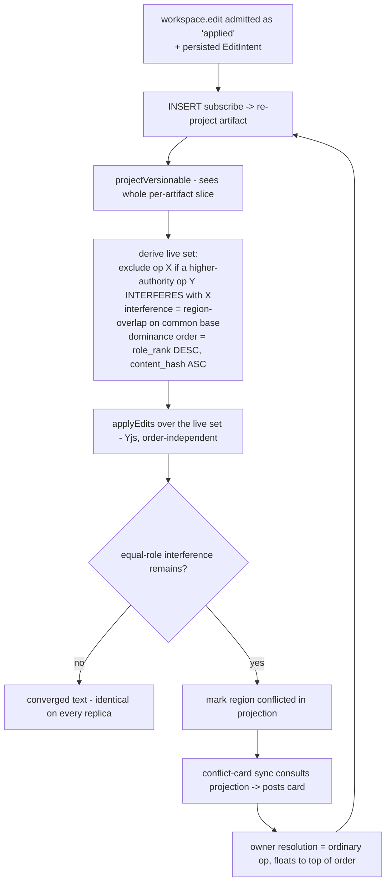

# feat: Authority-Ordered Convergent Merge (AOCM) for the conflict layer

> Supersedes `docs/plans/2026-06-14-001-feat-auto-conflict-resolution-plan.md` (on-hold; the
> set-containment-lattice + hold/auto approach it specified was found unsound across three review
> rounds). This plan implements the re-decided AOCM design.

## Summary

Replace the merge gate's mutable-lifecycle arbitration with a **pure derived projection**: an
artifact's live text is computed by excluding operations *dominated* — over a `(role_rank, content_hash)`
total order — by a higher-authority operation whose edit **interferes** (region-overlap on the common
base), then folding the surviving (live) operations through Yjs. Behavior is uniform and needs no
policy: disjoint edits merge automatically (any role); same-region different-role edits are resolved
by authority (the lower op is excluded); same-region equal-role edits surface a first-class conflict
card. Because dominance is derived from immutable operations, every replica converges from the
operations alone — no shared cloud DB, no lifecycle UPDATE to propagate. The merge is transport-agnostic
(local-first); the sync transport is a separate effort.

## Problem Frame

knock-knock's merge gate decides conflicts by mutating a `lifecycle` column (`proposed`/`superseded`),
which `versionableFold` reads to exclude losers from `applyEdits`. That mutation is per-replica state
that does not cross machines (Postgres `NOTIFY` fires on INSERT, not UPDATE — `ledger/store-pg.ts:349-369`),
so two replicas diverge on any concurrently-edited file. To be **local-first** (no shared cloud
Postgres), convergence must come from the immutable operations alone.

The fix (origin requirements): keep the gate's *arbitration* but change its *persistence* from a
mutated column to a **derived predicate**. The key correctness fact, confirmed in review: dominance
cannot be produced by reordering the CRDT (Yjs `applyUpdate` is order-independent) — it must be
**exclusion** of the dominated operation from the set Yjs folds. That is exactly what today's
`superseded` filter does; AOCM derives it instead of writing it. The total order `(role_rank DESC,
content_hash ASC)` makes every exclusion and every conflict-card rendering replica-identical.

## Requirements (origin trace)

- R1. Pure fold; dominance = exclusion; liveness/conflict derived, not a mutated column (merge case). → U2, U4
- R2. Total order `(role_rank DESC, content_hash ASC)`, immutable on-op fields; used for exclusion + card rendering, never as Yjs apply order. → U4
- R3. Interference = region-overlap on the common base, from EditIntents (Edit = `old_string` locus; Write = whole file); pure, replica-identical. → U2, U3
- R4. Uniform outcomes: disjoint → both apply; same-region different-role → higher excludes lower; same-region equal-role → first-class conflict. → U4, U5
- R5. v1 different-role exclusion is whole-op (whole-file anchor retained); disjoint still merges. → U4 (Scope: interval anchors deferred)
- R6. Local-first coordinator-free convergence from the operations alone, given the full contended set. → U4, U7, U8
- R7. Derived supersession still emits a supersession signal so the inbox/`dm-on-supersede` notice fires. → U6
- R8. Single-operator trust, roles unsigned; cross-operator signing → paired transport (out of scope). → (Scope/Assumptions)
- R9. Coverage-enforced property-test battery (corpus + separate-store skew fuzz + ground-truth oracle); merge ships when green. → U1, U8

---

## Key Technical Decisions

- **Derive dominance in the projection, never in the fold key.** `versionableFold.key` is a
  per-interaction predicate (`(i) => boolean`) and cannot consult other operations, so it only widens
  *slice membership* (admit the artifact's workspace.edits into the slice). All dominance/exclusion/
  conflict logic lives in `projectVersionable`, which sees the whole per-artifact slice. (Confirmed
  feasibility anchor.)
- **Admit workspace.edits as `applied`; stop merge-branching the lifecycle.** For versionable
  `workspace.edit`, `admit` no longer runs the role-ordered supersede/conflict branch — it admits the
  op as `applied`; the projection (U4) computes who is live/dominated/conflicted. The `lifecycle`
  column and `mergeProposal` stay for every other concept (turn, approval, channel, watch,
  knowledge-staleness, loop-guard, external-claim) — AOCM only removes lifecycle *mutation for the
  versionable merge*. Knowledge artifacts are append-only (anchor `none`, never conflict) and are
  unaffected.
- **Exclusion = leave the op out of the Yjs fold.** `projectVersionable` builds the live set
  (operations not dominated by a higher-authority interfering op) and folds only those through
  `applyEdits`. Yjs order-independence is fine — the losers are already excluded.
- **Total order `(role_rank DESC, content_hash ASC)`** — both immutable on-op fields; no middle key;
  the hash makes every pair comparable (no antichains). Consumed only to decide exclusion and to
  render conflict-card branches in a replica-identical order; never as the Yjs apply order; never via
  a re-derived ancestry depth.
- **Interference = region-overlap on the common base.** Computed from the persisted `EditIntent`s
  (U2): an `Edit`'s region is where its `old_string` sits in the common base; a `Write` spans the
  whole file. The common base is the fold of the operations' shared ancestor set (derived, replica-
  identical). The closed concurrent set is gathered via `store.listByArtifact` (all lifecycles), not
  `findConcurrentAtAnchor` (which filters to admitted|applied). (Confirmed feasibility anchor.)
- **Conflict-card and manual resolution re-point onto the derived model.** `conflict-card` fires when
  a newly-admitted workspace.edit creates a derived equal-role interference (it consults the projection
  via `ctx.engine.get`), not on a `lifecycle:'proposed'` row. `resolveConflict` becomes an ordinary
  higher-or-equal-authority operation the total order floats to the top; it stops calling
  `updateLifecycle` for the merge case. To preserve the override notice, the derivation that newly
  dominates an op **emits a supersession signal** (an ordinary INSERT to the loser's inbox, the same
  `surfaceToInbox` shape) so `dm-on-supersede` still fires.
- **Re-projection is INSERT-driven (free).** Because `projectVersionable` reads the whole slice fresh,
  the existing INSERT-subscribe path re-projects on every new op (local or exchanged). The merge case
  no longer depends on the `subscribeLifecycle`/UPDATE re-fold path at all — which is precisely what
  makes it cross-replica-correct.

---

## High-Level Technical Design



Cross-replica convergence: every input above is an immutable INSERT; the derivation is a pure function
of the slice; so two replicas holding the same operation set compute byte-identical text, with no
mutable state exchanged.

---

## Implementation Units

Phased: **P0** recovers the test baseline; **P1** builds the derived projection (the core); **P2**
surfaces conflicts and migrates manual resolution + the notification; **P3** is the gate.

### U1. Recover the deleted test baseline (P0 prerequisite)
**Goal:** Restore the merge/versionable/fold/cross-machine test suites deleted in `a68eb05` to green, so later units extend known-good scaffolding.
**Requirements:** prerequisite for R9
**Dependencies:** none
**Files:** `ledger/merge.test.ts`, `ledger/artifacts/versionable.test.ts`, `ledger/fold.test.ts`, `ledger/cross-machine.test.ts` (recovered from `a68eb05^`)
**Approach:** Restore the four named suites; fix only what drifted from current source. Debt recovery, kept separate from R9 so an unrelated recovered-test failure can't masquerade as a gate failure.
**Test scenarios:** the recovered suites pass on current `main`.
**Verification:** `bun test` green on the recovered files before P1.

### U2. Persist the normalized EditIntent on the workspace.edit patch
**Goal:** Carry the normalized `EditIntent` on the patch (it is discarded today), included in the content hash, so the interference test has a replica-identical substrate.
**Requirements:** R1, R3
**Dependencies:** U1
**Files:** `ledger/interaction.ts` (extend the versionable `Patch` with `intent`), `ledger/artifacts/versionable.ts`, `ledger/synchronizations/capture-workspace-edit.ts` (attach the parsed intent instead of dropping it), `ledger/canonical.ts` (confirm inclusion), `ledger/artifacts/versionable.test.ts`
**Approach:** Persist the normalized `parseEditIntent` output (`{kind:'edit', oldString, newString}` | `{kind:'write', content}`) — plain JSON, deterministic hash. Confirm two replicas building the same logical edit hash identically.
**Patterns to follow:** the existing patch construction in `capture-workspace-edit.ts`.
**Test scenarios:**
- Edit → `patch.intent` round-trips `{kind:'edit', oldString, newString}`; Write → `{kind:'write', content}`.
- Determinism: the same logical edit on two stores yields the identical hash.
- Regression: the reconstructability (byte-identical fold rebuild) test stays green.
- `Covers R3.`

### U3. The interference test + closed-set helper (pure)
**Goal:** A pure `interferes(a, b, commonBase): boolean` (region-overlap) and a `closedConcurrentSet` helper that gathers an artifact's contended operations over all lifecycles.
**Requirements:** R3
**Dependencies:** U2
**Files:** `ledger/artifacts/versionable.ts` (interference, I/O-free), `ledger/concurrency.ts` (a `closedConcurrentSet` helper built on `store.listByArtifact` — explicitly NOT `findConcurrentAtAnchor`, which filters out the proposed/non-applied peers), `ledger/artifacts/versionable.test.ts`
**Approach:** Region from the `EditIntent`: an Edit's range is `[indexOf(old_string), +len]` in the common base; a Write spans `[0, len]`. Two ops interfere iff their ranges intersect. Pure function of the EditIntents + common-base text.
**Technical design (directional):**
```
interferes(a, b, base):
  ra = region(a.intent, base)   # Edit: locus of old_string; Write: whole file
  rb = region(b.intent, base)
  return ra.lo < rb.hi and rb.lo < ra.hi   # half-open interval intersection
```
**Test scenarios:**
- Disjoint Edits (different loci) → no interference.
- Same-locus Edits (`foo→bar` vs `foo→baz`) → interference.
- Write ∥ anything → interference (Write spans the file).
- Edit whose `old_string` is absent in the base → defined behavior (treat as whole-region / interfere — fail safe); pin in planning notes.
- `closedConcurrentSet` returns proposed/non-applied peers (regression against the `findConcurrentAtAnchor` lifecycle filter).
- `Covers R3.`

### U4. The derived-dominance projection (the core)
**Goal:** Rewrite `projectVersionable` to compute the live set by exclusion over the total order + interference, and admit workspace.edits as `applied` (no lifecycle merge-branching).
**Requirements:** R1, R2, R4, R5, R6
**Dependencies:** U2, U3
**Files:** `ledger/artifacts/versionable.ts` (`versionableFold.key` widened to admit the artifact's workspace.edits into the slice; `projectVersionable` computes exclusion + folds the live set; expose conflicted regions), `ledger/admit.ts` (versionable workspace.edit admits as `applied`, bypassing the role-ordered supersede/conflict branch), `ledger/merge.ts` (the versionable case no longer routes through `mergeProposal`'s exclusion — document what still uses it), `ledger/artifacts/versionable.test.ts`
**Approach:** Exclusion rule in the projection: op X is excluded iff some op Y with strictly higher `role_rank` interferes with X. For equal-role interference, neither is excluded — the projection marks the region conflicted (consumed by U5). Fold the non-excluded (live) set through `applyEdits`. The total order `(role_rank DESC, content_hash ASC)` orders the exclusion comparison and the conflict-branch rendering deterministically. Liveness/dominance is encoded so `affectedFolds`/re-fold is unnecessary for the merge case (re-projection is INSERT-driven, U7).
**Patterns to follow:** existing `versionableFold`/`projectVersionable`/`applyEdits` shapes; the current `superseded`-filter is the behavior being made derived.
**Test scenarios:**
- Disjoint edits (any role) → both in the live set → both apply. `Covers AE1.`
- Owner edit interferes with agent edit → agent op excluded; owner's edit is the text. `Covers AE2.`
- Two equal-role interfering edits → neither excluded; region marked conflicted (no silent garble). `Covers AE3.`
- Three concurrent siblings → exclusion + ordering identical across two independently-built projections. `Covers AE5.`
- Whole-file Write vs an Edit (different role) → Write spans file → interferes → lower excluded. `Covers AE7.`
- Cross-replica: a second projection built from the same op-set (shuffled) yields byte-identical text. `Covers R6.`
- `Covers R1, R2, R4, R5.`

### U5. First-class conflict object + conflict-card re-point
**Goal:** Surface a derived equal-role conflict as a first-class projection object and post the card from it (not from `lifecycle:'proposed'`).
**Requirements:** R4
**Dependencies:** U4
**Files:** `ledger/synchronizations/conflict-card.ts` (match on a newly-admitted workspace.edit; consult the projection via `ctx.engine.get`; post the card when a derived equal-role interference exists; render branches in total-order), `ledger/synchronizations/conflict-card.test.ts`
**Approach:** The projection exposes conflicted regions with their branch hashes; the card sync reads them. Cross-relay dedup keeps the existing claim mechanism. The card's resolution buttons admit an ordinary owner operation (U6).
**Test scenarios:**
- Equal-role interference → card posts once, branches in total-order; replica-identical rendering.
- Disjoint equal-role edits → no card (no interference).
- Different-role interference → no card (authority resolved). `Covers AE2.`
- `Covers AE3.`

### U6. Migrate manual resolution + preserve the override notification
**Goal:** Re-point `resolveConflict` onto the derived model (resolution = an ordinary higher-or-equal-authority op) and stop mutating `lifecycle` for the merge case, while keeping the `dm-on-supersede` / inbox notice firing.
**Requirements:** R1, R7
**Dependencies:** U4
**Files:** `ledger/resolve-conflict.ts` (record the resolution as an ordinary op; drop the merge-case `updateLifecycle` calls), `ledger/admit.ts` (emit a supersession signal when the derivation newly dominates an op, reusing `surfaceToInbox`), `ledger/synchronizations/dm-on-supersede.ts` (verify it still triggers), `ledger/resolve-conflict.test.ts`
**Approach:** The resolution op's role floats it to the top of the total order, so the projection excludes the conflicting branches by derivation. Because supersession is now derived (no UPDATE), emit an explicit supersession-note INSERT (content-addressed, propagates) so the override notice path is preserved. Manual and automatic dominance now share one derivation.
**Test scenarios:**
- Owner resolves a held equal-role conflict → resolution op dominates; projection converges to the resolved text; no lifecycle UPDATE.
- A peer holding the resolution + both branches re-derives the identical resolved text; a peer missing a branch converges on arrival. `Covers AE4.`
- Owner override of an agent edit → the agent's now-dominated draft triggers the inbox/DM override notice. `Covers AE6.`
- `Covers R1, R7.`

### U7. INSERT-driven re-projection for the merge case
**Goal:** Confirm/ensure the artifact re-projects on every workspace.edit / resolution INSERT (local or exchanged), with no dependence on the `subscribeLifecycle` UPDATE path for the merge.
**Requirements:** R6
**Dependencies:** U4
**Files:** `ledger/fold.ts` (verify the INSERT-subscribe path re-projects the merge slice; add an explicit slice re-projection on the relevant verbs only if a gap is found), `ledger/fold.test.ts`
**Approach:** Since `projectVersionable` reads the whole slice, a new INSERT through the existing subscribe path already yields the updated projection. Verify this end-to-end for an op that newly dominates a prior proposed-now-applied edit; only add machinery if a concrete gap surfaces.
**Test scenarios:**
- A later interfering higher-role INSERT flips the live set in-process (not only on restart).
- Two engines over separate stores, edits delivered in shuffled order → identical projected text after exchange. `Covers R6.`
- `Covers R6.`

### U8. The property-test battery (the R9 gate)
**Goal:** The coverage-enforced corpus + separate-store skew fuzz with a hand-authored ground-truth oracle that authorizes shipping the merge.
**Requirements:** R9, R6
**Dependencies:** U4, U5, U6, U7, U1
**Files:** `ledger/aocm.test.ts` (new fuzz harness), extensions to `ledger/cross-machine.test.ts`, `ledger/artifacts/versionable.test.ts`, `ledger/merge.test.ts`
**Approach:** Fixed corpus = AE1–AE7 as named cases with **hand-authored expected resolved text** (not a re-implementation of the fold). Fuzz: K≥2 replicas as **separate `SqliteStore(':memory:')` instances** (not one shared store) with a controlled channel delivering ops in shuffled order / staggered completeness; assert all replicas converge to identical projected text once op-sets equalize, exclusion is replica-identical, and different-role authority dominates. Enforce coverage of disjoint / same-region-different-role / same-region-equal-role. A deliberately-broken exclusion (e.g. role ignored) must fail the corpus.
**Execution note:** Characterization-first on the U1 baseline before adding corpus/fuzz.
**Verification:** `bun test` green incl. the battery; coverage gate fails on a trivial low-overlap generator.
**`Covers R6, R9.`**

### U9. Mark the superseded plan
**Goal:** Mark `docs/plans/2026-06-14-001-feat-auto-conflict-resolution-plan.md` superseded so it isn't mistaken for live.
**Requirements:** housekeeping
**Dependencies:** none
**Files:** `docs/plans/2026-06-14-001-feat-auto-conflict-resolution-plan.md`
**Approach:** Add a one-line banner / `status` note pointing to this plan. No code.
**Test expectation: none — docs-only.**

---

## Acceptance Examples

Carried from origin (AE1–AE7), mapped to units above:
- AE1. Disjoint edits → both apply, no card. (U4)
- AE2. Owner interferes with agent → agent excluded, silent. (U4, U5)
- AE3. Same-region equal-role → conflict card. (U4, U5)
- AE4. Owner resolves → resolution dominates; peer re-derives identical state. (U6)
- AE5. Three concurrent siblings → identical order on every replica. (U4)
- AE6. Override → inbox/DM notice still fires. (U6)
- AE7. Write vs Edit → Write spans file → interferes → resolved by authority/card. (U4)

---

## Scope Boundaries

**In scope**
- The derived-dominance projection, region-overlap interference, and the manual-resolution migration (U2–U7), gated by U8.

**Deferred for later**
- **Interval-overlap anchors (origin R5).** Whole-file anchor retained, so different-role exclusion is whole-op; disjoint edits still merge (interference is region-aware), so only same-region collisions are coarse.
- **Critical-version snapshots** — performance optimization, not correctness; the full-slice projection already works.

**Paired (separate brainstorm)**
- The **local-first sync transport** (drop Supabase): content-addressed op-exchange + optional dumb relay. AOCM is the merge layer it carries; cross-operator op-exchange + signing live there.

**Outside this product's identity**
- Federated untrusted relays, object-capability authority, full Byzantine tolerance.

---

## Risks & Dependencies

- **Admit-as-applied changes the gate's shape for versionable.** Removing the role-ordered supersede/conflict branch for workspace.edit (U4) is the load-bearing change; everything downstream (conflict-card, resolveConflict) re-points onto the projection. Keep `mergeProposal`/lifecycle intact for all non-versionable verbs — verify no other anchored verb relied on the versionable path.
- **Interference needs a replica-deterministic common base.** The common-base text is a fold of the shared-ancestor op set; it must be computed identically on every replica (pure over immutable ops). Verify under the U8 skew fuzz.
- **Override notification depends on an emitted supersession signal (U6).** Since supersession is derived (no UPDATE), the `dm-on-supersede` trigger must be driven by an explicit INSERT — losing this silently drops the "your draft was overridden" notice.
- **`EditIntent` extraction is claude-sdk-shaped today.** Region-overlap relies on `parseEditIntent`; runtimes whose edits don't surface a structured intent are out (consistent with the existing capture skeleton).
- **Dependency:** the shipped lifecycle re-notify (`docs/plans/2026-06-09-002-...`, on `main`) — the merge case stops using it, but non-merge lifecycle concepts still do; don't regress them.

---

## Open Questions

**Deferred to implementation**
- Exact region computation for the interference test: whitespace handling, multi-occurrence `old_string`, multi-edit ops, and the `old_string`-absent fallback.
- The common-base derivation (which shared-ancestor cut) and its cost.
- The U8 exit-criterion constants (N fuzz runs, K replicas) and whether a two-process Postgres integration test supplements the in-process skew fuzz.
- Whether `mergeProposal` is fully bypassed for versionable or retained as a thin guard.

---

## Sources / Research

- Origin: `docs/brainstorms/2026-06-09-anchored-patch-category-conflict-layer-requirements.md` (R1–R9, AE1–AE7, the dominance-as-exclusion correction, the dropped policy, the region-overlap interference test, local-first target).
- Prior art (via origin): Matrix State Resolution v2 (authority-weighted convergence over a hash-DAG, the `(power, ts, hash)` total-order model), eg-walker (deterministic concurrent-op ordering; snapshots deferred), Pijul/categorical patch theory (first-class conflicts), Fugue (why region-overlap, not post-merge comparison, is the sound interference test).
- Code (feasibility anchors verified this session): `ledger/artifacts/versionable.ts` (`versionableFold`/`projectVersionable`/`applyEdits`/`parseEditIntent`/`applyEditIntent`; the `superseded` filter is today's dominance mechanism to make derived), `ledger/fold.ts` (`key` is per-interaction → derivation in projection; INSERT-subscribe re-projects), `ledger/concurrency.ts` (`findConcurrentAtAnchor` filters lifecycle → use `listByArtifact`), `ledger/admit.ts` (lifecycle setting + `surfaceToInbox`), `ledger/merge.ts`, `ledger/synchronizations/conflict-card.ts`, `ledger/synchronizations/dm-on-supersede.ts`, `ledger/resolve-conflict.ts`, `ledger/store-pg.ts:349-369` (the UPDATE-non-propagation the design removes dependence on).
- Superseded: `docs/plans/2026-06-14-001-feat-auto-conflict-resolution-plan.md`.
