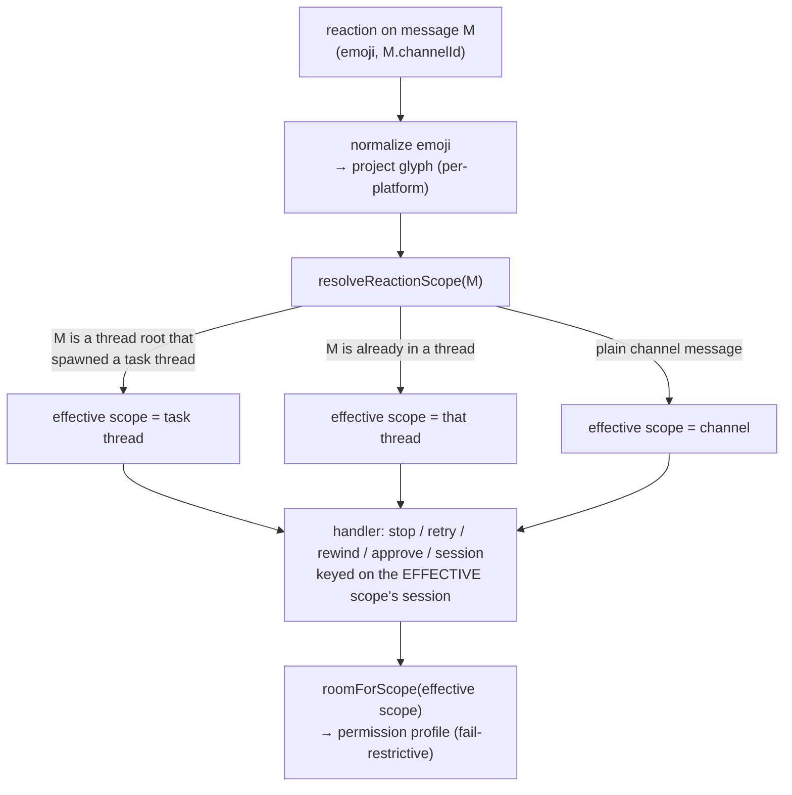
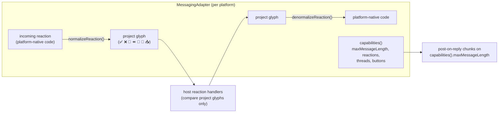
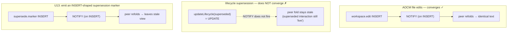

# refactor: Feature-cohesion hardening

## Summary

The last week added a lot — AOCM file-edit merge, a five-platform messaging
abstraction, session sharing/resume, watches, the §4 Discord UX, and the
Postgres cross-machine backend — on top of the ledger-native rewrite. Each
feature is individually clean, but the **seams between them leak**, and the test
net that would have caught the leaks was deleted. This plan does not redesign the
ledger model (it is sound). It restores the safety net, makes the recent features
cohere at their boundaries, and fixes the concrete bugs found in investigation —
so the experience is fluent and the data/convergence model is consistent with the
project's **local-first, multi-relay-via-AOCM** direction.

Five root themes drive the work:

1. **The safety net collapsed.** Commit `a68eb05` deleted all 41 `*.test.ts`
   files (~7k lines); only 6 AOCM files returned. `bun test` now runs 47 tests in
   6 files. `lib.ts`, `agent-host.ts`, `driver.ts`, every adapter, every session
   reader, every `host/*`, and most synchronizations have **zero** coverage. Docs
   still claim "189 tests passing" and reference a deleted `lib.test.ts`.
2. **The thread seam (scope vs room) misroutes reactions.** Reaction handlers use
   the *message's* channel as the scope, but turns run in a spawned task thread —
   so 🛑/🔁/⏪ on the original top-level message silently no-op, and the DM-courier
   handle loses a subscriber-ordering race and almost never attaches.
3. **The messaging abstraction is half-migrated.** The seam exists, but inbound
   reactions are compared as Unicode while non-Discord platforms deliver
   shortcodes, so **every reaction control is dead off-Discord**; outbound chunking
   ignores declared capabilities; Slack's token model bypasses the per-agent
   indirection.
4. **Delivery & resume lifecycles are optimistic.** Imported session context is
   marked "delivered" before the turn runs (lost on failure); resume mutates
   Driver state outside the serialized queue; stale session bindings aren't
   re-validated; `read()` isn't workspace-filtered.
5. **Cross-machine convergence is incomplete and not yet local-first-clean.**
   `watch.fired` isn't deduped across relays (N relays → N turns + N spawned
   processes); lifecycle supersession of turns/approvals/knowledge never
   replicates (NOTIFY fires on INSERT, not UPDATE). AOCM already solved this for
   file edits by *deriving convergence from immutable INSERTs* — that pattern is
   the local-first substrate to generalize.

AOCM's own algebra is sound; only its capture boundary needs hardening (no
binary-file guard, `caused_by` chains onto losing branches, one re-added test
passes for the wrong reason).

---

## Problem Frame

**Who is affected.** End users (owners and collaborating agents) hitting silent
no-ops — reactions that do nothing, lost session context, duplicated responses
across relays. Developers, who can no longer change anything safely because there
is no regression coverage and the canonical docs are false.

**Why now.** The feature burst outran both its integration and its test net. The
user's report — "features not super cohesive and well glued, so some bugs exist" —
is precisely the seam-leak pattern: each feature works in isolation and on the
happy path, but the boundaries (threads, platforms, cross-machine, failure paths)
are where they fail, and nothing catches it.

**Definition of done.** `bun test` exercises the pure decision logic and every
seam this plan touches; docs match the code; reactions work on every platform the
relay will actually start; the thread seam routes consistently; delivery/resume
survive failure; cross-machine collaboration converges from operations alone with
no hosted-DB dependency; AOCM capture is corruption-safe.

**Non-goals.** Redesigning the ledger/AOCM model; net-new features;
live-certifying the skeleton platforms against real Slack/Telegram/WhatsApp/iMessage
credentials; replacing Postgres as the cross-machine transport.

---

## Scope Boundaries

**In scope:** the cross-feature seams and the safety-net/doc restoration that make
the recent features cohere — the five themes above, expressed as Phases A–F below.

**Confirmed decisions (from scoping):**
- Messaging: fix the *contract* (inbound reaction normalization, capability-driven
  outbound, per-agent tokens) and **gate** Slack/Telegram/WhatsApp/iMessage as
  experimental/opt-in. Discord stays the supported surface.
- Multi-relay is a real goal, but the software must stay **fully local-first** —
  collaboration rides AOCM's derive-from-INSERT property; **no Supabase/Neon or
  other hosted-DB dependency** may be introduced. Local Postgres is acceptable as
  the cross-machine transport.
- Tests: fresh, targeted coverage tied to the pure logic and the seams the fixes
  touch — not a recovery of the drifted 41-file suite.

### Deferred to Follow-Up Work
- **Live-certifying the four skeleton platforms** against real credentials
  (Slack/Telegram/WhatsApp/iMessage end-to-end). This plan makes them *correct and
  honestly gated*, not *certified*.
- **Interval ("interval-anchor") AOCM merge** — whole-file anchors are retained per
  AOCM v1 scope.
- **A peer-to-peer (non-Postgres) sync transport.** Local-first today means "runs
  against a local Postgres / SQLite with no hosted dependency and converges from
  ops"; a CRDT-style serverless transport is a separate effort.
- **A full generalization of AOCM derivation to all lifecycle-mutating verbs.** U13
  closes the cross-machine *replication* gap for supersession pragmatically; a
  wholesale "derive every concept's liveness from INSERTs" refactor is a larger,
  separate architecture track.

---

## High-Level Technical Design

Three of the seams share a shape worth making explicit before the per-unit detail.

### 1. The reaction-target seam (root cause of the thread misrouting)

Today each reaction handler treats `reaction.message.channelId` as the scope. But
a top-level @mention spawns a *task thread*; the turn, session, and approvals all
live in the **thread** scope, while the inbound ack (👀) and the user's most
natural reaction target (🛑/🔁) sit on the **parent-channel** message. The fix is
one resolution seam every reaction handler routes through.

*Directional guidance, not implementation spec.* The point: glyph normalization
and scope resolution become two shared steps in front of **all** reaction
handlers, so stop/retry/rewind/approval/session stop disagreeing about "where".

### 2. The messaging normalization contract

The seam is real but asymmetric: outbound has a glyph→platform map, inbound does
not. Make the contract symmetric and capability-driven.

The host never sees a platform-native reaction code again; chunking never assumes
Discord's 1900.

### 3. Local-first cross-machine convergence (the AOCM pattern, generalized)

AOCM converges across machines because dominance/exclusion/conflict are **derived
from immutable INSERTs** — the NOTIFY trigger fires on INSERT, so peers learn of
everything that matters. Lifecycle supersession (turns/approvals/knowledge) breaks
this because it is an **UPDATE**, and NOTIFY does not fire on UPDATE.

The fix keeps the system **operation-driven and local-first**: convergence rides
INSERTs that any Store (local Postgres or SQLite) already propagates, with no
hosted-DB feature required.

---

## Key Technical Decisions

- **KTD-1 — One reaction-target seam, not per-handler patches.** Introduce a single
  `resolveReactionScope` + glyph-normalization pair that all reaction handlers
  consume. Rationale: the stop/retry/rewind misrouting, the dead-reactions bug, and
  the cold-cache room resolution are the *same* root cause expressed five times.
  One seam fixes all and prevents the next handler from re-introducing it.
- **KTD-2 — Lifecycle supersession converges via an INSERT marker, mirroring AOCM.**
  Rather than wait for NOTIFY-on-UPDATE (a Postgres-specific feature that pulls
  against local-first) or refactor every concept to derive liveness, emit a small
  INSERT-shaped supersession signal that crosses the existing INSERT NOTIFY and
  triggers a peer refold. Rationale: keeps convergence operation-driven and
  transport-agnostic; reuses the proven AOCM property; no hosted-DB dependency.
- **KTD-3 — Cross-relay fan-out uses the existing `external_claim` primitive.**
  `watch.fired` is deduped exactly like `conflict-card` posts (per-`relayId` claim),
  and OS-child spawning gets single-owner election. Rationale: reuse the primitive
  that already solves "exactly one relay acts," not a new mechanism.
- **KTD-4 — Confirmed delivery, not optimistic.** Shared-context and any "deliver
  once" state is marked consumed *after* the turn succeeds, inside the same path
  that observes success/failure. Rationale: a stopped or failed turn must not
  silently swallow imported context.
- **KTD-5 — Driver session mutations go through the serialized queue.** `bindSession`
  enqueues like `runTurn`. Rationale: the per-scope serialization is the existing
  invariant; resume currently violates it and races in-flight turns.
- **KTD-6 — Fresh tests target pure logic + touched seams.** `lib.ts` pure
  functions first (highest value, no I/O), then a seam test per fix. Rationale: the
  drifted old suite would resurrect stale assumptions; current targeted tests both
  verify the fixes and re-establish a floor.
- **KTD-7 — Skeleton platforms are gated, not finished.** A per-agent
  `experimental`/maturity flag + setup warning + relay guard makes non-Discord
  opt-in. Rationale: matches the confirmed scope — make the abstraction *correct*
  without committing to certifying five platforms.

---

## Implementation Units

Units are grouped into six phases. Phase A is the foundation (it makes every later
unit verifiable). Phases B–F are largely independent of each other and can be
sequenced by risk appetite, but each depends on A for its tests.

### Phase A — Restore the safety net & truth

#### U1. Make the docs honest

**Goal:** Remove every false claim so the canonical docs match the code before any
fix lands.
**Requirements:** Definition of done (docs match code).
**Dependencies:** none.
**Files:** `CLAUDE.md`, `docs/knock-knock-watches.md`, `docs/messaging-platforms.md`.
**Approach:** Fix the `bun test` description in `CLAUDE.md:8` (no `lib.test.ts`; state
the real suite). Remove/replace the "189 tests passing" and `+N tests` style claims
(`docs/messaging-platforms.md:257`, `docs/knock-knock-watches.md:270`). Add a short
"Messaging layer" subsection to `CLAUDE.md` describing the `MessagingAdapter` seam,
`adapters-msg/`, and that Discord is the supported surface with others gated
(forward-reference U8). Correct the glyph table drift (CLAUDE.md prose says "🛑
failed" while code uses ⚠️ failed / ⏹ stopped / 🛑 owner-stop).
**Patterns to follow:** existing CLAUDE.md section style; the honest caveat style
already in `docs/messaging-platforms.md` §7.
**Test scenarios:** `Test expectation: none — documentation only.`
**Verification:** grep for `lib.test`, `189 test`, `tests passing` returns no
stale hits; CLAUDE.md describes the messaging seam and the correct glyph vocabulary.

#### U2. Fresh targeted tests for the pure decision logic in `lib.ts`

**Goal:** Re-establish the highest-value coverage floor — the pure functions with no
I/O — and a working `bun test` baseline the rest of the plan builds on.
**Requirements:** Definition of done; KTD-6.
**Dependencies:** none (but every later unit's tests assume this harness exists).
**Files:** `lib.test.ts` (new), reference `lib.ts`.
**Approach:** Cover the pure functions investigation flagged as zero-coverage and
load-bearing: `classifyTool` (deny-literal-first, unmatched→ask, glob matching),
`expandPreset`/`PRESET_MODES` (deny floor always present; bypass keeps floor),
`resolveProfileForActor` (most-specific allow/ask wins, deny is union, absent tier
falls back), `resolveRoomForScope`, `loopGuard`, `parseWatchCommand`/`watchGate`,
`pickFreshContext`, `planSessionAcquire`, `threadNameFromPrompt`, and the messaging
mention/`requireMention` helpers. These are pure → fast, deterministic, no mocks.
**Patterns to follow:** the surviving `ledger/*.test.ts` style (`bun:test`,
`describe`/`it`/`expect`); the deleted `lib.test.ts` is recoverable from git
`a68eb05^` as a *reference for what to cover*, not to restore verbatim.
**Test scenarios:**
- `classifyTool`: a deny-literal (`rm -rf`) labeled both `execute` and `other` is
  denied in both cases (deny-literal checked first).
- `classifyTool`: an unmatched tool name returns `ask` (never silent allow).
- `expandPreset`: every preset (strict/ask-per-edit/auto/bypass) includes the full
  `DENY_FLOOR`; `bypass` is wide-open except the floor.
- `resolveProfileForActor`: most-specific tier wins for allow/ask; deny is the union
  of base + tier; an absent tier falls back to base (never empty).
- `resolveRoomForScope`: a thread scope resolves to its parent room; an unresolved
  scope fails restrictive (no empty profile).
- `loopGuard`: trips at the configured threshold; resets correctly.
- `parseWatchCommand`: `every=10s` desugars to a poll loop; `fireOn` parses kind +
  pattern; oneShot/maxFires defaults.
- `pickFreshContext`: returns an undelivered note once; returns nothing when all
  delivered; isolates by scope.
- `planSessionAcquire`: create vs reuse vs load decisions; load-unsupported →
  create.
**Verification:** `bun test` runs substantially more than 47 tests and is green;
each pure function above has at least the named scenarios.

---

### Phase B — The scope / room / reaction-target seam

#### U3. Introduce `resolveReactionScope` and route every reaction through it

**Goal:** A top-level 🛑/🔁/⏪/✅/📥 reaction acts on the scope where the turn
actually runs (the spawned thread), not the raw message channel.
**Requirements:** Theme 2; KTD-1.
**Dependencies:** U2.
**Files:** `agent-host.ts` (reaction handlers `onReaction`/`handleStop`/`handleRewind`
~`agent-host.ts:219–405`), `messaging-adapter.ts` (scope-resolution helper if shared),
`lib.ts` (pure resolution if the decision is data-only), `lib.test.ts`.
**Approach:** Add one resolution step in front of the handlers: given the reacted
message and its channel, resolve the *effective task scope* — if the message is a
top-level message that spawned a task thread, target that thread's session; if it is
already in a thread, use it; else the channel. Key all handler session lookups
(`this.sessions.get(...)`, `activeTurn`, `listByChannel`) on the effective scope.
Keep the owner-gate and deny-floor resolution (`roomForScope`) on the effective
scope. Extract the pure part (message → effective scope id, given known thread
mapping) into `lib.ts` so it is unit-testable.
**Patterns to follow:** the existing scope→room discipline (`roomForScope`,
`resolveRoomForScope` in `lib.ts`); the thread-spawn mapping already maintained on
inbound (`scopeToRoom`, `threadNameFromPrompt`).
**Test scenarios:**
- Covers the misrouting: 🛑 on a top-level message that spawned a thread resolves
  to the thread session and aborts the in-flight turn (not a no-op).
- 🔁 on a bot reply inside a thread retries that thread's most recent
  `turn.prompted`.
- A reaction in a plain channel (no thread) resolves to the channel scope unchanged
  (no regression).
- The effective scope still resolves scope→room and never yields an empty profile.
**Verification:** stop/retry on a threaded task act on the running turn; plain-channel
behavior is unchanged; pure resolver unit tests pass.

#### U4. Fix the DmCourier subscriber-ordering race

**Goal:** The per-turn DM handle attaches deterministically instead of losing a race
to its own turn.
**Requirements:** Theme 2.
**Dependencies:** U2.
**Files:** `agent-host.ts` (`onTurnPrompted`/`channelOfPrompt`/`runTurnForChannel`
~`agent-host.ts:614–739`), `dm-courier.ts`, `relay.ts` (subscriber registration order
~`relay.ts:198,340`).
**Approach:** The host's `onTurnPrompted` subscriber fires before the Synchronizer
sets `session.activeTurn`, so `channelOfPrompt` returns `''` and the DM handle is
dropped. Remove the dependence on `activeTurn` being set yet: attach the DM handle in
the same place that *establishes* the turn (the `drive-turn` path /
`runTurnForChannel`), or resolve the channel from the `turn.prompted` interaction's
own `channel` field rather than scanning sessions. Make handle attach idempotent.
**Patterns to follow:** how `drive-turn` already owns turn establishment; ledger
interactions carry their own `channel` — prefer reading it over reconstructing it
from live session state.
**Test scenarios:**
- A `turn.prompted` admitted before any session has `activeTurn` still attaches the
  DM handle (the race case).
- The DM courier transcript records the turn (not the `noopDm` placeholder).
- Double-attach is a no-op (idempotent).
**Verification:** DM courier attaches on the normal path; no `noopDm` fallback on a
healthy turn.

#### U5. Harden cold-cache room resolution + fix outcome-glyph double-marking

**Goal:** Reactions/conflict-cards on a thread the host hasn't seen since restart
resolve correctly (or fail safe with retry, not silent drop); a retried-then-succeeded
message doesn't show both ⚠️ and 🏁.
**Requirements:** Theme 2; Definition of done.
**Dependencies:** U2, U3.
**Files:** `agent-host.ts` (`roomForScope`/`markInboundOutcome` ~`agent-host.ts:274–282,
642–653`), `messaging-adapter.ts` (`parentOf`/`parentOfSync`).
**Approach:** When `roomForScope` misses on a cold `scopeToRoom` cache, consult the
async `parentOf` (and memoize) before declining, so a post-restart conflict
card/resume isn't silently dropped — still fail-restrictive if truly unresolvable.
In `markInboundOutcome`, clear any prior outcome glyph (🏁/⚠️/⏹) before applying the
new one, so retry doesn't stack outcomes; keep ⚠️ for failed but ensure it is not
conflated with the `stale` glyph in the same message.
**Patterns to follow:** the existing fail-restrictive deny-floor stance; the async
`parentOf` already exists on the adapter and is just not consulted from
`roomForScope`.
**Test scenarios:**
- `roomForScope` on a cold cache resolves via `parentOf` and memoizes the result.
- A truly unresolvable scope still returns no profile (fail-restrictive) rather than
  an empty allow-all.
- A message that ran failed→retry→done shows a single 🏁 (prior ⚠️ removed).
**Verification:** post-restart threaded conflict cards/resumes are delivered; no
double outcome glyphs after retry.

---

### Phase C — Messaging abstraction correctness (fix the contract, gate skeletons)

#### U6. Symmetric inbound reaction normalization (fixes dead reactions off-Discord)

**Goal:** Every platform maps an incoming reaction to the project glyph vocabulary so
the host's reaction controls work everywhere the relay will start.
**Requirements:** Theme 3; KTD-1, KTD-7.
**Dependencies:** U2; pairs with U3 (host compares normalized glyphs).
**Files:** `messaging-adapter.ts` (interface: add `normalizeReaction`), `adapters-msg/
discord.ts`, `adapters-msg/slack.ts`, `adapters-msg/telegram.ts`,
`adapters-msg/whatsapp.ts`, `adapters-msg/imessage.ts`, `ledger/render/surface.ts`
(glyph vocabulary), `agent-host.ts` (`onReaction` compares project glyphs only).
**Approach:** Mirror the existing outbound glyph→platform map (e.g. Slack's
`SLACK_SHORTCODE`) with an inbound reverse map per adapter, surfaced as
`IncomingReaction.glyph` already in the project vocabulary. The host's `onReaction`
matches only project glyphs (✅ ❌ 🛑 ⏪ 🔁 🧷 📥) — never platform-native codes. Discord
passes Unicode through unchanged.
**Patterns to follow:** the outbound `SLACK_SHORTCODE` table in `adapters-msg/slack.ts`;
`GLYPHS` in `ledger/render/surface.ts` as the single vocabulary.
**Test scenarios:**
- Slack `white_check_mark`/`octagonal_sign` normalize to ✅/🛑.
- Discord Unicode reactions pass through unchanged.
- An unmapped platform reaction normalizes to `undefined` and is ignored (no crash,
  no misroute).
- Host `onReaction` never receives a non-glyph code (contract test against each
  adapter's `normalizeReaction`).
**Verification:** approval ✅/❌, stop 🛑, rewind ⏪/🔁/🧷 fire on Slack (and any gated
platform) the same as Discord.

#### U7. Capability-driven outbound + per-agent token model

**Goal:** Outbound respects each platform's real limits; Slack's second token follows
the per-agent indirection like every other secret.
**Requirements:** Theme 3.
**Dependencies:** U2.
**Files:** `ledger/synchronizations/post-on-reply.ts` (`DISCORD_LIMIT`
~`post-on-reply.ts:48,91`), `messaging-adapter.ts` (`capabilities().maxMessageLength`),
`adapters-msg/slack.ts` (`SLACK_APP_TOKEN` ~`slack.ts:176`), `adapters-msg/index.ts`
(factory honors `opts`), `agent-host.ts` (passes per-agent opts to factory
~`agent-host.ts:148`), `state.ts`/`access.json` shape if a second token-env field is
needed.
**Approach:** Replace the hardcoded `DISCORD_LIMIT = 1900` with the adapter's declared
`maxMessageLength`. Route Slack's app-token through the per-agent `tokenEnv`-style
indirection (a second env-var *name* in the agent config) instead of the global
`process.env.SLACK_APP_TOKEN`, so two Slack agents don't collide. Have
`makeMessagingAdapter` accept and forward `opts` (the factory currently discards
`_opts`), so per-agent ports/tokens/test hooks reach the adapter.
**Patterns to follow:** the existing `tokenEnv`-as-name indirection in
`access.json`/`state.ts`; the per-adapter `capabilities()` already declares the limits.
**Test scenarios:**
- A reply longer than a platform's `maxMessageLength` chunks at that limit (Telegram
  4096, Slack 3000), not at 1900.
- A platform with a cap below 1900 does not overflow.
- The factory forwards `opts` to the constructed adapter (e.g. iMessage `dbPath` test
  hook is reachable).
- Two Slack agents resolve distinct app-tokens via per-agent config (no global
  collision).
**Verification:** long replies use the full platform width; per-agent Slack tokens
resolve independently; factory opts are honored.

#### U8. Gate the skeleton platforms as experimental/opt-in

**Goal:** Non-Discord platforms are clearly experimental, opt-in, and don't crash the
relay on process-global resource conflicts.
**Requirements:** KTD-7; Theme 3; Deferred (no live certification).
**Dependencies:** U6, U7.
**Files:** `setup.ts` (maturity warning + explicit opt-in ~`setup.ts:264`), `relay.ts`
(guard + clearer diagnostics for port-bind/db-poll failures ~`relay.ts:182–198,386`),
`adapters-msg/whatsapp.ts` (`Bun.serve` port from per-agent opts ~`whatsapp.ts:180`),
`adapters-msg/imessage.ts` (poll loop), `messaging-adapter.ts` (an
`experimental`/maturity capability), `CLAUDE.md`/`docs/messaging-platforms.md`.
**Approach:** Add an explicit opt-in flag for experimental platforms in setup (default
off; a visible warning when chosen). In the relay, when a process-global resource
conflicts (WhatsApp webhook port already bound, two adapters wanting the same port),
fail with a specific diagnostic rather than a generic "login failed." Drive the
WhatsApp port and iMessage poll cadence from per-agent opts (U7) so two agents don't
collide. Surface a maturity bit in `capabilities()` so the host can degrade
loudly-but-safely.
**Patterns to follow:** the existing skeleton headers and `setup.ts:264` warning; the
honest-limits style in `docs/messaging-platforms.md` §7.
**Test scenarios:**
- Choosing an experimental platform in setup requires explicit opt-in and emits a
  warning (pure setup-decision test where extractable).
- Two WhatsApp agents on distinct configured ports both start; on a shared port the
  relay reports a port-conflict diagnostic, not a generic login error.
- `capabilities().experimental` is true for the four skeletons, false for Discord.
**Verification:** a non-Discord agent only starts behind the opt-in; port/db conflicts
produce actionable diagnostics; Discord path unchanged.

---

### Phase D — Delivery & resume lifecycle correctness

#### U9. Confirmed shared-context delivery

**Goal:** Imported session context is consumed only when a turn actually uses it —
a failed/stopped turn re-offers it next time.
**Requirements:** Theme 4; KTD-4.
**Dependencies:** U2.
**Files:** `host/session-sharing.ts` (`pendingContext`/`delivered`
~`host/session-sharing.ts:207–224`), `agent-host.ts` (`runTurnForChannel`
~`agent-host.ts:730–739`).
**Approach:** Move the "mark delivered" step from *before* the turn (`pendingContext`
building the prefix) to *after* a successful turn completion. On failure/abort, leave
the notes undelivered so `pickFreshContext` re-injects on the next turn. Keep the
per-scope keying.
**Patterns to follow:** the success/failure observation already present at
`runTurnForChannel` (the `stopped`/error branches); `pickFreshContext` is pure and
unchanged.
**Test scenarios:**
- A turn that throws leaves the imported note undelivered; the next turn re-injects it.
- A stopped (🛑) turn leaves it undelivered.
- A successful turn marks it delivered exactly once; a following turn does not
  re-inject (no double-injection).
- Delivery state stays isolated per scope.
**Verification:** imported context survives a failed/stopped turn and reaches the next
turn; succeeds-once semantics hold on the happy path.

#### U10. Resume through the serialized queue + binding re-validation

**Goal:** A resume issued during an active turn isn't lost; a stale binding doesn't
resume a deleted or wrong-workspace session.
**Requirements:** Theme 4; KTD-5.
**Dependencies:** U2.
**Files:** `driver.ts` (`bindSession`/`runTurn` queue ~`driver.ts:53–87`), `agent-host.ts`
(`resumeSession`/`getOrCreateSession` ~`agent-host.ts:443,828–838`), `state.ts`
(`readSessionBinding` ~`state.ts:202–212`), `adapters/claude-sdk.ts` (load-failure →
fresh fallback), `adapters/acp.ts` (already has fallback).
**Approach:** Make `bindSession` enqueue onto the same `this.queue` as `runTurn` so a
resume can't clobber an in-flight turn's `sessionId`. On rebind in
`getOrCreateSession`, validate the persisted binding (session id still exists on disk;
its cwd still matches the agent workspace) before adopting it; otherwise start fresh.
Give the claude-sdk adapter a graceful "resume id invalid → fresh session" path to
match ACP, instead of surfacing a turn error.
**Patterns to follow:** the existing `runTurn` queue chaining in `driver.ts`; ACP's
`planSessionAcquire` create/reuse/load fallback as the model for the SDK path.
**Test scenarios:**
- A `bindSession` enqueued during an active turn applies after it, not during (no
  clobber of the in-flight `sessionId`).
- A persisted binding to a non-existent session id falls back to fresh (both adapters).
- A binding whose recorded workspace differs from the agent's current workspace is
  rejected (no cross-workspace resume).
- A valid binding resumes normally.
**Verification:** resume during a live turn is honored after it; stale/foreign bindings
never resume; SDK degrades gracefully on a bad resume id.

#### U11. Workspace-filter session `read()` + fix OpenCode cwd-less listing

**Goal:** Close the id-collision privacy leak — `read()` honors the same workspace
boundary as `list()`.
**Requirements:** Theme 4; Definition of done (privacy).
**Dependencies:** U2.
**Files:** `sessions/codex.ts` (`read` ~`codex.ts:108–134`), `sessions/gemini.ts`
(`read` ~`gemini.ts:140–174`), `sessions/opencode.ts` (`list` cwd-less guard
~`opencode.ts:91–116`), `sessions/session-store.ts` (`cwdMatchesWorkspace`).
**Approach:** In `read(id)`, after locating the session, verify its cwd matches the
agent workspace before returning it (today only `list()` filters, and `read` matches by
bare file stem, so a same-stem session in another workspace can be returned). In the
OpenCode `list()`, treat a cwd-less session as *not matching* a specific workspace
(don't list it for every workspace). Keep graceful degradation (missing/corrupt →
fewer results, never throw).
**Patterns to follow:** the workspace filter already in each reader's `list()`;
`cwdMatchesWorkspace` (path-prefix with `/` guard) in `sessions/session-store.ts`.
**Test scenarios:**
- `read(id)` for an id whose only on-disk match lives outside the agent workspace
  returns nothing (no cross-workspace read).
- `read(id)` for an in-workspace session returns it.
- An OpenCode session with no cwd field is not listed for an unrelated workspace.
- A corrupt transcript still degrades to fewer results (no throw).
**Verification:** `read()` cannot cross the workspace boundary; cwd-less OpenCode
sessions don't leak across projects.

---

### Phase E — Cross-machine / local-first collaboration correctness

#### U12. Cross-relay `watch.fired` dedup + single-owner spawn

**Goal:** One external event resumes the agent once and spawns one OS child, no matter
how many relays share the (local) Postgres.
**Requirements:** Theme 5; KTD-3; confirmed multi-relay local-first goal.
**Dependencies:** U2.
**Files:** `ledger/synchronizations/resume-on-watch.ts` (~`:21–43`), `watch-supervisor.ts`
(spawn ownership ~`:191–199`), `host/watch-control.ts` (`resolve` ownership), reference
`ledger/artifacts/external.ts` (`external_claim`).
**Approach:** Gate the `turn.prompted` admitted by `resume-on-watch` behind a per-event
`external_claim` keyed on `relayId` (the same primitive that dedups conflict-card
posts), so exactly one relay resumes. Elect a single owner relay for spawning each
watch's OS child (e.g. claim on the watch spec) so the command runs once, not per
machine.
**Patterns to follow:** `conflict-card.ts`'s `external_claim`/`relayId` dedup; the
per-agent `resolve()` ownership already used for watches.
**Test scenarios:**
- Two relays receiving the same replicated `watch.fired` admit exactly one
  `turn.prompted` (claim-deduped).
- Exactly one relay spawns the OS child for a given watch.
- Single-relay behavior is unchanged (claim always won locally).
**Verification:** on a two-relay local-Postgres setup a watch fires one turn and one
process; single-relay unaffected.

#### U13. Local-first cross-machine lifecycle replication (INSERT-marker convergence)

**Goal:** A supersession (turn/approval/knowledge) on one relay leaves the live view on
every relay — converging from operations alone, with no hosted-DB feature.
**Requirements:** Theme 5; KTD-2; confirmed local-first constraint.
**Dependencies:** U2; conceptually mirrors AOCM (`docs/authority-ordered-convergent-merge.md`).
**Files:** `ledger/admit.ts` (supersession path ~`admit.ts:116–117`), `ledger/store-pg.ts`
(`updateLifecycle` + NOTIFY ~`store-pg.ts:352–369`), `ledger/store-sqlite.ts` (parity),
`ledger/fold.ts` (refold trigger on the marker), `ledger/store.ts` (interface if a marker
verb is added).
**Approach:** Today supersession is an `updateLifecycle` UPDATE, and the NOTIFY trigger
fires only on INSERT — so peers never learn of it (acknowledged in
`store-pg.ts:355–360`). Following AOCM's pattern (KTD-2), emit an **INSERT-shaped
supersession marker** alongside (or instead of) the UPDATE, so the existing INSERT
NOTIFY carries it across machines and triggers a peer refold that drops the superseded
interaction from the live view. Keep the local UPDATE for fast local reads; the marker
is what crosses. Ensure SQLite and Postgres behave identically (the Store contract must
not diverge). No hosted-DB feature (e.g. NOTIFY-on-UPDATE, logical replication) is
introduced — convergence rides INSERTs any local Store already propagates.
**Patterns to follow:** AOCM's "derive convergence from immutable INSERTs, emit only
INSERTs" (`docs/authority-ordered-convergent-merge.md`); the INSERT NOTIFY path in
`store-pg.ts`; the existing lifecycle-refold machinery in `fold.ts`.
**Test scenarios:**
- A superseded turn on store A leaves the live `turn` fold on a separate store B after
  the marker replicates (mirror of the AOCM peer-rederivation test).
- An approval superseded on A is gone from B's live approvals.
- SQLite and Postgres produce identical post-supersession live views (contract parity).
- Local-only (single store) supersession is unchanged.
**Verification:** cross-store supersession convergence passes a property test analogous
to `ledger/cross-machine.test.ts`; no new hosted-DB dependency in the diff.

---

### Phase F — AOCM capture-boundary hardening

#### U14. Binary-file guard, live-only `caused_by` chaining, predicate alignment

**Goal:** AOCM capture can't silently corrupt a binary file or fabricate false
sequencing, and the versionable fold's membership predicate is consistent.
**Requirements:** AOCM capture-boundary findings; Definition of done.
**Dependencies:** U2.
**Files:** `ledger/synchronizations/capture-workspace-edit.ts` (binary guard ~`:55`,
`caused_by` ~`:95`), `ledger/artifacts/versionable.ts` (`versionableEditHashes`
~`:326–329`; membership predicate `:202`), `ledger/synchronizations/conflict-card.ts`
(`matches` predicate ~`:53–57`), `ledger/synchronizations/write-back-versionable.ts`
(`matches`).
**Approach:** Add a binary/non-UTF8 guard in capture so a `Write` of binary content is
skipped rather than mangled through `Y.Text` and written back as corrupt text. Change
`caused_by` to chain onto the *live* (kept) edit hashes only, not every hash in the
slice including losers, to avoid turning conceptually-concurrent edits into false
descendants. Align the three membership predicates (`versionableFold.key` accepts
`{admitted,applied}`; `conflict-card.matches` requires exactly `applied`;
`write-back.matches` accepts `{admitted,applied}`) onto one shared predicate so a future
`admitted` versionable edit can't silently disable the conflict card.
**Patterns to follow:** the existing `parseEditIntent`/`applyEditIntent` defensive
returns in `versionable.ts`; AOCM's derived-liveness functions for "live edits."
**Test scenarios:**
- A `Write` of binary content is skipped (no versionable edit recorded; file not
  overwritten with corrupt text).
- A sequential edit chains `caused_by` onto live edits only (a losing branch is not an
  ancestor), so genuinely concurrent edits remain concurrent.
- All three predicates agree for an `applied` edit and for a hypothetical `admitted`
  edit (no surface silently drops out).
- Existing AOCM convergence/conflict tests still pass (no regression).
**Verification:** binary writes are safely ignored; concurrency classification is not
distorted by losers; predicates share one definition.

#### U15. Conflict-card lifecycle + fix the stale test

**Goal:** The conflict card resolves and closes correctly (including "Write my own" and
cross-relay), shows the owner a meaningful basis to choose, and the test suite stops
passing for the wrong reason.
**Requirements:** Conflict-card findings; AOCM test-quality finding.
**Dependencies:** U2, U14.
**Files:** `host/conflict-ui.ts` (`cflt:write`/card lifecycle ~`:46–87`),
`ledger/synchronizations/conflict-card.ts` (branch body / derived close ~`:58–99`),
`ledger/resolve-conflict.ts`, `ledger/artifacts/versionable.test.ts` (stale test
~`:282–325`).
**Approach:** Make "Write my own" actually resolve (or explicitly defer with the card
closed and the region marked handled) so the card doesn't re-fire on the next edit.
Drive card close off the *derived* conflict state so that when any relay resolves, the
region clears and stale cards close (rather than each host trusting its own in-memory
card map). Replace the branch-body "~N bytes of Yjs update" with a meaningful summary
(e.g. a short diff/line-count) so Take A / Take B is a real choice. Rewrite the stale
`versionable.test.ts:282` test to assert the *derived* dominance behavior AOCM actually
implements (it currently asserts the removed legacy lifecycle-supersede mechanism and
passes coincidentally).
**Patterns to follow:** AOCM's derived-conflict projection in `versionable.ts`; the
`external_claim` cross-relay dedup in `conflict-card.ts`; `resolveConflict`'s INSERT-only
resolution.
**Test scenarios:**
- "Write my own" closes the card and the conflict region does not re-fire on the next
  edit.
- When relay A resolves a region, relay B's open card for the same region closes
  (derived close, not per-host map).
- The card body distinguishes two competing branches (not identical byte counts).
- The rewritten versionable test asserts derived dominance and would fail if the admit
  bypass were removed (guards the real behavior).
**Verification:** conflict cards have a clean open→resolve→close lifecycle across relays;
the branch summary is decision-useful; the AOCM test guards the derived model.

---

## Risks & Dependencies

- **U13 (cross-machine lifecycle) is the deepest change.** Touching the supersession
  path and the Store contract risks regressing local single-relay behavior. Mitigation:
  keep the local UPDATE for local reads (marker is additive), pin SQLite/Postgres parity
  with a contract test, and land it behind Phase A coverage.
- **U3's reaction-target seam touches a hot path** (every reaction). Mitigation: extract
  the decision into a pure, unit-tested function; keep plain-channel behavior provably
  unchanged.
- **Phase C changes the `MessagingAdapter` interface** (`normalizeReaction`,
  `capabilities` use, `opts`). All five adapters must implement it; the gated skeletons
  are the riskiest but lowest-traffic. Mitigation: a contract test every adapter runs.
- **Sequencing:** Phase A first (everything else asserts against it). B–F are mutually
  independent; recommended order by user-visible impact: B (thread seam) → C (reactions
  off-Discord) → D (delivery/resume) → E (cross-machine) → F (AOCM polish). E depends on
  nothing but A, so it can move earlier if multi-relay is the priority.
- **No hosted-DB dependency** is a hard constraint on U12/U13 — any fix that reaches for
  Supabase/Neon-specific features (logical replication, managed triggers) is out of
  bounds; convergence must ride INSERTs a local Store already propagates.

---

## Sources & Research

- Investigation of the recent feature burst (this session): four parallel deep-dive
  audits of the messaging layer, the AgentHost/§4 UX cluster, AOCM, and sessions/watches,
  plus direct inspection of `ledger/store-pg.ts` (the acknowledged cross-machine
  UPDATE gap) and the test-deletion commit `a68eb05`.
- `docs/authority-ordered-convergent-merge.md` — the derive-from-INSERT convergence
  pattern U13 generalizes.
- `docs/knock-knock-ledger-model.md` — the Interaction record, role-ordered merge, and
  fold engine the fixes build on.
- `CLAUDE.md` — the architecture-of-record (and the source of several stale claims U1
  corrects).
- Git history `git log --since="7 days ago"` and `a68eb05` (test deletion),
  `0bc0a92` (the prior Postgres double-delivery fix, the precedent for INSERT-echo
  dedup).
