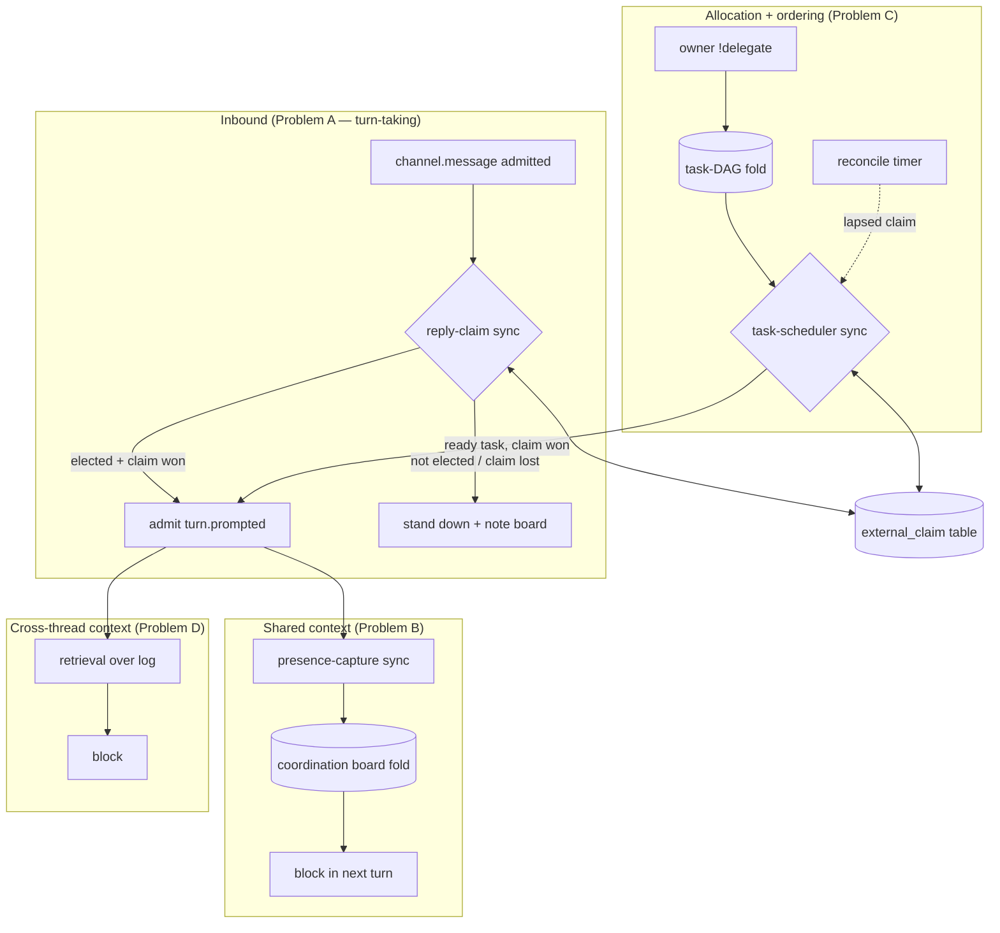
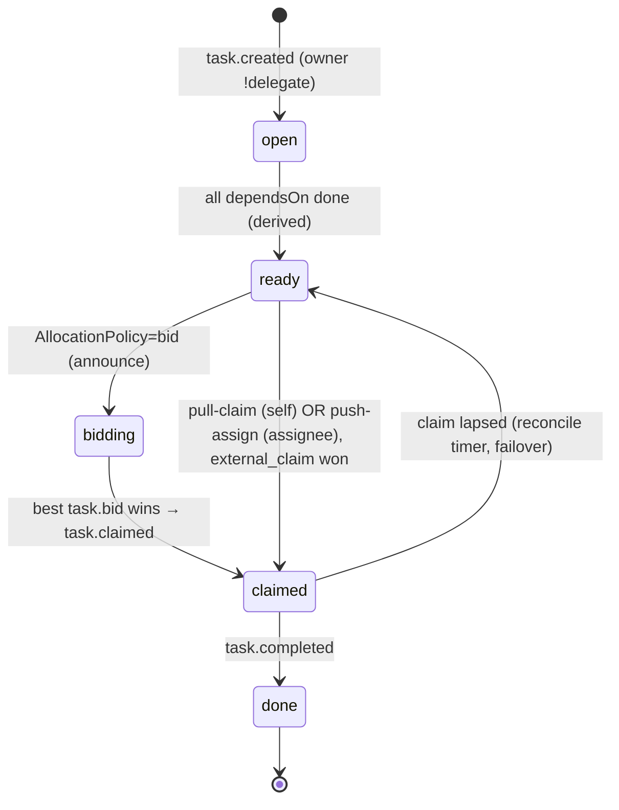
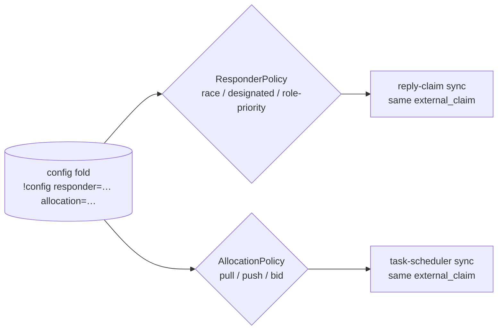

# feat: Ledger-native multi-agent coordination layer

## Summary

knock-knock removed its central server, so two or more agents — co-resident on
one machine or federated cross-machine over a shared Postgres ledger — now
coordinate purely through the append-only Interaction log. They don't. Each
`AgentHost` decides **independently** whether to reply, so two bots both answer
the same message ("Got it" twice); no agent can see what the others are doing or
what a thread is *about*; and a "set up 5 subagent tasks" request has no notion
of who-goes-first or who-next. This plan adds a **coordination layer** built
entirely from the substrate's existing primitives — `external_claim`,
deterministic `(role_rank, content_hash)` folds, the knowledge fold, and the
`resume-on-watch` election triad — adapting four established results from
distributed systems and multi-agent research:

1. **Optimistic claim + content-hash tiebreak** (CRDT / LWW-register) → exactly
   one agent replies, convergent across machines with no round-trip.
2. **`resume-on-watch` single-owner election** (the repo's own watches §7 triad)
   → conflict-free task allocation and failover.
3. **Deterministic fold as the convergence primitive** (event-sourcing total
   order) → a task board / delegation state that projects identically on every
   replica.
4. **Generative-Agents three-signal retrieval** (recency + lineage + overlap)
   → an agent pulls the related prior chat for its task instead of cold-knocking.

**Generality is a first-class goal, not an afterthought.** knock-knock is
multi-platform (Discord today; Slack/Telegram next, behind the `MessagingAdapter`
seam), multi-runtime (claude-sdk + every ACP agent), multi-user (many humans, each
running their own bots), and must support multiple **collaboration topologies** —
peer / co-equal, orchestrator–worker, pipeline/handoff, and contract-net bidding.
The decisive design move is to **separate mechanism from policy**: the primitives
above are the pattern-agnostic *mechanism*; *which* agent fields a message and
*how* tasks are allocated are pure **policies** (`ResponderPolicy`,
`AllocationPolicy`) selected per-room/per-thread through the existing `config`
fold. The same claim/fold/board/scheduler carries every pattern — switching
topology is a config value, never a rewrite. All platform specifics route through
the `MessagingAdapter` seam (`ref.id`, `mentionsBot`, `replyToMessageId`,
`Capabilities.mentions`); all runtime-facing capture keys on neutral ledger verbs
(`turn.*`/`tool.*`), never a specific agent's output shape.

It will **not** reintroduce a server/broker, change the Interaction record, edit
existing concepts (folds), or mutate config from chat.

---

## Problem Frame

The screenshot that motivated this is the canonical failure: a human says "I want
**bot002** to answer directly, other bots plz don't speak," and *both* bot002 and
bot101 reply ("Got it. I'll stay quiet" / "Got it — I'll only answer when you
address me directly"). Three distinct gaps produce the chaos, and they are
separable:

- **(A) No turn-taking / mutual exclusion.** The inbound gate
  (`src/agent-host.ts` `handleInbound`) is local and per-host. Each bot
  independently passes `guildSenderAllowed` / mention / rate-cap and admits its
  own `channel.message`, then `prompt-on-message` admits `turn.prompted`
  unconditionally once the loop-guard passes. There is **no "claim this message"
  step** anywhere. The `loop-guard` caps *consecutive agent turns* (depth) — it
  does nothing about *two agents answering one message* (breadth). The
  `targetAgent` hint only de-conflicts co-resident bots on a single message, not
  separately-addressed or cross-machine bots.
  **Important nuance** (`src/agent-host.ts:766`): `requireMention` defaults *on*,
  so the pure "broadcast, nobody mentioned" path rarely reaches the ledger. The
  acute real-world failure (the screenshot) is **two *eligible* bots — both
  @mentioned, both matching a name pattern, or with require-mention off — each
  replying.** The fix must arbitrate among *eligible* agents; the no-mention
  broadcast is a secondary case, not the headline.
- **(B) No shared task/awareness context.** Knowledge is read only at reply-time
  and there is no projection of "who is doing what right now" or "what is this
  thread about." Agents can't see each other's delegation state, so they
  re-derive it by knocking.
- **(C) No decentralized task allocation or ordering.** There is no primitive for
  "decompose into N tasks with dependencies; who claims each; what's ready next."
  The closest precedent — the watches §7 single-owner election — exists but is
  not generalized to tasks.
- **(D) No collaboration-topology abstraction.** Even if A–C were solved one way,
  the right *way* differs by team: some rooms want co-equal peers, some a single
  orchestrator that fields and assigns, some a sequential pipeline, some
  bid-for-work. With no policy seam, any one solution hard-codes a topology and
  fits only some users — across a multi-platform, multi-runtime, multi-user app.

**Hard constraint (the dominant design force):** cross-machine state propagates
**only via Postgres `LISTEN/NOTIFY`, which fires on `INSERT`, never `UPDATE`**
(`src/ledger/store-pg.ts:62-73`). Any coordination decision expressed as a
mutation of an existing row's lifecycle column works on one relay and silently
diverges across machines — the exact bug AOCM and watches already hit. Coordination
must be **INSERT-derived**: contend via `external_claim` (atomic row contention,
*not* NOTIFY-dependent) or carry losers in an immutable `supersedes` array and
re-derive locally (`apply-supersession` shape).

**Scope decision (confirmed with user):** all four problems are planned as one
cohesive layer, sequenced **A → B → C** with A (the acute pain) shippable first,
and **D (the mechanism/policy split) is built in from the start** so each pattern
— peer, orchestrator–worker, pipeline, bid — is a selectable policy, not a
separate build. Cross-machine coordination is a **Postgres-only** capability; on
SQLite (no shared store, no NOTIFY) coordination is same-machine only and degrades
to an in-process path. Deliverable is a research-grounded implementation plan.

---

## Requirements

| ID | Requirement |
|----|-------------|
| **R1** | When a human message does not explicitly address a specific agent, **exactly one** agent replies — no duplicate responses — including across machines on a shared Postgres ledger. |
| **R2** | When a human explicitly addresses specific agent(s), only those agents respond; unaddressed agents stand down structurally (not by NL request alone). |
| **R3** | The same agent served by multiple relays drives a given turn **exactly once** (no cross-relay double-drive). |
| **R4** | Agents share awareness of (a) what each other is currently doing and (b) what the thread/task is about (delegation state), delivered into each turn's prompt. |
| **R5** | A human can delegate a set of tasks with dependencies; the system tracks who owns what and which task is **ready next**, with no central scheduler. |
| **R6** | Task allocation is conflict-free and convergent — concurrent claims for one task resolve to a single owner **identically on every replica**. |
| **R7** | A stalled/failed task owner is detected and its task reassigned (failover) without a coordinator, even when no new event arrives. |
| **R8** | An agent can retrieve related prior chat from other threads/replies relevant to its current task, instead of starting cold. |
| **R9** | All coordination state crosses machines via INSERT-propagating interactions + `external_claim`; **never** via lifecycle UPDATE. It degrades safely to same-machine on SQLite. |
| **R10** | Allocation-affecting coordination commands are owner/terminal-authored; never chat-mutated by peers (prompt-injection invariant). |
| **R11** | Coordination is **platform-neutral**: addressing and message identity route through the `MessagingAdapter` seam (`ref.id`, `mentionsBot`, `replyToMessageId`, `Capabilities.mentions`) — no platform-specific syntax (e.g. raw `<@id>` parsing). It works on any current or future `Platform`. |
| **R12** | Collaboration topology is **policy, not hard-code**: the responder policy (`race` \| `designated` \| `role-priority`) and the allocation policy (`pull-claim` \| `push-assign` \| `bid`) are pure functions selected per-room/per-thread via the `config` fold. The claim/fold/board/scheduler mechanism is identical across all of them. |
| **R13** | Coordination is **runtime-agnostic**: all capture and decisions key on neutral ledger verbs (`turn.*` / `tool.*`), working across claude-sdk and every ACP runtime, with no dependency on a specific agent's output format. |

---

## High-Level Technical Design

### Component shape

The coordination layer is three new folds + four new synchronizations + pure
logic in `lib.ts`. Nothing imperative is added to the supervisor; behavior plugs
into the existing `Synchronizer`.



### Responder election + drive-once (the R1/R2/R3 core)

Two distinct exclusion concerns, both built on `external_claim`, resolved in one
pass:

```mermaid
sequenceDiagram
  participant H as Human msg
  participant RX as relay X (bot002)
  participant RY as relay Y (bot101)
  participant EC as external_claim (Postgres)
  Note over H,RY: each bot has its OWN gateway → Discord delivers separately;<br/>each host admits its own channel.message. Claims key on the<br/>shared Discord message id D (never the per-host interaction hash).
  H->>RX: deliver msg D → admit channel.message (stamps targetAgent=bot002)
  H->>RY: deliver msg D → admit channel.message (stamps targetAgent=bot101)
  alt each host: am I explicitly addressed?
    RX->>EC: addressed → acquire drive/<chan>/bot002/D (holder relayId)
    EC-->>RX: acquired → admit turn.prompted
    Note over RY: not addressed → stand down (R2)
  else eligible (mentioned-among-many, or broadcast)
    RX->>EC: acquire reply/<chan>/D (holder agentKey=bot002)
    RY->>EC: acquire reply/<chan>/D (holder agentKey=bot101)
    EC-->>RX: acquired (first writer wins)
    EC-->>RY: not acquired, currentHolder=bot002 → stand down (R1)
  end
```

Each bot runs its own platform gateway (its own token), so the human message is
delivered to each bot *separately* and each host admits its **own**
`channel.message` (stamping a distinct `targetAgent`, hence distinct interaction
hashes). The claim therefore keys on the **shared platform message id** `D`
(`IncomingMessage.ref.id`, identical on every host) — never the per-host
interaction hash. "Am I addressed" reads the seam (`mentionsBot` /
`replyToMessageId`, or — per `Capabilities.mentions` — `reply`/`text` on platforms
without native mentions), never raw `<@id>` text (R11). Each host answers a
*self-relative* question ("am I addressed / am I eligible"), which is all a single
relay can know (its `access.json` lists only its own bots). The **`ResponderPolicy`
decides the winner among eligible agents** (race / designated / role-priority);
`reply/<chan>/<D>` enforces it as one winner across agentKeys, and
`drive/<chan>/<agentKey>/<D>` ensures **which relay** drives that agent's turn
exactly once (mirrors `resume-on-watch`'s `watchfire/<hash>`). The claim's
atomicity comes from the Postgres row lock, not NOTIFY — correct cross-machine
(R9). On SQLite the same call is process-local, exactly right for same-machine.

### Task DAG lifecycle (Problem C)



`open→ready` and the "who's next" ordering are **derived purely** from the fold
(`readyTasks(board)` = open tasks whose deps are all `done`) — no scheduler owns
it, so every replica computes the same frontier. `ready→claimed` is where the
`AllocationPolicy` plugs in: `pull-claim` (any ready agent self-claims),
`push-assign` (only the task's `assignee` claims — orchestrator-worker), or `bid`
(eligible agents append `task.bid`, the highest deterministic bid claims —
contract-net). All three resolve through the *same* `external_claim` + tiebreak;
only the eligibility-to-claim differs. Failover is a periodic **reconcile timer**
(half-TTL), because a lapsed claim cannot rely on a new event to trigger
re-election (the watches §7 lesson).

### Collaboration patterns as policies (Problem D)

The same mechanism realizes every topology by choosing two pure policy values via
`!config` (`resolveConfigFor` projects room ⊕ thread):

| Pattern | `ResponderPolicy` | `AllocationPolicy` | What it feels like |
|---|---|---|---|
| **Peer / co-equal** (default) | `race` | `pull-claim` | Whoever grabs it first answers / works; fully decentralized. |
| **Orchestrator–worker** | `designated` (front-door agent) | `push-assign` (orchestrator sets `assignee`) | One lead fields the room and hands tasks to named workers. |
| **Pipeline / handoff** | `designated` or `role-priority` | `pull-claim` over a dependency chain | A→B→C unlocks in DAG order; each stage's owner picks up when ready. |
| **Contract-net / market** | `race` | `bid` | Agents bid a self-rated utility; best bid wins the task. |



Mechanism (`reply-claim`, `task-scheduler`, the folds) is identical across rows;
only the pure policy functions and the config values change.

### Algorithm selection (why these, from the research)

| Sub-problem | Chosen technique | Rejected alternative | Why |
|---|---|---|---|
| Exactly-one reply | Optimistic `external_claim` race + deterministic candidate resolution | Lamport / Ricart-Agrawala / Maekawa mutex | Classic mutex needs reliable FIFO channels and a reply-collect phase that blocks under replication lag; the claim is lock-free, round-trip-free, and already cross-machine-correct here. |
| Task allocation | Claim + content-hash tiebreak; readiness derived from DAG; pluggable pull / push / bid policy | Raft / central auctioneer | Raft needs a reachable majority quorum — incompatible with eventual consistency; a central auctioneer reintroduces the server we removed. Contract-net bidding is realized *as* a policy over the same claim, not a separate system. |
| Collaboration topology | Mechanism/policy split — pure `ResponderPolicy` + `AllocationPolicy` selected via the `config` fold | Hard-coding one pattern; a separate orchestration engine | One hard-coded topology fits only some of a multi-user/multi-platform base; a separate engine duplicates the claim/fold machinery. Policy-over-mechanism reuses the substrate and matches the repo's config-overlay model. |
| Convergent board state | Deterministic fold over immutable INSERTs `(role_rank, hash)` | OT / mutable hold-state | OT needs a central sequencer; mutable hold-state was rejected across three AOCM review rounds as unsound cross-machine. |
| Context retrieval | Three-signal heuristic (recency + thread/reply lineage + participant/tag overlap) | Full embedding index now | Log natively provides recency + lineage; embeddings are a layerable upgrade, deferred to keep v1 dependency-free. |

> Directional guidance for reviewers — diagrams convey the intended shape;
> per-unit specifics below are authoritative for implementation.

---

## Key Technical Decisions

- **KTD1 — Reuse `external_claim`, don't invent a lock.** Two holder idioms, both
  precedented: `relayId` holder for "which relay acts" (per `resume-on-watch` /
  `conflict-card`), `agentKey` holder for "which agent answers." Keys are
  computed deterministically from the **shared platform message id**
  (`IncomingMessage.ref.id`, and agentKey/relayId), never the per-host interaction
  hash — so every relay derives
  the same key.
- **KTD2 — INSERT-derived, never UPDATE.** Every coordination decision is a new
  immutable interaction; lifecycle changes (e.g. "task reassigned") are carried
  in a `supersedes` array and re-derived locally à la `apply-supersession`.
  NOTIFY fires on INSERT only.
- **KTD3 — Don't overload the loop-guard.** It is per-channel *depth/volume*
  control; mutual exclusion (breadth) is a separate `external_claim` race at
  prompt time. Externally-synthesized turns still *count* in the loop-guard fold
  (a known inflation; see Risks).
- **KTD4 — Responder election is a pluggable policy over one claim mechanism.**
  All policies resolve to "exactly one winner" via `external_claim`; they differ
  only in *who* the pure `ResponderPolicy` prefers before the claim: `race`
  (first-acquire wins — the peer default), `designated` (a config-named front-door
  agent always fields, orchestrator-worker), or `role-priority` (owner-bot >
  others, by role rank). Explicit address always narrows eligibility first (R2).
  The gate requires `prompt-on-message` to admit `turn.prompted` only when the
  claim is won (see U2) — the synchronizer fires every matching sync
  independently, so registration order alone cannot suppress it. Editing
  `prompt-on-message` (a *synchronization*) is consistent with KTD8's "zero edits
  to *concepts*" — concepts are the folds, which stay untouched.
- **KTD5 — The coordination board reuses the knowledge-fold conventions.** Its
  own fold keyed on a `coord:channel/<scopeId>` artifact (append-only, anchor
  `none` so the merge gate is a no-op, INSERT-only) — the same conventions as the
  knowledge fold, not the literal `know:` artifact. Delivered once-per-turn via a
  `pickFreshContext`-style selector → `<coordination>` injection. The SQLite
  channel-digest fallback runs **only in the single-relay case**; with separate
  SQLite stores on different machines there is no shared state, so coordination
  (and the digest) does **not** run — two relays posting unsynchronized digests
  would re-create the very duplicate-post bug this layer exists to fix.
- **KTD6 — Scheduler mirrors `resume-on-watch`; failover needs a timer.** A
  task-scheduler sync injects `turn.prompted` for a task's owner under a claim;
  lapsed-claim re-election runs on a periodic reconcile tick (half-TTL), since no
  event arrives when an owner dies. (Watches §7.)
- **KTD7 — Retrieval v1 is heuristic.** recency + `caused_by`/thread-reply lineage
  + participant/tag overlap, scored purely. Embedding-based relevance is deferred.
- **KTD8 — New behavior = new sync file + new fold; zero edits to concepts.** All
  decision logic lands in `src/lib.ts` (no I/O) with `tests/lib.test.ts` coverage;
  folds and syncs are thin shells registered in `src/relay.ts`. (CLAUDE.md rubric.)
- **KTD9 — Separate mechanism from policy (the generality keystone).** The
  primitives (claim, board/task folds, scheduler, INSERT-derived convergence) are
  the pattern-agnostic *mechanism*. The collaboration *topology* lives entirely in
  two pure seams in `lib.ts` — `ResponderPolicy` (who fields a message) and
  `AllocationPolicy` (`pull-claim` self-service / `push-assign` orchestrator /
  `bid` contract-net) — resolved per-room/per-thread through the existing two-layer
  `config` fold (`resolveConfigFor`). Switching peer↔orchestrator↔pipeline↔bid is
  a config value; the mechanism and tests for the mechanism are unchanged. This
  mirrors how `loopGuard`, presets, and channel config already work.
- **KTD10 — Platform neutrality via the `MessagingAdapter` seam (R11).** Claim
  keys use the neutral `ref.id`; "addressed to me" reads `mentionsBot` /
  `replyToMessageId` / `Capabilities.mentions` — never platform syntax. A platform
  without native mentions degrades to `reply`/`text` addressing automatically. No
  coordination code imports a platform SDK.
- **KTD11 — Runtime-neutral capture (R13).** Presence/board capture and policy
  decisions key on `turn.*`/`tool.*` verbs common to every `AgentAdapter`;
  agent-specific shapes (e.g. Claude-Code `TodoWrite`) are never required, so the
  layer behaves identically under claude-sdk and any ACP runtime.

---

## Alternatives Considered

- **Extend the loop-guard to dedupe first-responders.** Rejected: the loop-guard
  fold is keyed by channel and counts turns regardless of agent; a human message
  resets it to 0 for everyone, so it cannot suppress a first duplicate. Mutual
  exclusion is a different concern (KTD3).
- **A standing elected "channel leader" (Bully/Raft) that fields all messages.**
  Rejected as the *only* model: standing leadership needs failover detection for
  the leader itself and removes peer collaboration. But the *intent* is preserved
  as the `designated` responder policy — a config-named front-door agent, enforced
  per-message via the same claim, with no separate leader-election protocol.
- **Hard-coding one collaboration topology.** Rejected: a single baked-in pattern
  (whether peer-race or orchestrator) fits only part of a multi-user/multi-platform
  base. The mechanism/policy split (KTD9) makes topology a config choice instead.
- **A separate orchestration engine for task workflows.** Rejected: it would
  duplicate the claim/fold/scheduler machinery and add a second source of truth.
  Push-assign and bidding are realized as allocation policies over the one
  mechanism (KTD9).
- **Central in-process task queue (reintroduce a coordinator).** Rejected:
  violates the serverless constraint and would not cross machines without exactly
  the server we removed.
- **Embedding index for retrieval from day one.** Deferred, not rejected: adds a
  dependency and an index to maintain; the heuristic three-signal model is enough
  to prove the retrieval seam and is replaceable behind the same interface.

---

## Scope Boundaries

### In scope
Turn-taking exactly-once reply (A); shared coordination/awareness board (B);
task DAG allocation + ordering + failover (C); the mechanism/policy split with
**all** responder policies (`race` / `designated` / `role-priority`) and **all**
allocation policies (`pull-claim` / `push-assign` / `bid` contract-net) selected
via the `config` fold (D); platform-neutral routing through the `MessagingAdapter`
seam; runtime-neutral capture; heuristic cross-thread retrieval; cross-machine
correctness on Postgres with SQLite same-machine degrade; a property/skew battery;
pattern integration tests; a design doc.

### Deferred to follow-up work (planned, later PRs)
- **Agent-initiated task proposal** via a tool with owner confirmation (v1 seeds
  tasks via owner `!delegate` only, R10).
- **Capability-aware bid scoring** beyond a self-rated utility (e.g. learned cost
  models, Gerkey–Matarić ST-MR/MT-SR task classes); v1 bid is single-task /
  single-robot / instantaneous (ST-SR-IA).
- **Embedding-based relevance** for retrieval (KTD7).
- **Loop-guard fold exemption** for externally-synthesized coordination turns
  (the inflation noted in Risks) — shared with the existing watches follow-up.

### Out of scope
Changes to the Interaction record or content-addressing; edits to existing
concepts (folds); shipping a *new* platform adapter (Slack/Telegram) — the layer
is platform-*neutral* (R11) but Discord stays the only live surface here;
chat-mutable config/allocation; cross-machine coordination without a shared store
(impossible by construction).

---

## Output Structure

New files (all under `src/ledger/` + `src/`, mirroring existing layout):

```
src/
  lib.ts                                  # (modified) pure logic: eligibility, claim keys,
                                          #   ResponderPolicy (U13), AllocationPolicy (U14), bid scoring (U15)
  relay.ts                                # (modified) register folds + syncs + reconcile timer
  ledger/
    concepts/
      coordination-board.ts               # U4: board fold (awareness/delegation state)
      task-dag.ts                         # U7: task DAG fold (adds assignee for push)
    synchronizations/
      reply-claim.ts                      # U2: exactly-one-reply via ResponderPolicy; U3 adds board note
      capture-presence.ts                 # U5: derive "who's doing what" into the board (turn.* only in v1)
      deliver-coordination.ts             # U6: inject <coordination> block (+ SQLite fallback)
      task-scheduler.ts                   # U9: claim/assign ready tasks (pull|push|bid), wake owner, failover
      deliver-related-context.ts          # U10: inject <related-context> block
config/                                   # (no new dir — policies ride the existing config fold)
tests/
  lib.test.ts                             # (modified) pure-logic + policy-function scenarios (U13/U14/U15)
  ledger/
    coordination.test.ts                  # U1/U4/U7 fold + decision tests
    coordination-policies.test.ts         # U16: per-pattern integration (peer/orchestrator/pipeline/bid)
    coordination-cross-machine.test.ts    # U11: skew/convergence battery (policy-agnostic)
docs/
  knock-knock-coordination.md             # U12: design note (+ pattern matrix)
```

The tree is a scope declaration; per-unit `**Files:**` are authoritative.

---

## Implementation Units

### Phase 1 — Turn-taking: exactly one agent replies, via pluggable policy (R1, R2, R3, R11, R13)

#### U1. Pure eligibility + claim-key logic (platform-neutral)
- **Goal:** Decide, with no I/O and from a *single relay's* knowledge, whether
  this host's agent is eligible to reply, plus the deterministic claim keys — so
  every relay agrees without enumerating a global participant set, on **any**
  platform.
- **Requirements:** R1, R2, R3, R11.
- **Dependencies:** none.
- **Files:** `src/lib.ts`, `tests/lib.test.ts`.
- **Approach:** Add **self-relative, platform-neutral** pure functions (a relay
  only knows its own bots): `isAddressed(message, myBotId)` reading the seam's
  `mentionsBot` / `replyToMessageId` (and `Capabilities.mentions` to know whether
  `native`/`reply`/`text` addressing applies) — **never raw `<@id>` parsing**
  (R11, KTD10); `isEligibleToReply(message, cfg, myBotId)` (addressed, replied-to,
  pattern match, or — require-mention off — broadcast); `replyClaimKey(channel,
  msgId)` and `driveClaimKey(channel, agentKey, msgId)` built from the neutral
  **`IncomingMessage.ref.id`**, never the per-host interaction hash (which differs
  per host because each stamps a distinct `targetAgent`). Reuse `guildSenderAllowed`
  / `senderKind` / `isMentioned` semantics already in `lib.ts`.
- **Patterns to follow:** existing pure helpers in `src/lib.ts` (`loopGuard`,
  `resolveChannelForScope`, `isMentioned`); the seam fields in
  `src/messaging-adapter.ts` (`IncomingMessage`, `Capabilities.mentions`).
- **Test scenarios:**
  - Happy: `mentionsBot` true for bot002's host, false for bot101's → `isAddressed` matches. *Covers R2.*
  - Multiple eligible: both bots `mentionsBot` → both eligible (the common real case; winner decided by U13/U2). *Covers R1.*
  - Platform-neutral: a `Capabilities.mentions: 'reply'` platform → addressing resolved from `replyToMessageId`, not text; a `'text'` platform → name-pattern path. *Covers R11.*
  - Determinism: claim keys byte-identical across hosts given the same `ref.id`; assert they do **not** depend on interaction hash.
- **Verification:** `bun test tests/lib.test.ts` green; keys identical across simulated hosts; no platform SDK import in the new code.

#### U13. ResponderPolicy seam (race / designated / role-priority)
- **Goal:** Make "which eligible agent fields this message" a pure, config-selected
  policy — so peer, orchestrator-worker, and role-priority topologies share one
  mechanism (KTD9, R12).
- **Requirements:** R1, R2, R12.
- **Dependencies:** U1.
- **Files:** `src/lib.ts` (`ResponderPolicy`, `resolveResponderPolicy`,
  `preferredResponder`), `src/ledger/concepts/config.ts` *(no edit — reuse)*,
  `tests/lib.test.ts`.
- **Approach:** Define `type ResponderPolicy = 'race' | 'designated' | 'role-priority'`
  and a pure `preferredResponder(policy, self, board, roomCfg)` returning whether
  *this* agent should attempt the claim and at what precedence: `race` → all
  eligible attempt immediately (first-acquire wins); `designated` → only the
  config-named front-door agent attempts (others defer unless it is absent/expired
  on the board); `role-priority` → attempt ordered by role rank (owner-bot first),
  lower ranks defer briefly. Resolve the policy per-room/per-thread via the
  existing `config` fold (`resolveConfigFor(state, room, scope)`) — a new
  `responder` config key, owner-set through `!config` (terminal/owner only, R10).
  **Pure only; the claim itself stays in U2.**
- **Patterns to follow:** `resolveConfigFor` / `projectChannelConfig` /
  `resolveTwoLayerConfig` in `src/lib.ts`; `loopGuard` as the "pure decision a
  thin sync calls" precedent.
- **Test scenarios:**
  - Happy (race): all eligible agents attempt; policy adds no precedence.
  - Happy (designated): only the named front-door agent attempts; a non-designated eligible agent defers. *Covers orchestrator-worker.*
  - Edge (designated absent): front-door agent not present/active on the board → next eligible may attempt (no deadlock).
  - Happy (role-priority): owner-bot precedes a peer bot; equal rank falls back to race.
  - Config: `responder` resolves thread-over-room, default `race` when unset. *Covers R12.*
- **Verification:** policy is a pure function of (policy, self, board, cfg); switching policy changes only who attempts, not the claim mechanism.

#### U2. Reply-claim synchronization (policy-driven election + drive-once)
- **Goal:** Gate `turn.prompted` so the agent chosen by the room's `ResponderPolicy`
  replies — exactly one — and a given agent's turn is driven by exactly one relay.
- **Requirements:** R1, R2, R3, R9, R12.
- **Dependencies:** U1, U13.
- **Files:** `src/ledger/synchronizations/reply-claim.ts`,
  `src/ledger/synchronizations/prompt-on-message.ts` (**rewrite the trigger**),
  `src/relay.ts`, `tests/ledger/coordination.test.ts`.
- **Approach:** New `reply-claim` sync matching `channel.message` (human/owner
  role). On fire: resolve eligibility via U1; if not eligible, **stand down
  silently** (no admit, no board note — board annotation is U3 in Phase 2). If
  eligible, consult the resolved `ResponderPolicy` (U13): if `preferredResponder`
  says defer, stand down; if attempt, `acquireClaim(replyClaimKey, holder=agentKey,
  ttl)` — winner proceeds, loser stands down. (For an explicit single-address the
  policy is moot — a `driveClaimKey` holder=relayId still guarantees one relay
  drives.) On claim success, admit the gated turn. The policy decides *who tries*;
  the claim guarantees *one wins* regardless — so a `designated`/`race`/`role-priority`
  swap never weakens exactly-once.
  **Commit to the only viable gating shape:** the synchronizer fires *every*
  matching sync independently, so registration order cannot suppress
  `prompt-on-message`. Rewrite `prompt-on-message` so it no longer admits
  `turn.prompted` straight off `channel.message`; instead `reply-claim` admits a
  `turn.claimed` (or the winner directly emits `turn.prompted`) and
  `prompt-on-message` keys off that. This edits a *synchronization*, not a
  *concept* (KTD8 holds). Holder idioms per KTD1; never UPDATE (R9, KTD2).
- **Execution note:** Start with a failing cross-host test that two relays seeing
  the same message admit exactly one `turn.prompted`.
- **Patterns to follow:** `src/ledger/synchronizations/resume-on-watch.ts`
  (`watchfire/<hash>` claim → admit `turn.prompted`); `withClaim` /
  `acquireClaim` in `src/ledger/artifacts/external.ts`; `src/ledger/sync.ts`
  dispatch (`onInsert` fires all matchers).
- **Test scenarios:**
  - Happy (race, two eligible bots, two relays): both fire; exactly one `turn.prompted` admitted; the other stands down silently. *Covers R1.*
  - Happy (designated): with `responder=designated`, only the front-door agent admits even when others are eligible. *Covers R12.*
  - Happy (explicit single address): only the addressed agent admits; addressed agent driven once even with two relays serving it. *Covers R2, R3.*
  - Regression: `prompt-on-message` no longer admits `turn.prompted` on an un-claimed `channel.message` (the rewrite holds).
  - Edge: claim TTL expires before the winner drives → does not silently double-drive (TTL > expected drive start; documented).
  - Error: `acquireClaim` returns `acquired:false` with a stale `currentHolder` → loser stands down, no throw, wave not crashed.
  - Integration: end-to-end the screenshot scenario — one "Got it," not two.
  - Cross-machine: simulated NOTIFY skew still yields one winner (claim is row-lock atomic, not NOTIFY-dependent). *Covers R9.*
- **Verification:** screenshot scenario produces a single reply; `tests/ledger/coordination.test.ts` green.

### Phase 2 — Shared coordination context (R4)

#### U4. Coordination-board fold
- **Goal:** A per-scope projection of "who is doing what" and the delegation state.
- **Requirements:** R4, R6.
- **Dependencies:** none (board substrate for U3/U5/U6).
- **Files:** `src/ledger/concepts/coordination-board.ts`, `src/lib.ts` (pure
  projection), `src/relay.ts` (register fold), `tests/ledger/coordination.test.ts`.
- **Approach:** Fold keyed on `coord:channel/<scopeId>` artifacts, stepping on
  `coord.*` append interactions (presence, designation, task-status echoes).
  Projection `projectCoordinationBoard(state, scopeId)` is pure in `lib.ts` and
  derives the live board with the deterministic `(role_rank, hash)` order (KTD2);
  ride the knowledge-fold substrate conventions (anchor `none`, INSERT-only).
- **Patterns to follow:** `src/ledger/artifacts/knowledge.ts` (`activeNotes`,
  append-only, anchor `none`); `src/ledger/concepts/loop-guard.ts` (fold shell
  delegating to a pure `lib.ts` fn).
- **Test scenarios:**
  - Happy: appends from two agents project a board listing both activities.
  - Edge: concurrent appends converge to identical board on reordered replay (determinism). *Covers R6.*
  - Edge: empty board → safe default, no throw.
- **Verification:** projection deterministic under shuffled input; `bun test` green.

#### U3. Responder designation on the board
- **Goal:** Make the U2 election outcome visible to peers so they don't re-knock —
  the structural backstop for the NL "others don't speak" directive bots ignore
  today. *(Moved to Phase 2: it consumes the U4 board, so Phase 1 = U1+U2 ships
  standalone without it.)*
- **Requirements:** R4.
- **Dependencies:** U2, U4.
- **Files:** `src/ledger/synchronizations/reply-claim.ts` (extend the winner path),
  `tests/ledger/coordination.test.ts`.
- **Approach:** When `reply-claim`'s winner is decided, append a `coord` note
  "agent X is responding to <msg>" to `coord:channel/<scopeId>` so the
  `<coordination>` block (U6) tells bot101 that bot002 has it. Losers still stand
  down silently in U2; this note is additive awareness, INSERT-only (R9).
- **Test scenarios:**
  - Happy: after election, the board shows exactly one active responder for the message.
  - Edge: the note carries the winner's id so a peer's next turn prompt can defer.
  - Test expectation: assert on board projection, not on Discord.
- **Verification:** board projection lists one responder; a peer turn prompt would include it.

#### U5. Presence/activity capture
- **Goal:** Populate the board automatically from turn lifecycle so cross-task
  awareness (needed by C) is free, not manual.
- **Requirements:** R4.
- **Dependencies:** U4.
- **Files:** `src/ledger/synchronizations/capture-presence.ts`, `src/relay.ts`,
  `tests/ledger/coordination.test.ts`.
- **Approach:** **v1 scope: sync on `turn.prompted` / `turn.replied` only** →
  append a `coord` note "agent X started/finished <short label>" to
  `coord:channel/<scopeId>`. Derive the label from the turn's prompt envelope;
  keep it short. INSERT-only (R9). **`tool.*`-granularity presence is an explicit
  deferred follow-up** — start coarse and revisit only if awareness proves too
  blunt (see Open Questions).
- **Patterns to follow:** the relay-level Workbench subscriber on `turn.*`
  (`host/workbench.ts`) that resolves the turn and updates per-scope UI — mirror
  its turn-resolution, write to the fold instead of Discord.
- **Test scenarios:**
  - Happy: a driven turn produces a "started" then "finished" board entry.
  - Edge: a stopped/failed turn marks the activity ended (no dangling "working").
  - Integration: board reflects two agents working in the same scope without collision.
- **Verification:** board tracks live activity across a turn lifecycle.

#### U6. Coordination delivery into turns
- **Goal:** Inject the board into each turn's prompt once, so agents start aware.
- **Requirements:** R4, R9.
- **Dependencies:** U4.
- **Files:** `src/ledger/synchronizations/deliver-coordination.ts` or
  `src/driver.ts` (prompt assembly), `src/lib.ts` (`pickFreshCoordination`,
  `wrapCoordination`), `tests/lib.test.ts`.
- **Approach:** Mirror session-sharing's delivery: a pure `pickFreshCoordination`
  (once-only selector, like `pickFreshContext`, deduping by note hash against a
  `delivered` set). **The `delivered` set lives where the per-scope context
  delivery state already lives** (the host's `SessionSharing`/Driver injection
  path, same lifetime as the turn loop) — not a fresh per-call set. A
  `<coordination>` wrapper is prepended in `Driver.buildPrompt` ahead of
  `<channel>`. **The SQLite channel-digest fallback runs only in the single-relay
  case** (one process, claims serialize, no duplicate post); with separate SQLite
  stores across machines there is no shared state, so coordination does not run
  and no digest is posted (KTD5) — posting unsynchronized digests would re-create
  the duplicate-post bug.
- **Patterns to follow:** `pickFreshContext` / `wrapSharedContext` in `src/lib.ts`;
  `Driver.buildPrompt` injection (`src/driver.ts`); the `delivered`-set ownership
  in `host/session-sharing.ts`.
- **Test scenarios:**
  - Happy: next turn's prompt contains a `<coordination>` block listing peer activity.
  - Edge: a board note is delivered exactly once across consecutive turns (not re-injected). *Covers R4.*
  - Edge (single-relay SQLite): fallback posts one digest; (separate-store SQLite): nothing posted, no duplicate. *Covers R9.*
  - Test expectation: assert on assembled prompt string + once-only flag.
- **Verification:** prompt contains the block once; SQLite fallback never double-posts.

### Phase 3 — Task allocation + ordering, via pluggable policy (R5, R6, R7, R12)

#### U7. Task-DAG model and fold
- **Goal:** Represent a delegated task set with dependencies and derive the ready
  frontier purely.
- **Requirements:** R5, R6.
- **Dependencies:** none (model layer).
- **Files:** `src/ledger/concepts/task-dag.ts`, `src/lib.ts` (`readyTasks`,
  `ownerOf`, `projectTaskDag`), `src/relay.ts`, `tests/lib.test.ts`,
  `tests/ledger/coordination.test.ts`.
- **Approach:** Fold on `task.created` / `task.claimed` / `task.completed`
  (and `task.bid`, see U15) interactions keyed `task:channel/<scopeId>`. A task =
  `{id, label, dependsOn[], status, assignee?, owner?}` — **`assignee` is the
  push-target** (set at creation for orchestrator-worker / `push-assign`), `owner`
  is who actually claimed it. **Separate the two kinds of status the fold tracks:**
  *op-derived status* (`open` / `ready` / `done`) is a pure deterministic function
  of the immutable op set — `readyTasks(board)` = `open` tasks whose `dependsOn`
  are all `done` (the "who's next" ordering, KTD6) — and **this** is what the
  determinism test asserts. *Claim-derived liveness* (claimed-vs-lapsed) depends
  on `external_claim` expiry, which is **not** in the ledger and does **not**
  cross NOTIFY, so it is *eventual* (bounded by the reconcile interval), not
  instantaneously convergent — keep it out of the deterministic projection
  (U9/reconcile owns it). Reassignment carried via `supersedes` (KTD2), never
  UPDATE. Cycles cannot occur because U8 rejects them at parse time.
- **Patterns to follow:** `src/ledger/artifacts/versionable.ts` (deterministic
  derivation from immutable ops); `src/ledger/concepts/watch.ts` (fold of intents).
- **Test scenarios:**
  - Happy: linear chain A→B→C → only A ready initially; B ready after A done.
  - Edge: diamond DAG (A→{B,C}→D) → B,C ready together; D only after both.
  - Determinism: op-derived status (`readyTasks`) identical under shuffled op replay; the test asserts on the post-reconcile steady state, **excluding** the transient claimed/ready window. *Covers R6.*
- **Verification:** ready-frontier matches DAG semantics; op-derived projection deterministic under shuffle.

#### U8. Owner delegation command (open or assigned tasks)
- **Goal:** Seed the task DAG from an owner instruction, prompt-injection-safe,
  supporting both pull (open) and push (assigned) tasks.
- **Requirements:** R5, R10, R12.
- **Dependencies:** U7.
- **Files:** `src/agent-host.ts` (`handleInbound` short-circuit), `src/lib.ts`
  (`parseDelegateCommand`), `tests/lib.test.ts`.
- **Approach:** `!delegate` owner command short-circuits in `handleInbound`
  **before any admit** (the `!watch`/`!config` pattern), parses a task spec
  (labels + `dependsOn` + optional `@agent` **assignee** per task), and admits
  `task.created` interactions carrying `assignee?`. An assignee makes the task a
  push target (orchestrator-worker); omitting it leaves the task open for
  pull-claim or bid. `parseDelegateCommand` **rejects a dependency cycle at parse
  time** (DFS over `dependsOn`). Never admitted as a peer `channel.message` (R10).
  Agent-proposed tasks are deferred (follow-up).
- **Patterns to follow:** owner control-command short-circuits in
  `src/agent-host.ts:780-829`; `parseShareCommand` in `src/lib.ts`.
- **Test scenarios:**
  - Happy (pull): `!delegate` with 3 open tasks + deps → 3 `task.created`, no assignee.
  - Happy (push): `!delegate "review" @bot002` → `task.created` with `assignee=bot002`. *Covers R12.*
  - Edge: malformed spec → rejected with a help message, nothing admitted.
  - Edge: a `dependsOn` cycle (A↔B) → rejected at parse time, nothing admitted.
  - Security: a peer (non-owner) issuing `!delegate` is ignored (owner-gated). *Covers R10.*
- **Verification:** owner seeds open and assigned tasks; cycles and non-owners are rejected.

#### U14. AllocationPolicy seam (pull-claim / push-assign / bid)
- **Goal:** Make "how a ready task is taken" a pure, config-selected policy so
  pull, push, and bid share one scheduler mechanism (KTD9, R12).
- **Requirements:** R5, R12.
- **Dependencies:** U7.
- **Files:** `src/lib.ts` (`AllocationPolicy`, `resolveAllocationPolicy`,
  `claimantFor`), `tests/lib.test.ts`.
- **Approach:** Define `type AllocationPolicy = 'pull-claim' | 'push-assign' | 'bid'`
  and a pure `claimantFor(policy, task, self, board, bids?)` returning whether
  *this* agent may attempt the claim for a ready task: `pull-claim` → any eligible
  agent may; `push-assign` → only `task.assignee` may (others never attempt);
  `bid` → only the winning bidder may (decided by U15's pure tiebreak). Resolved
  per-room/per-thread via the `config` fold (a new `allocation` key, owner-set via
  `!config`, R10). **Pure only;** the claim/wake/failover stay in U9.
- **Patterns to follow:** `resolveConfigFor` in `src/lib.ts`; U13 as the sibling
  policy-seam shape.
- **Test scenarios:**
  - Happy (pull): all eligible agents may attempt.
  - Happy (push): only the assignee may attempt; a non-assignee never does. *Covers orchestrator-worker.*
  - Happy (bid): only the computed bid winner may attempt.
  - Edge (push, assignee absent): no claimant → task stays ready, surfaced for reassignment (no silent drop).
  - Config: `allocation` resolves thread-over-room, default `pull-claim` when unset. *Covers R12.*
- **Verification:** pure function of (policy, task, self, board, bids); switching policy changes only who may claim, not the mechanism.

#### U9. Task scheduler — claim/assign, wake, failover
- **Goal:** Allocate ready tasks to single owners under the room's
  `AllocationPolicy`, wake them, and reassign on failure — no central scheduler.
- **Requirements:** R5, R6, R7, R9, R12.
- **Dependencies:** U7, U8, U14.
- **Files:** `src/ledger/synchronizations/task-scheduler.ts`, `src/relay.ts`
  (register + start a reconcile timer), `src/lib.ts` (`electTaskClaimant` tiebreak),
  `tests/ledger/coordination.test.ts`, `tests/ledger/coordination-cross-machine.test.ts`.
- **Approach:** Sync on `task.created` / `task.completed` / `task.bid` (frontier
  may have changed): for each ready task, consult the resolved `AllocationPolicy`
  (U14) — `claimantFor` decides whether *this* agent may attempt (`pull-claim`: any
  eligible; `push-assign`: only `assignee`; `bid`: only the bid winner). If yes,
  `acquireClaim(task:channel/<scope>/<taskId>, holder=agentKey, ttl)`; winner
  admits `task.claimed` + a `turn.prompted` for itself (legitimately bypassing
  loop-guard *decision*, like `resume-on-watch`). All three policies funnel through
  the **same** claim, so exactly-one-owner (R6) holds regardless of policy.
  Concurrent claims resolve by Postgres row lock; `electTaskClaimant` tiebreaks on
  `(role_rank, content_hash)`. A **periodic reconcile timer** (half-TTL) re-checks ready/claimed tasks so a
  lapsed claim is re-taken even with no new event (R7, KTD6). Implement the timer
  as a **closure started in `relay.ts`** (claim-gated per scope so one relay
  reconciles), *not* a new `WatchSupervisor`-style class — it spawns no child
  process. **Crucially, renewal must track turn progress, not relay liveness:** a
  bare `setInterval` renews the claim even while the owning turn is hung, so
  failover would only fire on relay *crash*, never on turn *stall*. Tie renewal to
  the Driver's active-turn handle — renew only while the turn is genuinely
  in-flight and advancing — so a stalled (not crashed) owner's claim lapses and
  the task reassigns (R7).
- **Execution note:** Two failing tests first — (a) owner relay crashes, claim
  lapses, standby re-claims on the reconcile tick; (b) owner turn *stalls* (relay
  alive, turn not advancing), renewal stops, claim lapses, standby re-claims.
- **Patterns to follow:** `src/ledger/synchronizations/resume-on-watch.ts`
  (claim→`turn.prompted`); `src/watch-supervisor.ts` for the half-TTL renewal /
  reconcile *mechanism* and the turn-handle liveness binding (adapt the
  renewal-tied-to-live-work idea; do **not** copy its class shape — no child
  process here); `relay.ts:340` `relayId` + timer start.
- **Test scenarios:**
  - Happy (pull): single ready open task → one eligible agent claims → `turn.prompted` for it only.
  - Happy (push): `assignee=bot002` → only bot002 claims even if others are ready; a non-assignee never claims. *Covers R12.*
  - Happy (ordering): chain A→B → B is not claimable until A `done`; then claimed. *Covers R5.*
  - Edge (concurrency): two agents race one open task → exactly one `task.claimed`; the other sees the holder. *Covers R6.*
  - Failover (crash): owner relay dies → claim lapses → reconcile tick reassigns to a standby. *Covers R7.*
  - Failover (stall): owner relay alive but turn not advancing → renewal stops → claim lapses → reassigned. *Covers R7.*
  - Cross-machine: reassignment carried via `supersedes`/INSERT crosses NOTIFY; both machines agree on the owner. *Covers R9.*
  - Edge: reconcile tick with no lapsed claims is a no-op (idempotent, no spurious wakes).
- **Verification:** DAG drains in dependency order; concurrent claims yield one owner; both crash and stall failover reassign.

#### U15. Contract-net bid round (AllocationPolicy = bid)
- **Goal:** When the room uses `allocation=bid`, let eligible agents bid a
  self-rated utility for a ready task and have the best bid claim it — the FIPA
  Contract-Net / Gerkey–Matarić market pattern, realized over the same claim.
- **Requirements:** R5, R6, R12.
- **Dependencies:** U7, U9, U14.
- **Files:** `src/ledger/synchronizations/task-scheduler.ts` (bid branch),
  `src/lib.ts` (`scoreBid`, `winningBid`), `tests/ledger/coordination.test.ts`.
- **Approach:** On a ready task under `bid`, each eligible agent admits a
  `task.bid` interaction carrying a self-rated utility (a number from a pure
  `scoreBid(task, self, board)` — v1 ST-SR-IA: single number, no learned model).
  After a short bid window (or once all known-eligible agents have bid), the pure
  `winningBid(bids)` picks the highest utility, tiebroken deterministically by
  `(role_rank, content_hash)` so every replica agrees with no round-trip. The
  winner is the only `claimantFor` (U14), so it claims via the **same**
  `external_claim` and the scheduler wakes it exactly as for pull/push. Bids are
  INSERT-only and converge cross-machine (R9); the window is a soft timer, and a
  no-bid task falls back to `pull-claim` so it is never stranded.
- **Patterns to follow:** the optimistic-claim + content-hash tiebreak (Sources:
  CRDT / FIPA CNP); U9's claim+wake mechanism (unchanged); U14's `claimantFor`.
- **Test scenarios:**
  - Happy: 3 agents bid different utilities → highest claims; others stand down. *Covers R5.*
  - Edge (tie): equal top utility → deterministic `(role_rank, hash)` winner, identical on every replica. *Covers R6.*
  - Edge (no bids in window): task falls back to `pull-claim`, not stranded.
  - Cross-machine: bids are INSERTs; both stores compute the same winner under skewed delivery. *Covers R9.*
- **Verification:** bid winner claims via the shared mechanism; tie is deterministic; no-bid falls back.

### Phase 4 — Cross-thread retrieval (R8)

#### U10. Heuristic related-context retrieval
- **Goal:** Pull the related prior chat for an agent's current task from other
  threads/replies.
- **Requirements:** R8.
- **Dependencies:** none (delivery seam parallels U6).
- **Files:** `src/lib.ts` (`scoreRelatedInteractions`, `selectRelatedContext`),
  `src/ledger/synchronizations/deliver-related-context.ts` or `src/driver.ts`,
  `tests/lib.test.ts`.
- **Approach:** Pure three-signal scorer over the interaction log: **recency**
  (insertion order / decay), **lineage** (`caused_by` chain + thread-reply parent),
  **overlap** (participant + tag/keyword). **Bound the candidate input before
  scoring** — `selectRelatedContext` must take a pre-filtered candidate set, not
  the full store: apply a lookback window (last N interactions and/or last D days,
  optionally participant-overlap pre-filter) so the scan is O(window), not O(full
  log). Without an input bound, "top-k output" still implies a full-log scan every
  turn — unacceptable latency on a long-running deployment. Returns top-k;
  delivered as a `<related-context>` block in `buildPrompt` (once-only, like U6).
  Embedding relevance deferred (KTD7) behind the same `scoreRelatedInteractions`
  seam.
- **Patterns to follow:** `sessions/distill.ts` (distilling a transcript to a
  brief); `pickFreshContext` delivery; Generative-Agents recency/importance/
  relevance weighting (Sources).
- **Test scenarios:**
  - Happy: a task referencing a topic discussed in a sibling thread surfaces that thread's messages in top-k. *Covers R8.*
  - Edge: no related chat → empty block, no throw, no padding.
  - Edge: scorer is deterministic; output top-k respected AND input scan stays within the lookback window on a large log.
  - Edge: lineage weight ranks a direct `caused_by` ancestor above a keyword-only match.
- **Verification:** relevant prior chat appears; irrelevant chat does not; scan is window-bounded.

### Phase 5 — Cross-machine correctness, pattern coverage + docs (R6, R9, R11, R12)

#### U11. Cross-machine property/skew test battery
- **Goal:** Prove convergence, exactly-once, and failover under replication skew —
  the ship gate — and that it holds **regardless of which policy** is selected.
- **Requirements:** R1, R3, R6, R7, R9, R12.
- **Dependencies:** U2, U7, U9, U15.
- **Files:** `tests/ledger/coordination-cross-machine.test.ts`.
- **Approach:** Extend the existing two-store harness (`tests/ledger/cross-machine.test.ts`,
  `tests/ledger/aocm.test.ts`) with: a separate-store skew fuzz (interleave/reorder
  NOTIFY delivery) asserting exactly one reply-winner and one task-owner **for each
  responder and allocation policy**; a determinism check that board + ready-frontier
  + bid-winner project identically on both stores from the same op set; a failover
  check across stores; a "claim is row-lock atomic, not NOTIFY-dependent" assertion.
- **Patterns to follow:** `tests/ledger/aocm.test.ts` (AE corpus + separate-store
  skew fuzz + role-blind teeth check).
- **Test scenarios:**
  - Two stores, skewed delivery → one reply-winner, one task-owner, under each policy combo. *Covers R12.*
  - Reordered op replay → identical board + frontier + bid-winner on both stores. *Covers R6.*
  - Owner-store crash mid-task → other store reassigns on reconcile. *Covers R7.*
  - SQLite single-store path → same outcomes via process-local claim. *Covers R9.*
- **Verification:** battery green; no divergence across the fuzz seeds or policies.

#### U16. Per-pattern integration tests
- **Goal:** Prove each collaboration topology works end-to-end as a config choice
  over the one mechanism (R12) — the evidence the generalization holds.
- **Requirements:** R12, R11, R13.
- **Dependencies:** U2, U9, U13, U14, U15.
- **Files:** `tests/ledger/coordination-policies.test.ts`.
- **Approach:** Drive each pattern through the real syncs by setting only config:
  **peer** (`race`+`pull-claim`) → first-come reply + self-claim; **orchestrator-worker**
  (`designated`+`push-assign`) → front-door fields, assigns to named workers;
  **pipeline** (`designated`/`role-priority` + `pull-claim` over a dependency chain)
  → A→B→C unlocks in order; **contract-net** (`race`+`bid`) → best bid wins. Assert
  the mechanism code path is identical (same syncs fire) and a fake non-native-mention
  `Capabilities` still resolves addressing (R11) and a non-Claude runtime's `turn.*`
  still drives capture (R13).
- **Patterns to follow:** `tests/ledger/coordination.test.ts` harness; config-fold
  setup via `resolveConfigFor`.
- **Test scenarios:**
  - Each of the four patterns reaches the correct end state from the same code, switched only by `!config`. *Covers R12.*
  - Addressing resolves on a simulated `Capabilities.mentions: 'reply'` platform. *Covers R11.*
  - Capture + scheduling work with a non-Claude `turn.*` stream (no `TodoWrite`). *Covers R13.*
- **Verification:** all four patterns pass; no pattern requires a mechanism edit.

#### U12. Design note
- **Goal:** Record the coordination model + pattern matrix in the repo's design-note
  house style.
- **Requirements:** documentation.
- **Dependencies:** U1–U11, U13–U16.
- **Files:** `docs/knock-knock-coordination.md`, `CLAUDE.md` (one-line pointer in
  the synchronizations/concepts sections).
- **Approach:** Document the four problems, the **mechanism/policy split + the
  pattern→policy matrix**, the claim idioms, the INSERT-derived invariant, the DAG
  lifecycle, the retrieval signals, platform/runtime neutrality, and the SQLite vs
  Postgres reach — using the "Shipping in the skeleton / Designed, not yet shipped"
  convention of `docs/knock-knock-watches.md`.
- **Test expectation:** none — documentation.
- **Verification:** doc renders; cross-links resolve; CLAUDE.md updated.

---

## Risks & Mitigations

- **Loop-guard count inflation.** Scheduler/reply-synthesized `turn.prompted`
  bypass the loop-guard *decision* but still increment its fold counter
  (the watches §5 interaction). *Mitigation:* document; the deferred "loop-guard
  fold exempts externally-triggered turns" follow-up covers it; choose TTLs so
  normal flow stays well under `maxConsecutive`.
- **Claim TTL vs drive latency.** If a reply/task claim TTL expires before the
  winner starts driving, a second relay could re-take it and double-act.
  *Mitigation:* TTL > observed drive-start latency (30–60s precedent); winner
  renews at half-TTL for long tasks (watches §7).
- **Policy config divergence across machines.** Each relay reads its own
  `access.json`/config; if two machines resolve different `responder`/`allocation`
  values for the same room, they could both attempt (or both defer). *Mitigation:*
  exactly-one still holds because the **claim** is the backstop under every policy
  (a divergence at worst degrades to `race`, never to duplicate or zero replies);
  the cross-machine battery (U11) asserts this under mixed-policy skew. Treat
  config convergence as best-effort, claim as authoritative.
- **`designated` front-door is a single point.** If the named responder is absent
  or stalls, the room could go quiet. *Mitigation:* the policy yields to the next
  eligible agent when the designate is absent/expired on the board (U13 edge case),
  so it degrades to `race` rather than silence.
- **Bid-window latency.** The `bid` policy adds a short collection window before a
  claim. *Mitigation:* window is soft and bounded; a no-bid task falls back to
  `pull-claim` (U15), so bidding never strands a task or blocks the pull/push paths.
- **NOTIFY gap during listener disconnect.** A missed NOTIFY heals only on the
  peer's next restart-replay. *Mitigation:* claims are row-lock atomic (not
  NOTIFY-gated) so exactly-once survives the gap; the reconcile timer re-derives
  frontier independently of event arrival.
- **Stalled (not crashed) task owner.** A bare renewal timer renews the claim
  while the owning turn hangs, so failover would never fire on a stall.
  *Mitigation:* renewal is tied to the Driver turn-progress handle, not relay
  liveness (U9) — a stalled turn stops renewing and the claim lapses.
- **SQLite cross-machine illusion.** Two SQLite relays on different machines share
  nothing; a user may expect coordination. *Mitigation:* document Postgres-only
  reach loudly (U12); the SQLite channel-digest fallback runs **only single-relay**
  (U6/KTD5) — separate-store SQLite posts nothing, so the illusion never manifests
  as duplicate posts.
- **Board/retrieval prompt bloat.** Injecting coordination + related-context every
  turn can crowd the window. *Mitigation:* once-only delivery (U6/U10), top-k
  bounds, short labels.

---

## Cross-Machine & Operational Notes

- All new state is INSERT-only; the only cross-machine "mutation" semantics ride
  `supersedes` re-derivation (`apply-supersession` shape). No new NOTIFY channel.
- `external_claim` is the only coordination lock — cluster-wide atomic on
  Postgres, process-local on SQLite. No new table beyond what `external_claim`
  already provides.
- One new periodic timer (the task reconcile tick) starts in `src/relay.ts`
  alongside `WatchSupervisor`; it is claim-gated so only one relay reconciles per
  scope, and is a no-op when idle.
- Collaboration policies are set **per room/thread via `!config`** (owner/terminal
  only, R10) using the existing two-layer `config` fold — no new config store. The
  defaults (`responder=race`, `allocation=pull-claim`) reproduce today's intent, so
  rooms that set nothing behave as decentralized peers.
- `KNOCK_KNOCK_DEBUG=1` should log claim acquire/lose, resolved policy, and election
  outcomes (extend the existing debug surface).

---

## Open Questions

- **Resolved — how the reply-claim gates the prompt.** Registration order cannot
  suppress `prompt-on-message` (the synchronizer fires all matchers). U2 therefore
  rewrites `prompt-on-message` to admit `turn.prompted` only off a claim-gated
  `turn.claimed` (or the winner emits `turn.prompted` directly), rather than off
  the raw `channel.message`. The remaining execution-time micro-choice (emit
  `turn.claimed` vs. emit `turn.prompted` directly) is a smallest-diff call; both
  satisfy R1–R3.
- **Task label/decomposition source.** v1 takes labels verbatim from `!delegate`.
  Whether a lead agent should be allowed to *propose* decomposition (owner-confirmed)
  is a product question deferred to follow-up.
- **Presence granularity.** Whether `tool.*` events (not just `turn.*`) should feed
  the board is a tuning call; start with `turn.*` only (U5) and revisit if
  awareness is too coarse.
- **Default policy per room shape.** `race`+`pull-claim` is the global default;
  whether the setup wizard should *suggest* `designated`+`push-assign` when a room
  has an obvious lead bot is a UX question for setup, not a blocker here.
- **Bid window length.** The `bid` collection window (U15) trades latency for
  participation; the exact duration (and whether to close early once all
  known-eligible agents have bid) is an execution-time tuning detail.

---

## Sources & Research

External research was load-bearing — it selected the four core techniques and
ruled out classic mutex/consensus as ill-fitting the substrate.

- Shapiro et al. 2011, *A Comprehensive Study of CRDTs* — optimistic claim +
  content-hash tiebreak (R1/R6 core). https://hal.inria.fr/inria-00555588
- Bonabeau et al. 1999, *Evolution of Division of Labour* (stigmergy/threshold) —
  self-selection allocation backing C. https://www.sciencedirect.com/science/article/pii/S0003347299913898
- FIPA Contract Net Protocol 2002; Gerkey & Matarić 2004, *MRTA Taxonomy* —
  the `bid` allocation policy (U15); v1 is the ST-SR-IA class.
  https://www.fipa.org/specs/fipa00029/ · https://journals.sagepub.com/doi/10.1177/0278364904045563
- Helland 2015, *Immutability Changes Everything* — deterministic fold as the
  convergence primitive (KTD2). https://queue.acm.org/detail.cfm?id=2884038
- Park et al. 2023, *Generative Agents* — recency/importance/relevance retrieval
  (U10). https://arxiv.org/abs/2304.03442
- Ongaro & Ousterhout 2014, *Raft*; Lamport 1978; Ricart-Agrawala 1981; Maekawa
  1985 — consensus/mutex alternatives evaluated and rejected for the EC log.
- Internal: `docs/authority-ordered-convergent-merge.md`,
  `docs/knock-knock-watches.md` (§7 election triad), `docs/session-sharing.md`,
  `docs/knock-knock-ledger-model.md`, and the `apply-supersession` /
  `external_claim` implementations — the substrate this layer reuses.
