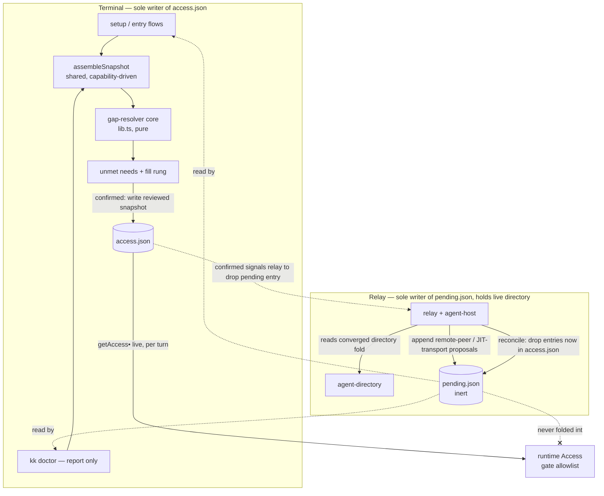

# feat: Auto-configuring onboarding via a single gap-resolver

## Summary

Replace the linear setup wizard with one **gap-resolver**: it knows the complete-config target for a `(bot, channel)` pairing, computes the unmet needs from combined on-disk and live state, and fills each by the cheapest legal rung — auto-derive, pick from a discovered list, or guided manual entry. First-run setup, add-channel, add-bot, cross-machine join, and a new `kk doctor` all invoke the same core, differing only in starting state and whether they write config or report on it. The default posture is careful: discovered config is *proposed*, held inert in a separate store, and never admitted to the sender allowlist until the owner confirms it in the terminal.

---

## Problem Frame

Cold-start is the sharpest pain in knock-knock. A first-time user hand-gathers opaque IDs across every platform and hand-enters them into a roster that is *separate from* inviting someone to the channel — the "I added them, why don't they work?" split. Cross-machine is worse: users learn they need a transport channel only after `⟦kk-mesh⟧` noise leaks into a human channel.

The friction is avoidable. Adapters already self-identify at connect (`src/adapters-msg/slack.ts:128` calls `auth.test()` and keeps only the user id), and the mesh already converges peer identities into rooms with no manual roster (`src/lib.ts:335`, `src/ledger/concepts/agent-directory.ts`). `CONCEPTS.md` states the intent: peers are "discovered automatically rather than manually rostered." The setup layer is the only one still treating IDs as data the human must produce — and, as deepening surfaced, the runtime currently auto-admits discovered peers to the allowlist with no confirm step (`src/agent-host.ts:1501`), so realizing the careful posture is partly a *narrowing* of today's behavior, not only new scaffolding.

---

## Requirements

Carried from the origin requirements doc (`origin:` above), grouped by concern. Origin R-IDs are preserved; R10/R11/R20/R22 are tightened by deepening, and R23–R26 are added from the security and architecture review.

**Resolver core**

- R1. Define the complete-config target for a `(bot, channel)` pairing: token, self bot-ID, owner-ID, channel binding, collaborators, and a transport channel when a cross-machine peer exists.
- R2. The resolver computes the set of unmet needs from combined on-disk and live state, and the cheapest legal fill rung for each.
- R3. First-run setup, add-channel, add-bot, cross-machine join, and `kk doctor` all invoke the same resolver, differing only in starting state and whether they write config or report on it.

**Discovery and fill ladder**

- R4. Each unmet need is filled by the first available rung: auto-derive → pick from a discovered list → guided manual entry.
- R5. Self bot-ID is auto-derived from the token on every platform and never prompted.
- R6. Channel binding and collaborators render as pick-lists drawn from what the bot can observe, on platforms that support enumeration.
- R7. Owner-ID is set by the owner selecting themselves from the discovered member list, or by nonce-confirmed capture (R22); it is never auto-assumed and never typed when discovery is available.
- R22. Owner-ID nonce capture: the terminal prints a single-use random phrase with a short TTL; only a message whose text matches it within the window is eligible, the raw immutable user-id is shown beside the self-set display name for confirmation, and two or more matches abort and re-issue a fresh nonce. The nonce is a weak ownership signal — the terminal confirm is the real gate — and it is never reused across sessions or restored from prior pending state.
- R21. An enumeration call returns a three-valued outcome — results, `degraded` (declared-capable but rejected at call time, e.g. a revoked Discord intent or Telegram privacy mode), or `unsupported`. A `degraded` or empty-but-capable result falls through to the manual/nonce rung with a stated reason, never an empty pick-list presented as "no members."

**Trust and topology**

- R8. Discovered config is proposed, not applied: it is excluded from routing, permissions, and the sender allowlist until confirmed in the terminal.
- R9. The default posture is different-owner — every discovered peer, collaborator, and transport channel requires explicit terminal confirmation.
- R10. Looser auto-adopt is opt-in: co-resident siblings (an agent-key this machine hosts) may be adopted automatically; a remote agent-key is auto-adopted only after the owner marks the `(agent-key, user-id)` pair trusted once in the terminal, persisted for reuse.
- R11. Classification is observable-binary — local-hosted vs remote. A remote peer is always confirm-gated unless its `(agent-key, user-id)` pair is on the trusted list; the resolver never auto-proposes "this is your other machine," because the beacon carries no machine or owner identity (see KTD4).
- R12. A discovered peer's identity is shown as claimed (unverified) at confirmation time, because directory beacons are currently unsigned.
- R23. The runtime sender allowlist (input to `guildSenderAllowed`) is drawn only from the owner, confirmed `access.json` participants/humans, and co-resident agent-keys. A directory-discovered remote peer is shown in the roster (addressable as a handoff target) but is **not** admitted as a sender until confirmed. Co-resident siblings remain auto-heard, preserving the `CONCEPTS.md` "heard automatically" behavior for the local case only.

**Trust integrity under unsigned beacons**

- R24. Persisted trust binds to an `(agent-key, user-id)` pair, not an agent-key alone — across the trusted list, tombstones, and confirmed peers. A beacon under a trusted agent-key whose user-id differs from the recorded pair drops to confirm-gated and raises a "this key now claims a different user-id" warning.
- R25. At propose time the resolver detects identity collisions: a discovered beacon whose user-id equals the confirmed owner, a confirmed human, or a confirmed peer with a different agent-key is surfaced as a conflict (defaulting to declined), with the overlap named explicitly — not rendered as an ordinary claimed/unverified proposal.
- R26. Beacon-derived strings (label, blurb, handle, proposed channel names) are sanitized (strip control chars, length-capped) and rendered as clearly-delimited "claimed by peer" data. The confirm prompt's action framing and trust-consequence text come from knock-knock, never from beacon fields. `pending.json` growth is bounded per agent-key so a beacon flood cannot bury a real proposal.

**Pending-state lifecycle**

- R20. Proposed-but-unconfirmed items persist in a durable store that survives across runs and is never folded into the runtime `Access`, tracked through `proposed → confirmed | declined | stale`. Confirmation re-reads live state and, if the claimed identity drifted since the owner reviewed it, aborts and re-presents rather than writing the new values. A declined item is tombstoned by `(agent-key, user-id)` and not re-proposed until that pair publishes a materially new identity — cosmetic beacon churn does not lift the tombstone.

**Cross-platform capability**

- R13. Each adapter declares which discovery capabilities it supports: self-ID, channel enumeration, member enumeration, channel creation.
- R14. The resolver picks the fill rung per need from the adapter's declared capabilities and the runtime enumeration outcome (R21); an unsupported or degraded rung falls through to the next.
- R15. On capability-degraded platforms the resolver uses guided nonce capture and signposts why the richer flow is unavailable.

**Verification and guidance**

- R16. `kk doctor` runs the resolver in report-only mode: per channel it checks token validity, channel membership, owner-ID resolution, workspace existence, and — if a peer exists — a mesh round-trip, each with a specific fix.
- R17. `kk doctor` surfaces pending discoveries awaiting confirmation as first-class output and marks the channel not-yet-complete while any remain.

**Just-in-time transport**

- R18. Transport is not prompted upfront; the resolver surfaces it only when a cross-machine peer is detected without a configured transport channel.
- R19. Where the platform allows channel creation the resolver offers to create the transport channel; otherwise it guides the owner to designate one — before mesh traffic would post to a human channel.

---

## Key Technical Decisions

- KTD1. **One resolver = a pure core fed by a shared snapshot assembler.** The gap-computation core lives beside `projectToRuntime` in `src/lib.ts` (no I/O): it takes `AuthoringAccess` + a `DiscoverySnapshot` + the per-adapter capability descriptor, and returns ordered unmet needs with the chosen fill rung. The snapshot is built by **one shared** impure `assembleSnapshot(sources)` function (next to the adapters), not by each caller — because snapshot assembly is exactly where the capability-branched enumeration and degradation logic lives, and three callers assembling it independently would reintroduce the per-flow drift the "one resolver" goal exists to kill. Callers differ only in which sources they can supply. Rationale: the repo centralizes pure decision logic in `lib.ts` and tests it without mocks (`tests/lib.test.ts`); isolating the pure core *and* sharing the impure assembler is what keeps "five flows, one resolver" true rather than nominal. (R1, R2, R3)

- KTD2. **Discovery capabilities extend the capability model; enumeration calls are duck-typed with a three-valued outcome.** A discovery descriptor (self-ID, channel-enumeration, member-enumeration, channel-creation) is declared per adapter and branched on by capability, never platform name — mirroring `Capabilities` (`src/messaging-adapter.ts:53`). The calls themselves (`listChannels`, `listMembers`, `createChannel`) stay *off* the core `MessagingAdapter` interface and are duck-typed by the assembler, exactly as `fetchRecent` already is (`src/agent-host.ts:363`, treated as absent-is-no-op at `src/host/mesh-sync.ts:284`). Each call returns `results | degraded | unsupported` so the assembler can distinguish "no members" from "not allowed to see members" at runtime — a static boolean descriptor cannot. Rationale: keeps the thin interface thin (only setup/doctor make these calls) while satisfying R21/R15 where the brainstorm's capability table alone would dead-end. (R13, R14, R21)

- KTD3. **Two inert stores, each single-writer, owned by `state.ts`.** There is **no cross-process lock**, so each store has exactly one writer. The relay is the sole writer of `~/.knock-knock/pending.json` (the proposals it discovers, each with `discoveredAt`); on each pass it reads `access.json` *first*, appends only peers not already confirmed and not tombstoned, and reconciles away entries since confirmed — so a peer confirmed during the pass is never re-proposed. The terminal is the sole writer of all **decisions**: confirmations land in `access.json`, and decline tombstones plus the trusted-`(agent-key,user-id)` list land in `access.json`'s terminal-owned base (same `0600` atomic discipline) — never in the relay-written `pending.json`. The relay *reads* tombstones and trusted-pairs to suppress re-proposing and gate auto-adopt, but never writes them. Both stores sit behind typed accessors in `src/state.ts`, and the relay stamps a `lastScanAt` heartbeat so `doctor` can tell "relay offline" from "no peers." Neither store is an input to `projectToRuntime`. Rationale: this closes two holes a deepening review found — a declined item had no legal writer under a single `pending.json`, and the trusted-pair list sitting in the relay-writable file was a tamper surface; keeping decisions terminal-side fixes both, while single-writer-per-file matches the ledger's "one writer per artifact" philosophy (`src/ledger/concepts/agent-directory.ts:17`). `AuthoringAccess` has no proposal field and `parseAuthoringAccess` strips unknown keys (`src/state.ts:44`), so proposals stay in the sibling file. (R8, R20, R24, R26)

- KTD4. **Trust binds to `(agent-key, user-id)` pairs; co-resident is local-set-only.** The beacon (`AgentIdentity`, `src/ledger/interaction.ts:91`) carries no machine or owner field, and `meshProvenanceOk` for `agent.identity` only checks the beacon agrees with itself (`src/lib.ts:1841`) — so agent-key and user-id are both attacker-choosable on the unsigned, plaintext-broadcast mesh. Co-resident is therefore decided **only** by "agent-key ∈ this machine's locally-hosted set" (`coResidentKeys`, `src/agent-host.ts:402`, `src/relay.ts:285`), never inferred from a beacon resembling a local key. Same-owner-cross-machine is reached solely by the owner marking an `(agent-key, user-id)` pair trusted; a later beacon must match both to auto-adopt. Ambiguity defaults to confirm-gated. Rationale: matches the brainstorm's stated stopgap while closing the trust-laundering hole of binding auto-adopt to a broadcastable agent-key alone (see Open Questions for the residual R10 risk). (R10, R11, R12, R24)

- KTD5. **Cross-machine discovery flows relay → pending store → terminal; doctor stays read-only.** The converged directory only exists inside the running relay's ledger engine (on SQLite, cross-machine beacons arrive over the mesh transport the relay opens). The relay — which already warns about peers-without-transport at startup (`src/relay.ts:205-221`) — writes discovered remote-peer and JIT-transport *proposals* into `pending.json` and signposts them. `kk doctor` and standalone setup read those proposals; they do **not** spin up their own ledger+mesh and do **not** publish a beacon (a published beacon would mutate shared state and stop being report-only). When the relay is offline, doctor reports cross-machine discovery as "unavailable (relay offline)," not "none" — distinguished by the relay's `lastScanAt` heartbeat (KTD3), since an empty `pending.json` alone is ambiguous. Rationale: routing cross-machine discovery through the one process that already holds the live directory is honest and cheap, and keeps doctor side-effect-free. (R16, R17, R18, R19)

- KTD6. **Confirmation applies live (no restart) and is bound to the reviewed snapshot.** The relay re-reads `access.json` live on every decision path via `getAccess()` (`src/state.ts:29` reads per call with no cache; `src/agent-host.ts:1558` and ~12 other sites call it per turn), so a terminal confirm of a collaborator/owner/peer into an already-connected bot's room takes effect on the relay's next turn with **no restart**. Only opening a brand-new adapter connection or a new mesh-transport channel is boot-time and needs a restart — the resolver signposts that narrow case only. Confirmation writes the exact fields the owner reviewed (carried in the pending entry); if the live beacon drifted since propose time it aborts and re-presents (R20). Rationale: an earlier draft of this plan wrongly assumed boot-only reads and a blanket restart requirement; the live-read reality removes a whole class of "why didn't my confirm take effect" friction and makes AE5's "before noise leaks" hold for the running relay. (R20)

- KTD7. **Realizing R8/R9 is a narrowing of runtime gating, not just a new store.** Today `roomWithPeers` (`src/agent-host.ts:1501`) merges every directory peer for a room into `participants`, which is exactly what `guildSenderAllowed` admits as a sender (`src/lib.ts:281`) — so discovered peers are auto-heard with no confirm step. The plan splits directory-derived peers into a roster/display set (addressable) and the gate allowlist (confirmed + co-resident only). Co-resident peers stay in both; remote/unconfirmed peers appear in the roster but not the gate. Rationale: without this change R8/R9/AE1 are aspirational — the pending store alone does not stop the running relay from hearing an unconfirmed peer. This is flagged explicitly as a behavioral change (CLAUDE.md "Invisible Decision"). (R8, R9, R23)

---

## High-Level Technical Design

Two shapes carry this plan that prose alone leaves ambiguous: where the resolver runs and how proposals and confirmations move between processes, and the lifecycle of a single proposal.

### Resolver contexts and the proposal bus

The pure core and the shared assembler are the same everywhere; the three callers differ only in which sources they can supply and whether they write live config. The relay is the sole writer of `pending.json`; the terminal is the sole writer of `access.json`; the relay re-reads `access.json` live.



### Proposal lifecycle

```mermaid
stateDiagram-v2
  [*] --> proposed: discovered (auto-derive / pick-list / relay beacon)
  proposed --> confirmed: owner confirms; live re-read matches reviewed snapshot
  proposed --> stale: live identity drifted before confirm
  stale --> proposed: re-presented with updated snapshot
  proposed --> declined: owner rejects
  declined --> proposed: same (agent-key,user-id) publishes a materially new identity
  confirmed --> [*]: written to access.json; relay drops the pending entry on reconcile
  declined --> [*]: tombstoned by (agent-key,user-id); cosmetic churn does not re-surface
```

`confirmed` is the only transition that writes `access.json`; everything else mutates `pending.json`, whose sole writer is the relay.

---

## Implementation Units

Grouped into three phases. Dependencies cite U-IDs.

### Phase A — Foundations

### U1. Adapter discovery capability descriptor

- **Goal:** Declare per-adapter discovery capabilities, branched on by capability never platform name.
- **Requirements:** R13
- **Dependencies:** none
- **Files:** `src/messaging-adapter.ts` (descriptor type), `src/adapters-msg/{slack,discord,telegram,github,notion}.ts`, `tests/adapters-msg/discovery-capabilities.test.ts`
- **Approach:** Add a small discovery descriptor (self-ID always true; `channelEnumeration`, `memberEnumeration`, `channelCreation` per the origin capability matrix) declared alongside `capabilities()`. This is the uniform, low-risk change that unblocks the resolver's rung selection (U5) independently of the uneven enumeration implementations (U3).
- **Patterns to follow:** `Capabilities` shape and capability-not-platform branching (`src/messaging-adapter.ts:53`).
- **Test scenarios:**
  - Each adapter's descriptor matches the origin matrix (Discord/Slack enumerate channels+members; Telegram channel/member enumeration false; GitHub/Notion per matrix; `channelCreation` only Discord/Slack).
  - The resolver can read the descriptor without connecting (pure read).

### U2. Inert stores in `state.ts`: pending proposals + trusted pairs

- **Goal:** Persist proposals/tombstones and the trusted-`(agent-key,user-id)` list behind typed accessors, never folded into runtime.
- **Requirements:** R8, R20, R24, R26
- **Dependencies:** none
- **Files:** `src/state.ts` (`readPending`/`appendPending`/`reconcilePending`, trusted-pair accessors; atomic `0600` writes), `src/lib.ts` (proposal + tombstone types, pure lifecycle helpers), `tests/state.test.ts`, `tests/lib.test.ts`
- **Approach:** Define `Proposal` (kind, platform, target ids, claimed identity fields, `discoveredAt`, source identity for drift detection, status) written to relay-owned `~/.knock-knock/pending.json` under `STATE_DIR` (`src/state.ts:23`), and terminal-owned `Tombstone`s keyed by `(agentKey,userId)` plus the trusted-`(agentKey,userId)` list kept in `access.json`'s base (per KTD3's single-writer split — resolves the origin's deferred persistence question and keeps trust anchors out of the relay-writable file). All writes mirror `saveAuthoringAccess` (`src/state.ts:72`): atomic temp-rename at `0600`, tolerant-parse-and-quarantine, so a concurrent `doctor` read never sees a torn file. Pure `lib.ts` helpers: add-with-dedupe, mark-confirmed (emit the `AuthoringAccess` mutation), mark-declined (tombstone by pair), is-tombstoned, bound-per-agent-key. A tombstone lifts only on a **material** change — a user-id change, which is a new pair per R24 — never on cosmetic churn (label/blurb/handle/rooms). `projectToRuntime` is untouched and never reads these.
- **Patterns to follow:** atomic `0600` writes and tolerant coercion (`src/state.ts:44,72`); pure mutation helpers returning new objects (`renameBot`, `src/lib.ts:162`); single-writer-per-artifact (`src/ledger/concepts/agent-directory.ts:17`).
- **Test scenarios:**
  - A proposal round-trips through save/read unchanged, including `discoveredAt`.
  - Covers R20/R24. Declining tombstones by `(agentKey,userId)`; re-adding the same pair with only cosmetic changes (blurb/label) stays suppressed; re-adding with a changed userId re-proposes.
  - R26: per-agent-key cap drops excess proposals rather than growing unbounded; oversized/control-char beacon strings are sanitized on store.
  - `reconcilePending` drops entries whose identity now appears confirmed in `access.json`.
  - `projectToRuntime` output is byte-identical whether or not `pending.json` exists (inertness proof).
  - A corrupt `pending.json` is quarantined and treated as empty.

### U3. Adapter enumeration methods (duck-typed, three-valued)

- **Goal:** Implement the enumeration/creation calls per adapter where capable, returning `results | degraded | unsupported`.
- **Requirements:** R6, R21, R14
- **Dependencies:** U1
- **Files:** `src/adapters-msg/{slack,discord,telegram,github,notion}.ts`, `tests/adapters-msg/enumeration.test.ts`
- **Approach:** Add duck-typed `listChannels()`, `listMembers(channelId)`, `createChannel(name)` only where U1's descriptor claims support, following the off-interface `fetchRecent` pattern (`src/agent-host.ts:363`). Each returns a three-valued outcome so the assembler distinguishes empty-and-trustworthy from forbidden/degraded (Discord privileged-intent revoked, Telegram privacy mode → `degraded`). Slack/Discord get full implementations; Telegram/GitHub/Notion implement only what the matrix allows (often near-empty, degrading to manual). Self-ID is already resolved at connect on all five (`slack.ts:128`, `discord.ts:92`, `telegram.ts:140`, `github.ts:171`, `notion.ts:148`) — expose it, don't re-fetch. Lands adapter-by-adapter; not on the critical path for U5.
- **Patterns to follow:** duck-typed optional adapter calls and absent-is-no-op (`src/agent-host.ts:363`, `src/host/mesh-sync.ts:284`).
- **Test scenarios:**
  - `listMembers` on a capable adapter returns normalized `{id,label}[]`; on a non-capable adapter the method is absent (duck-type returns false → `unsupported`).
  - Covers R21. A capable call that the platform rejects (simulated intent/privacy failure) returns `degraded`, distinct from an empty-but-successful `results: []`.
  - `createChannel` exists only where `channelCreation` is declared.

### Phase B — Engine

### U4. Shared snapshot assembler

- **Goal:** Build the `DiscoverySnapshot` once, capability-driven, from whichever sources a caller supplies.
- **Requirements:** R2, R4, R21
- **Dependencies:** U1, U2, U3
- **Files:** `src/discovery.ts` (new; impure; co-located with the adapters or `setup.ts` — settle at implementation), `tests/discovery.test.ts`
- **Approach:** `assembleSnapshot({ access, adapter?, directory? })` runs the capability-branched enumeration (U3) and reads the directory when supplied, normalizing each into snapshot facts (live self-ID, channels, members, directory peers with claimed identity, configured transport). Callers supply available sources only: the relay supplies a live adapter + live directory; `kk doctor` supplies a live adapter + a directory read from `pending.json` (it does not open a ledger/mesh, per KTD5); setup supplies a fresh adapter + empty directory. Nothing outside the relay connects an adapter today, so the assembler must construct one via `makeMessagingAdapter` and run `connect(token, secrets)` — resolving `requiredSecrets` from `secretEnv` as `AgentHost.start` does (`src/agent-host.ts:336`) — then `disconnect`. Enumeration results are cached for a short TTL per pass and a `degraded` outcome is sticky, so repeated `doctor`/relay passes don't exhaust platform rate limits. Degraded/unsupported outcomes are carried through, not swallowed, so the resolver chooses the right rung.
- **Patterns to follow:** capability branching from U1; duck-typed calls from U3.
- **Test scenarios:**
  - With a member-enumeration-capable adapter, the snapshot carries a member list; with a `degraded` outcome it carries the degraded marker and reason (drives R15).
  - With no adapter (offline doctor), cross-machine peers come from `pending.json` and the snapshot marks the live directory unavailable.
  - The same sources produce the same snapshot regardless of caller (drift-prevention proof).

### U5. Gap-resolver core (pure)

- **Goal:** Compute the complete-config target, unmet needs, and cheapest legal fill rung per need.
- **Requirements:** R1, R2, R4, R5
- **Dependencies:** U1, U4
- **Files:** `src/lib.ts` (resolver core), `tests/lib.test.ts`
- **Approach:** `CompleteConfigTarget` for a `(bot, channel)` and a pure `resolveGaps(authoring, snapshot, descriptor, trust)` returning ordered `Need[]`, each with its rung (`auto-derive | pick | manual/nonce`) chosen by descriptor capability then the snapshot's runtime outcome then trust tier. Seeds the need set from existing missing-config logic (`finishWithNextSteps`/`botFullyTokened`, `src/setup.ts:1257,379`) rather than reinventing it. No I/O.
- **Execution note:** Implement test-first — the need/rung matrix is the heart of the feature and the repo tests pure logic without mocks.
- **Patterns to follow:** pure folds beside `projectToRuntime`; table-style assertions in `tests/lib.test.ts`.
- **Test scenarios:**
  - Covers F1. Greenfield (token only) yields needs self-ID (auto-derive), channel (pick), collaborators (pick), owner-ID (pick/nonce) in order.
  - Covers F2. With self-ID and owner-ID on disk, only channel-binding and collaborators are unmet.
  - R5: self-ID always resolves to auto-derive, never prompted.
  - R14/R21: a `degraded` member outcome makes the collaborator/owner need fall through pick → manual/nonce.
  - A fully-configured `(bot, channel)` returns zero needs.

### U6. Trust classification + identity-collision detection

- **Goal:** Classify each discovered identity and flag collisions, binding trust to `(agent-key, user-id)` pairs.
- **Requirements:** R9, R10, R11, R12, R24, R25
- **Dependencies:** U2
- **Files:** `src/lib.ts` (pure `classifyTrust`, `detectCollisions`), `tests/lib.test.ts`
- **Approach:** Pure `classifyTrust(agentKey, userId, coResidentKeys, trustedPairs)` → `co-resident | trusted-remote | gated`. Co-resident = agent-key in the locally-hosted set (`coResidentKeys`, `src/agent-host.ts:402`) — never inferred from a beacon resembling a local key. Trusted-remote = the exact `(agentKey,userId)` pair on the trusted list; a trusted key publishing a *different* userId → `gated` + warning (R24). Everything else and any ambiguity → `gated`, marked claimed/unverified (R12). `detectCollisions(beacon, confirmed)` flags a discovered userId equal to the confirmed owner, a confirmed human, or a confirmed peer under a different agent-key → conflict, default declined (R25).
- **Patterns to follow:** pure classification helpers in `lib.ts`.
- **Test scenarios:**
  - Covers AE2. A co-resident agent-key classifies `co-resident` (auto-adopt, no prompt).
  - Covers AE1. A remote pair not on the trusted list classifies `gated`, claimed/unverified.
  - R10/R24: a trusted `(key,userId)` pair classifies `trusted-remote`; the same key with a new userId classifies `gated` with a key-changed warning.
  - R11: a beacon whose agent-key resembles a local key but is not in the hosted set is `gated`, never co-resident.
  - Covers R25/AE7. A beacon userId equal to the confirmed owner / a confirmed human / a different-key confirmed peer is flagged a collision and defaults declined.

### Phase C — Enforcement and surfaces

### U7. Allowlist narrowing — split roster display from the gate

- **Goal:** Stop the running relay from admitting unconfirmed remote peers as senders, while keeping them addressable.
- **Requirements:** R8, R9, R23
- **Dependencies:** U2, U6
- **Files:** `src/agent-host.ts` (`roomWithPeers`/`peerParticipantsFor`, `src/agent-host.ts:1495-1505`), `src/lib.ts` (`peerDirectoryParticipants` `src/lib.ts:335`, `guildSenderAllowed` `src/lib.ts:281`), `tests/lib.test.ts`, `tests/host/`
- **Approach:** Split directory-derived peers into a roster/display set (used for addressing, recap labels, status echoes) and the gate allowlist (input to `guildSenderAllowed`). The gate draws only from owner + confirmed `participants`/`humans` + co-resident keys (R23); remote/unconfirmed peers appear in the roster but not the gate. Co-resident peers remain in both. The merged room today feeds three consumers — `guildSenderAllowed` (`src/agent-host.ts:1060`), `senderKind` role classification (`:1133`), and the roster preamble builder (`:1733`) — so the split must route the gate set to the first two and the roster set to the third, not narrow `roomWithPeers` wholesale. Note GitHub's `githubAssociationTrusted` (`src/lib.ts`) widens the allowlist independently of `participants`; confirm a gated directory peer is not admitted via that association path. This is a behavioral narrowing of today's auto-hear (KTD7) — sequence it carefully and cover with tests proving an unconfirmed remote peer is addressable but not admitted as a sender.
- **Patterns to follow:** the existing `roomWithPeers` merge precedent (`src/agent-host.ts:1501`) — invert it from "merge into participants" to "merge into roster, gate from confirmed only."
- **Test scenarios:**
  - Covers AE1/R23. An unconfirmed remote peer in the directory is addressable in the roster but `guildSenderAllowed` returns false for it until confirmed.
  - A co-resident peer is both addressable and admitted (no regression to the designed local behavior).
  - After confirmation writes the peer to `access.json`, the live `getAccess()` read admits it on the next turn with no restart (R20/KTD6).
  - Owner and confirmed humans are unaffected.

### U8. Fill-ladder terminal UX + confirmation (replaces the wizard)

- **Goal:** Drive the resolver through `@clack/prompts`, propose fills, confirm safely, and migrate the entry flows off the linear wizard.
- **Requirements:** R3, R6, R7, R22, R8, R19, R20, R25, R26
- **Dependencies:** U4, U5, U6
- **Files:** `src/setup.ts` (resolver-driven flow), `src/lib.ts` (confirm→`AuthoringAccess` mutation from U2), `tests/setup.*` for extractable pure helpers
- **Approach:** Land the resolver+assembler as a new path that **coexists** with the wizard (the resolver feeds the existing prompts), migrate flows F1–F5 onto it, then delete dead wizard code last (CLAUDE.md surgical-changes) — not a single big-bang cutover of the 1363-line `setup.ts`. Render each need's rung: auto-derive (no prompt), pick-list (`p.select`/`p.multiselect` from the snapshot), or guided manual (existing `PLATFORMS` validators, `src/setup.ts:210`). Owner-ID nonce capture (R22): the terminal prints a random phrase, only a message whose text matches it is eligible, the raw immutable userId is shown beside the self-set name, and multiple matches abort and re-issue. Confirmed items write the reviewed snapshot via `saveAuthoringAccess`; if the live identity drifted, abort and re-present (R20). Re-run `detectCollisions` (U6) against live `access.json` at confirm time, not only at propose, so a collision created by another confirmation in the interim is caught (R25); collisions render as conflicts defaulting to decline. Beacon strings are sanitized and clearly delimited; the prompt's trust-consequence framing is knock-knock's, not the beacon's (R26). Reuse `orCancel` (`src/setup.ts:340`). The U7 gate-narrowing must land before or with the first migrated flow, so no half-migrated state mixes confirm-gated and old auto-adopt semantics across one install. Signpost a restart only when confirming a brand-new connection/transport channel (KTD6).
- **Patterns to follow:** `@clack/prompts` idioms and `orCancel`; `PLATFORMS` validators/howto; existing `addPeer` transport guidance (`src/setup.ts:597-617`).
- **Test scenarios:**
  - Covers F1. Greenfield walk-through proposes channel + collaborators + owner-ID and writes a complete `(bot, channel)` with no hand-typed IDs (enumeration-capable platform).
  - Covers AE3/R15. On a `degraded` member outcome (Telegram group) owner-ID falls to nonce capture with a stated reason.
  - Covers R22/AE6. Nonce capture: a message not matching the nonce is ignored; the matching sender's raw userId is shown for confirm; two matching messages abort and re-issue; timeout falls back to manual entry, never hang.
  - Covers R20. A peer whose claimed identity drifted between propose and confirm triggers re-present, not a silent write of the new values.
  - Covers R25. A collision introduced between propose and confirm (another peer confirmed to the colliding user-id) is caught at confirm, not only at propose.
  - Covers R8/R23. A gated proposal writes to `pending.json` only; `projectToRuntime` of the resulting `access.json` excludes it from `participants`/`humans`.
  - Cancelling any prompt exits cleanly via `orCancel` with no partial write.

### U9. Relay integration — propose-only discovery + JIT transport

- **Goal:** Have the running relay record discovered remote-peer and transport proposals (it alone holds the live directory) and signpost them, as the sole writer of `pending.json`.
- **Requirements:** R18, R19, R8, R20
- **Dependencies:** U2, U5, U6
- **Files:** `src/relay.ts` (extend the peers/transport path, `src/relay.ts:193-221`), `src/agent-host.ts` (read directory via `directoryIdentities`, `src/agent-host.ts:1477`; reconcile pending), `tests/host/` or `tests/relay.*`
- **Approach:** After the directory converges, run the resolver in propose-only mode for cross-machine needs. Read `access.json` at the *start* of each pass, then for each remote peer not confirmed and not tombstoned, append a `proposed` peer to `pending.json` (U2) with `discoveredAt`, and reconcile away entries now confirmed — reading access first means a peer confirmed during the pass is never re-appended (no transient confirmed+proposed duplicate). Writes use U2's atomic temp-rename, and the relay stamps a `lastScanAt` heartbeat each pass so `doctor` can distinguish offline from no-peers. When a confirmed cross-machine peer exists with no `meshTransport` room (`src/lib.ts:373`, `src/agent-host.ts:515`), append a `transport` proposal (create-or-designate per capability) before mesh traffic would post to a human channel. The relay writes **only** `pending.json`, never `access.json`, and adds no new ledger writes for discovery (no extra beacon).
- **Patterns to follow:** existing peers-without-transport warnings (`src/relay.ts:205-221`); `meshTransportRoom` detection (`src/agent-host.ts:515`).
- **Test scenarios:**
  - Covers F5. A converged remote-peer beacon with no confirmed entry appends a `proposed`, gated/claimed peer to `pending.json`.
  - Covers AE5. A confirmed cross-machine peer with no `meshTransport` room appends a `transport` proposal before any `⟦kk-mesh⟧` line targets a human room.
  - An already-confirmed peer is reconciled out; a tombstoned pair produces no new proposal (idempotent re-runs).
  - The relay never writes `access.json` in this path.

### U10. `kk doctor` command (report-only resolver + integrity checks)

- **Goal:** A new subcommand that runs the resolver in report mode with live checks, the pending surface, and the trust-integrity assertions deepening surfaced.
- **Requirements:** R16, R17, R3, R21, R23, R24, R25
- **Dependencies:** U2, U4, U5
- **Files:** `src/cli.ts` (add `case 'doctor'` + `USAGE`, `src/cli.ts:11,27`), `src/doctor.ts` (new), `tests/doctor.test.ts`
- **Approach:** Add a `doctor` dispatch mirroring the `setup`/`relay` argv-splice + dynamic-import pattern (`src/cli.ts:36`). The module reads `access.json` + `pending.json`, runs live per-channel checks (token validity via self-ID, channel membership, owner-ID resolution, workspace existence, mesh round-trip if a confirmed peer exists and the relay is reachable), each with a specific fix, and lists `pending.json` proposals as first-class "pending confirmation — run `<confirm command>`," aging stale ones by `discoveredAt`. It marks any channel with outstanding proposals not-yet-complete. Report-only: no `access.json` write, no beacon publish; cross-machine discovery shows "unavailable (relay offline)" when the relay's `lastScanAt` heartbeat (KTD3) is stale or absent — distinguishing it from a fresh heartbeat with no peers ("none"). Adds integrity checks: no directory-only userId in any effective gate allowlist (R23); no beacon userId colliding with a confirmed owner/human/other-key peer (R25); no co-resident agent-key whose beacon carries a foreign userId; no trusted pair whose live beacon userId diverged (R24). Applies R21 (degraded ≠ empty).
- **Patterns to follow:** `cli.ts` dispatch + dynamic import (`src/cli.ts:36`); reuse `finishWithNextSteps`/`statusReport` gap logic (`src/setup.ts:1257,1181`).
- **Test scenarios:**
  - Covers AE4. A discovered-but-unconfirmed collaborator in `pending.json` is listed pending-confirmation with the confirm command and the channel marked not-yet-complete.
  - Covers R16. Each check (bad token, not in channel, unresolved owner-ID, missing workspace) reports the specific fix.
  - Covers R23/R24/R25. The integrity checks fire on a seeded directory-only allowlist entry, a userId collision, and a diverged trusted pair.
  - R21: a `degraded` member outcome reports degraded with a reason, not "0 members."
  - An empty `pending.json` with a stale/absent `lastScanAt` reports "unavailable (relay offline)"; with a fresh heartbeat it reports "none."
  - Doctor performs no `access.json` write and publishes no beacon (assert against state files).

---

## Scope Boundaries

**Deferred for later** (from origin)
- `kk pair` short-code cross-machine bootstrap and OAuth-based token install — the two ideation survivors left unexplored.
- Beacon signing — this plan builds the confirm-gating and `(agent-key,user-id)`-pair integrity that live *around* unsigned beacons; signing is the separate Phase 3 provenance track. A machine/owner-identity beacon field (which would enable true same-owner auto-detection) belongs to that track, not here (see KTD4).

**Outside this product's identity** (from origin)
- Setting any secret from chat — the terminal-only invariant is unchanged, and is hardened (R26): the bot may discover and propose, but confirmation, secrets, and the framing of any trust decision stay terminal-side.

**Deferred to follow-up work** (plan-local)
- A per-rejection UX beyond the `(agent-key,user-id)` tombstone (e.g. "never ask again for this owner") — not required by the origin.
- Hot-reloading newly *connected adapters* without a relay restart. Confirming roster/owner/peer changes already applies live (KTD6); only opening a new connection or transport channel needs a restart, which the resolver signposts.

---

## Risks & Dependencies

- **Unsigned beacons are attacker-choosable across agent-key and user-id** (`meshProvenanceOk` self-checks only, `src/lib.ts:1841`; agent-keys travel in plaintext on the shared transport). Mitigations in-plan: `(agent-key,user-id)`-pair trust binding (R24), collision detection (R25), claimed/unverified rendering (R12), and the allowlist narrowing (R23). Residual risk on R10 auto-adopt is surfaced as an Open Question.
- **R8/R9 require narrowing live runtime gating, not only a new store** (KTD7). U7 changes `roomWithPeers`/`guildSenderAllowed` inputs; a regression there would either re-open auto-hear (security) or mute co-resident siblings (function). Covered by U7's tests on both directions.
- **Discord privileged guild-members intent** may be absent; member enumeration then returns `degraded`. Handled by R21 and the manual/nonce fallthrough.
- **Silent capability no-op.** A platform can declare a capability and silently not honor it (the documented Telegram `suppressMentions` case, `docs/solutions/integration-issues/telegram-peer-bot-handoff-dropped-at-channel-scope.md`). The three-valued enumeration outcome (KTD2) and `kk doctor` integrity checks are the guard.
- **Social-engineering via relay-written proposals.** Beacon-authored strings reach the owner's confirm prompt; R26 sanitizes and neutrally frames them, and the trust-consequence text is knock-knock's.
- **No cross-process lock on state files.** Mitigated by making the relay the sole writer of `pending.json` (KTD3); terminal writes only `access.json` plus terminal-owned decisions, which the relay re-reads live and reconciles against.
- **State-file trust boundary.** `pending.json` and `access.json` live under `STATE_DIR` at `0600`/`0700`; the model assumes OS-user isolation. A process running as the same user could inject a `pending.json` proposal the owner then confirms — a known residual risk, bounded by keeping all decisions (tombstones, trusted-pairs, confirmations) terminal-owned (KTD3) so an injected proposal cannot become a trust anchor without an explicit terminal confirm.
- **Live transport designation.** Designating an existing room as transport applies live via `getAccess` (KTD6); a turn firing between the proposal and the owner's confirm can still route a `⟦kk-mesh⟧` line to a human room. AE5's guarantee holds for the proposal, not for traffic in that pre-confirm gap — acceptable because confirm is terminal-fast, but stated rather than implied.
- **Directory availability.** Cross-machine discovery depends on the relay having connected and synced; standalone setup/doctor cannot see remote peers when the relay is offline (KTD5), and this is reported honestly.
- **Dependency:** the mesh directory (`peerDirectoryParticipants`, `src/lib.ts:335`), co-resident detection (`coResidentKeys`, `src/agent-host.ts:402`), and live `getAccess()` reads already exist and are reused, not rebuilt.

---

## Acceptance Examples

- AE1. Different-owner peer discovered. Covers R8, R9, R11, R12, R23. **Given** a remote peer beacon whose pair is not trusted, **when** the resolver runs, **then** the peer is listed claimed/unverified, written to `pending.json` only, addressable in the roster but kept out of the gate allowlist until confirmed.
- AE2. Co-resident sibling. Covers R10. **Given** a second bot whose agent-key this machine hosts, **when** it connects, **then** it classifies co-resident and is adopted with no confirmation prompt and remains auto-heard.
- AE3. Telegram owner-ID. Covers R7, R15, R21. **Given** a Telegram group whose member enumeration returns `degraded`, **when** owner-ID is needed, **then** the resolver uses nonce capture and explains member-pick is unavailable on this platform.
- AE4. Pending discoveries in doctor. Covers R17. **Given** discovered-but-unconfirmed collaborators in `pending.json`, **when** `kk doctor` runs, **then** it lists them pending-confirmation with the confirm command and marks the channel not-yet-complete.
- AE5. Just-in-time transport. Covers R18, R19. **Given** a confirmed cross-machine peer and no transport channel, **when** the resolver runs, **then** it proposes creating or designating a transport channel before any `⟦kk-mesh⟧` traffic posts to a human channel.
- AE6. Nonce owner capture. Covers R22. **Given** nonce-based owner capture in a group, **when** a non-owner sends a message not matching the nonce, **then** it is ignored; only the nonce-matching sender's raw userId is offered for terminal confirm, and two matches abort and re-issue.
- AE7. Identity collision. Covers R25. **Given** a discovered beacon whose userId equals the confirmed owner or a confirmed human, **when** the resolver runs, **then** it is surfaced as a named conflict defaulting to declined, not an ordinary claimed/unverified proposal.

---

## Open Questions

- **Should R10 auto-adopt ship before beacon signing?** Deepening showed agent-keys are broadcast in plaintext, so even pair-bound auto-adopt (R24) trusts a key anyone in the channel can read; the residual exposure is an attacker who already controls the trusted userId. The plan constrains R10 to `(agent-key,user-id)` pairs as the strongest mitigation short of signing, but whether the convenience is worth any residual auto-adopt risk before Phase 3 is a product call. Recommend a brief `ce-brainstorm` check if there is appetite to defer R10 entirely until signing; otherwise the pair-bound form ships.
- **Do R24–R26 (trust-integrity hardening) belong in this plan or a follow-up?** They go beyond the origin's "claimed/unverified" pre-signing stopgap. They ship here because unsigned beacons make the bare stopgap exploitable (collision, trust-laundering), and they reuse the same units — but if the team prefers a tighter onboarding-only first delivery, R24–R26 plus U6's collision paths and U10's integrity checks could move to a "trust hardening" follow-up that lands after the core resolver and confirmed-vs-pending store are proven. This is a scope call for the user, not the implementer.
- **The confirm command surface for pending items** — a dedicated `kk confirm`, a `kk doctor --fix` interactive pass, or re-entering `kk setup`. U10 references "the confirm command" abstractly. Recommendation: reuse the `setup` interactive menu as the confirm surface to avoid a new verb, with `doctor` pointing to it. Resolvable at implementation.

---

## Sources / Research

- Config model and invariant: `src/lib.ts:65` (`Access`), `:139` (`AuthoringAccess`), `:180` (`projectToRuntime`), `:281` (`guildSenderAllowed`), `:305` (`senderKind`), `:335` (`peerDirectoryParticipants`), `:373` (`declaresPeerCollaborators`), `:1841` (`meshProvenanceOk` self-check); terminal-only invariant `src/state.ts:2`, `src/lib.ts:64,137`.
- Live runtime reads (no restart): `src/state.ts:29` (`readAccessFile` reads per call, no cache), `src/agent-host.ts:1558` and the `getAccess()` call sites, `src/relay.ts:281` (boot wires `readAccessFile` as a live getter).
- Auto-hear today (the narrowing target): `src/agent-host.ts:1495-1505` (`roomWithPeers`/`peerParticipantsFor` merge directory peers into the gate `participants`).
- Persistence: `src/state.ts:23` (`STATE_DIR`), `:44` (`parseAuthoringAccess` strips unknown keys), `:62-72` (atomic `0600` read/save); single-writer-per-artifact precedent `src/ledger/concepts/agent-directory.ts:17`.
- Adapter seam and self-ID: `src/messaging-adapter.ts:53` (`Capabilities`, branch-on-capability), `:157` (`MessagingAdapter`); self-ID at `src/adapters-msg/{slack:128,discord:92,telegram:140,github:171,notion:148}`; duck-typed optional-call precedent `fetchRecent` (`src/agent-host.ts:363`) and absent-is-no-op (`src/host/mesh-sync.ts:284`). No enumeration calls exist today.
- Setup building blocks to reuse: `PLATFORMS` descriptor (`src/setup.ts:210`), `firstRunWizard` (`:1279`), entry flows `addBot`/`addChannel`/`addPeer`/`pickCollaborators`/`manageBot`, `finishWithNextSteps` (`:1257`), `statusReport` (`:1181`), `orCancel` (`:340`).
- Directory/mesh: `src/ledger/interaction.ts:91` (`AgentIdentity`, no machine field), `src/ledger/concepts/agent-directory.ts:22-41` (LWW-by-agent-key fold), `src/agent-host.ts:402` (`coResidentKeys`), `:411` (`publishIdentity`), `:515` (`meshTransportRoom`), `:1477` (`directoryIdentities`); relay peers/transport warnings `src/relay.ts:193-221`, co-resident set built from local hosts `:285`.
- CLI dispatch: `src/cli.ts:11` (`USAGE`), `:27`/`:36` (`switch` + argv-splice + dynamic import). No `doctor` command exists today.
- Conventions: Bun + ESM with `.ts` import extensions; `@clack/prompts` for terminal UX; `bun test` pure-function tests without mocks (`tests/lib.test.ts`).
- Learning carried in: `docs/solutions/integration-issues/telegram-peer-bot-handoff-dropped-at-channel-scope.md` — model discovery per-capability, not per-platform-uniform; a declared capability can silently no-op (feeds R21 and the three-valued enumeration outcome).
