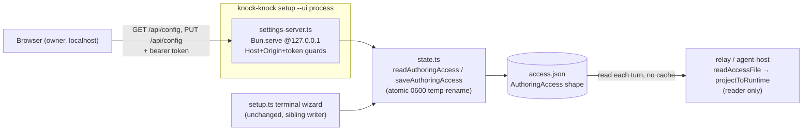
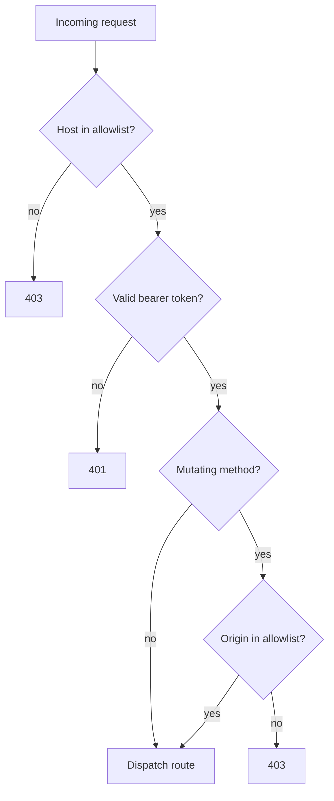
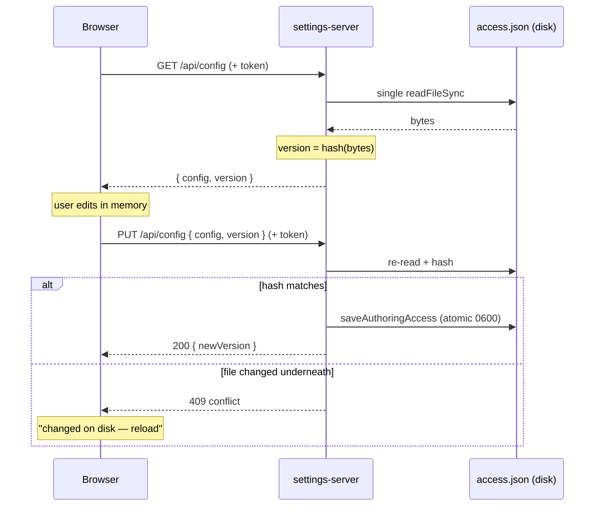

# feat: Local web settings UI (setup --ui)

## Summary

Add `knock-knock setup --ui`: it boots a localhost-only web server and prints a URL the owner opens in a browser — a clean, grouped, Notion-settings-style surface for viewing and editing their config (bots, channels, memberships, collaborators/roster, mention preferences, ledger). Edits persist back to the same `~/.knock-knock/access.json` the terminal wizard and relay already consume, through the existing validated write path in `src/state.ts`. The web UI and the terminal wizard become two front-ends over one config model — never a fork of it. The terminal wizard is unchanged; `--ui` is additive and opt-in.

---

## Problem Frame

The setup wizard (`src/setup.ts`) is a linear `@clack/prompts` flow: a fixed task menu walked one prompt at a time. Editing one channel's collaborators or fixing one bot's runtime means re-entering the menu, picking the task, and stepping through prompts in order — there is no way to *see* the whole configuration at once or jump directly to the thing you want to change. As soon as a user has more than one bot and a couple of channels, the terminal flow is slow to navigate and easy to lose your place in.

The config itself is already a clean, file-backed model: `access.json` is authored in the channel-centric `AuthoringAccess` shape and read by both the wizard and the relay. What's missing is a navigable, grouped editing surface over that model. A local web page — opened by the owner on their own machine — gives random-access navigation and visual grouping the terminal can't, without changing the config model, the write discipline, or the security posture underneath.

A non-linear terminal TUI was the obvious alternative and would avoid the HTTP server and its security gate entirely. The owner explicitly asked for a browser UI (`setup --ui`) with a Notion-settings-style experience — the richer visual layout, familiar form interactions, and shareable-on-screen review are what motivate the web surface over a denser terminal one. That is the deliberate bet; the plan's job is to make it safe (loopback-only, terminal-only secrets, owner-on-own-machine).

---

## Requirements

**Command and server**

- R1. `knock-knock setup --ui` starts a local web server and prints the URL to open; plain `knock-knock setup` keeps the existing terminal wizard as its default behavior.
- R2. The server binds `127.0.0.1` only and stops cleanly on Ctrl-C.
- R3. The server is opt-in — it starts only for the `--ui` flag; no other command opens a port.

**Editing surface**

- R4. The UI renders the current config grouped Notion-style: Bots, Channels (with memberships, collaborators, mention/approval toggles), Roster (people and peers), global preferences (`mentionPatterns`, `ackReaction`), and Ledger backend.
- R5. The UI can add, edit, and remove bots, channels, channel memberships, channel collaborators, and roster entries, and can edit global preferences and the ledger backend.
- R6. Edits persist to `access.json` (and `settings.json` for ledger) through `src/state.ts`'s existing write path; the projected runtime shape is never written.
- R7. Removing a roster entry also removes it from every channel's collaborators, matching terminal behavior, via the *same* scrub helper the terminal uses (not a parallel reimplementation).
- R8. Token and secret *values* are never entered or displayed in the UI; the UI shows only the env-var *name* a bot references. Token entry stays terminal-only.
- R17. The write endpoint reconstructs each `bots`/`roster.people`/`roster.peers`/`channels` object, plus each `Membership` and `Collaborator` inside a channel, from a known-field allowlist (the exact keys of the `Bot`/`Person`/`Peer`/`Channel`/`Membership`/`Collaborator` types in `src/lib.ts`), dropping every unknown key, before persisting. `parseAuthoringAccess` does *not* strip unknown fields (it is a bare cast — `src/state.ts:53-71`), so this is the only thing that keeps an arbitrary injected field (e.g. a raw token under any key name) out of `access.json`. `tokenEnv`/`secretEnv` are validated as env-var *names* (charset/grammar), never free text.
- R20. The permission-bearing membership fields `profile` and `preset` are *not* writable from v1: the write reconstruction preserves each membership's existing `profile`/`preset` from the on-disk config and ignores any value for them in the payload. Editing the allow/ask/deny rules (and the deny-floor clamp) is deferred (KTD8); accepting them through this surface would be the exact high-stakes permission editing v1 excludes.

**Security**

- R9. Every request validates the `Host` header against the bound host; a mismatch is rejected (DNS-rebinding defense).
- R10. Every state-changing request validates the `Origin` header against the server's own origin; a mismatch is rejected (CSRF defense).
- R11. Every API request — including the config-read `GET` — requires a per-run secret token, generated at startup, carried in the printed URL, and compared in constant time; a missing or wrong token is rejected. The token gates reads because the config body (collaborators, userIds, peer agent-keys, env-var names) is a sensitive map of who may drive agents.
- R12. HTML responses set `Referrer-Policy: no-referrer` and the page loads no third-party assets, so the token cannot leak via `Referer`.
- R18. The server never sets `Access-Control-Allow-Origin` (no CORS allowance at all), so no cross-origin page can read the config response even if it reaches the endpoint.
- R19. The token appears only in stdout and the in-process server — never in child-process argv/env, `process.title`, or any file (no log, no temp). The frontend reads it from `location.search` once, holds it in a memory variable (never `localStorage`), then calls `history.replaceState` to strip `?token=` from the URL so it isn't retained in browser history or the address bar.

**Persistence and concurrency**

- R13. The read API returns a version token derived from a hash of the file's bytes; the write API rejects with `409` when the file changed underneath the editor, rather than clobbering.
- R14. Config writes preserve the atomic temp-write-rename at `0600` and round-trip the terminal-owned `trust` anchors intact.

**Frontend**

- R15. The UI ships as a single embedded HTML/CSS/JS asset bundled into the compiled binary; no frontend framework or separate build pipeline is added.
- R16. The UI surfaces every interaction state clearly: loading, empty config (first run), save-in-progress (Save disabled / spinner, blocking a second concurrent submit), save success, `400` validation errors, and the `409` on-disk-conflict. On `409` the UI never silently discards the owner's in-progress edits — it keeps them and offers to re-apply against the reloaded config, because a relay trust-write can fire a `409` for an edit the user made alone (System-Wide Impact).

---

## Key Technical Decisions

- KTD1. **Persist only through `src/state.ts`; never a second write path.** The UI's read/write endpoints call `readAuthoringAccess` / `saveAuthoringAccess`, inheriting atomic temp-rename, `0600` perms, unknown-key coercion (`parseAuthoringAccess`), and the projection contract for free. Serializing `access.json` from the server directly would bypass all of it — exactly the drift CLAUDE.md §1/§4 warns against.

- KTD2. **Mirror the existing `Bun.serve` server shape in `src/webhook-receiver.ts`.** It is the repo's one inbound-HTTP pattern: `Bun.serve`, `127.0.0.1` default bind, pure routing helpers split from a thin `fetch`, a `KNOCK_KNOCK_*` env override over a default-port constant, and `server.stop(true)` returning a `{ stop() }` handle. The settings server is the second user of that pattern, not a new one.

- KTD3. **Defense-in-depth security: Host allowlist + Origin check on mutations + per-run bearer token on *every* request.** Because `access.json` is privilege-granting, no single layer is load-bearing. Host-allowlisting kills DNS rebinding; Origin-checking mutations kills cross-site writes; a per-run token (`crypto.randomUUID()`, compared with `crypto.timingSafeEqual`) defends against other local processes and against a bug in either header check, and gates the config-read `GET` too (the body is sensitive — R11). The server sets no CORS allowance (R18). Token lives in process memory only, never persisted. Two boundaries are accepted, not defended: anyone with loopback access who can read the token (via terminal scrollback, shell history, or `ps`) and a malicious browser extension inside the owner's browser — both sit inside the owner's trust boundary, like their OS user.

- KTD4. **Optimistic concurrency via a content hash of the bytes read → `409`; no file locking.** The version token is a hash (`Bun.hash` or sha256) over the exact buffer the read parsed, derived from a *single* `readFileSync` so the config and its version are pinned to the same bytes. This closes a TOCTOU that mtime+size hides: a separate `stat` can observe a newer version than the buffer actually read, handing the editor stale config under a fresh-looking token. A hash is also immune to filesystem mtime resolution and to same-size edits (a roster rename often leaves byte length unchanged). It honors the codebase's deliberate "no cross-process lock" stance (`src/state.ts` KTD3) — the hash *detects* the write-write race, it doesn't prevent it. The concurrent-writer set is three, not two: the terminal wizard, the UI, and the relay's trust writes (`addTombstone`/`addTrustedPair` call `saveAuthoringAccess` — `src/state.ts:127,135`).

- KTD5. **Secrets stay terminal-only.** The UI edits structure and references env-var *names*; it never accepts or echoes token values. This preserves the product's terminal-only-secrets invariant (`docs/security-and-permissions.md`) — a localhost UI is on the owner's side of the trust boundary, but secret *entry* gains nothing from an HTTP hop and loses the invariant's clarity.

- KTD6. **Single embedded HTML page via Bun's file import; vanilla JS, no framework.** `import html from './settings-ui.html' with { type: 'file' }` is statically analyzable, so `bun build --compile` *should* embed it into the binary with no change to `scripts/build.sh`. This is unverified ground — no embedded-asset precedent exists in this repo, and `build.sh` cross-compiles two linux targets from a Mac host, exactly where asset resolution can differ from a local `bun run`. **Fallback if it doesn't embed cleanly under `--compile --target`:** inline the HTML as a string constant in a `.ts` module — the same "static string literal bundles" guarantee `build.sh` already documents for the dynamic imports. A SPA framework would be a new dependency to justify against CLAUDE.md §8 with no payoff.

- KTD7. **Lift the pure validators into `src/lib.ts`; leave the platform prose in `src/setup.ts`.** The field validators the UI needs (`validateBotKey`, `discordId`, `notionId`, `mkValidate`, `validateAbsPath`, `required`) currently live inside `src/setup.ts`, which runs `main()` on import (no `import.meta.main` guard) — so the server cannot import them from there. They belong in `src/lib.ts`, the established I/O-free pure-logic home that already owns the config types and `expandPreset`; a new `config-schema.ts` for six small functions with a canonical home is a premature module boundary (CLAUDE.md §3/§10). The full `PLATFORMS` table is *not* pure data — it carries `@clack`-shaped howto/notes prose — so it stays in `setup.ts` and references the lifted validators. Lift the validators, not the table. Behavior-preserving.

- KTD8. **v1 edits the `AuthoringAccess` surface only.** Per-room allow/ask/deny permission profiles (`rooms/<agent>/<channel>.settings.json`, a separate file with the deny-floor clamp) and live discovery/doctor actions are out of v1 scope (see Scope Boundaries). This keeps v1 a focused config editor over one file with one write path.

---

## High-Level Technical Design

Two front-ends over one config model. The terminal wizard and the new settings server both read and write the same `access.json` via `src/state.ts`; the relay reads the projected runtime shape and never writes it.



Every request passes the same guard gate before it reaches a route. The order is cheap-checks-first; any failure short-circuits.



Save uses optimistic concurrency: the read hands the browser a version token; the write refuses if the file moved underneath it.



---

## Output Structure

New files this plan adds (existing files edited in place are not shown):

```
src/
  settings-server.ts     # Bun.serve localhost server: guards, read/write API
  settings-ui.html       # single embedded SPA (HTML + inline CSS + vanilla JS)
tests/
  settings-server.test.ts
```

Validators move into the existing `src/lib.ts` (U1), not a new module; tests for them extend `tests/lib.test.ts`.

---

## Implementation Units

### U1. Lift the pure validators into `src/lib.ts`

**Goal:** Make the field validators importable by both the terminal wizard and the new server without importing `src/setup.ts` (which runs `main()` on import).

**Requirements:** R5, R6, R17 (consistent validation across both surfaces)

**Dependencies:** none (parallelizable with U2)

**Files:** `src/lib.ts` (add validators), `src/setup.ts` (update imports), `tests/lib.test.ts` (extend)

**Approach:** Move the pure validators (`validateBotKey`, `discordId`, `notionId`, `mkValidate`, `validateAbsPath`, `required`) into `src/lib.ts`, the I/O-free pure-logic home that already owns the config types and `expandPreset`. Update `setup.ts` to import them. The `PLATFORMS` table stays in `setup.ts` (it carries `@clack`-shaped howto/notes prose, not pure data) and references the lifted validators — lift the validators, not the table. No validation logic changes; this is a relocation.

**Execution note:** Characterization-first — snapshot the current validators' accept/reject behavior on a table of inputs before moving them, so the lift is provably behavior-preserving.

**Patterns to follow:** `src/lib.ts` export style (CONTRIBUTING.md designates it the no-I/O home). Validators currently at `src/setup.ts:178-423`.

**Test scenarios:**
- `discordId` rejects non-numeric and accepts a snowflake; `notionId` accepts a 32-hex/dashed id and rejects malformed.
- `validateBotKey` rejects empty and duplicate keys against an existing `bots` map.
- `validateAbsPath` rejects relative paths, accepts absolute.
- Characterization: the lifted validators return identical results to the pre-move versions across the snapshot table.

### U2. Localhost settings server skeleton with request guards

**Goal:** A `Bun.serve` server on `127.0.0.1` with the full security gate in place, returning a `{ url, port, stop() }` handle. No config endpoints yet — health route plus 404.

**Requirements:** R1, R2, R3, R9, R10, R11, R12

**Dependencies:** none

**Files:** `src/settings-server.ts` (new), `tests/settings-server.test.ts` (new)

**Approach:** `startSettingsServer({ port?, hostname?, token, log? }) → { url, port, stop() }`, mirroring `src/webhook-receiver.ts`. Bind `127.0.0.1`. Default to an **ephemeral port** (`port: 0`, reading back `server.port`) — an unguessable high port means a blind cross-site attacker can't pre-target the URL; the token still gates it, but the random port is cheap defense-in-depth. A `KNOCK_KNOCK_SETTINGS_PORT` env override reintroduces a known port for the owner's convenience (a slight posture cost the token covers). Build the Host/Origin allowlists from the resolved port. Factor a pure `guardRequest(req, { host, origin, token })` helper returning an allow/deny decision, split from the thin `fetch`. Token gates *every* request (R11); compare with `crypto.timingSafeEqual` (guard buffer length first to avoid throwing). Host allowlist `{ 127.0.0.1:<port>, localhost:<port> }`; Origin checked on non-GET/HEAD. Never set `Access-Control-Allow-Origin` (R18). Set `Referrer-Policy: no-referrer` on responses. Cap PUT body size at a named constant (256 KB is ample for a config file) and return `413` on oversize before parsing. Error bodies never leak internals: the top-level catch, the `400`, and the `409` all return a generic opaque body (`{ error: 'conflict' }` etc.) with no stack trace, filesystem path, or hash value. `stop: () => server.stop(true)`; the server's lifetime is the foreground process.

**Patterns to follow:** `src/webhook-receiver.ts` end to end (Bun.serve, `127.0.0.1`, pure `routeWebhook`/`parseWebhookPath` split, env+default-const port, `server.stop(true)`).

**Test scenarios (pure `guardRequest`, no port bind needed):**
- Covers AE2. Valid host + valid origin + valid token → allowed.
- `Host: evil.example:PORT` → rejected (403).
- Mutating method with foreign `Origin` → rejected (403); GET with absent `Origin` but valid token → allowed.
- GET with valid host but *missing token* → 401 (reads are token-gated).
- Missing token → 401; wrong token → 401; wrong-*length* token → 401 with no thrown error (length guard before `timingSafeEqual`); correct token → allowed.
- No response ever carries an `Access-Control-Allow-Origin` header.

### U3. Read API and embedded SPA shell

**Goal:** `GET /api/config` returns the current config plus a version token; `GET /` serves the embedded settings page.

**Requirements:** R4, R13 (version token), R15

**Dependencies:** U1, U2

**Files:** `src/settings-server.ts` (extend), `src/settings-ui.html` (new), `tests/settings-server.test.ts` (extend)

**Approach:** `GET /api/config` → `{ access, ledger, version }`. Read `access.json` with a *single* `readFileSync`, derive both the parsed `AuthoringAccess` and `version = hash(bytes)` (`Bun.hash` or sha256) from that one buffer, so config and version are pinned to the same bytes (KTD4); on `ENOENT` use defaults with `version` of the empty config. Embed the page via `import html from './settings-ui.html' with { type: 'file' }` (KTD6 fallback applies if it doesn't embed) and serve it with `Bun.file` + `Content-Type: text/html` + `Referrer-Policy: no-referrer`. Frontend skeleton only here: a vanilla page that reads the token from `location.search` once, holds it in a memory variable (never `localStorage`), calls `history.replaceState` to strip `?token=` from the URL (R19), fetches `/api/config` with the token, and renders the sections read-only. Full editing is U5.

**Verification gate:** Before U5 invests in frontend polish, build a *cross-compiled* binary (one of the linux targets) and confirm the embedded HTML serves from it — not just from `bun run`. If embedding fails, switch to the KTD6 string-constant fallback here.

**Patterns to follow:** `src/state.ts` read functions; Bun single-file-executable HTML embedding (Sources).

**Test scenarios:**
- `GET /api/config` returns the on-disk `AuthoringAccess` shape plus ledger and a version token, and requires a valid token.
- Version token changes after the file's bytes change; is stable across re-reads of unchanged bytes.
- Missing `access.json` → returns defaults and a stable version, no crash.
- `GET /` returns `text/html` with `Referrer-Policy: no-referrer`.

### U4. Write API with validation and optimistic concurrency

**Goal:** Persist edited config through `saveAuthoringAccess` with field-allowlist reconstruction, a content-hash version check, shared referential integrity, and `trust` round-trip.

**Requirements:** R5, R6, R7, R13, R14, R17

**Dependencies:** U1, U3

**Files:** `src/settings-server.ts` (extend), `src/lib.ts` (shared field-reconstruction + scrub helpers), `src/setup.ts` (adopt the shared scrub helper), `tests/settings-server.test.ts` (extend), `tests/lib.test.ts` (extend)

**Approach:** `PUT /api/config` accepts edited authoring JSON plus the `version` token (per-section `PATCH` is an Open Question). Re-read the file and re-hash; on version mismatch → `409`, no write. Otherwise **reconstruct** each `bots`/`roster.people`/`roster.peers`/`channels` object plus each nested `Membership`/`Collaborator` from a known-field allowlist (R17), dropping every unknown key — `parseAuthoringAccess` does *not* do this, so it is the only barrier against an injected raw secret. Preserve each membership's `profile`/`preset` from the on-disk config and ignore any payload value for them (R20). Run the U1 field validators (`tokenEnv`/`secretEnv` validated as env-var names); on validation error → `400` naming the field and the rule, never echoing the submitted value, no write. Apply referential integrity — removing a roster entry scrubs it from every `channels[*].collaborators` — via a pure helper in `lib.ts`. **The same unit must replace the terminal's inline scrub (`src/setup.ts:849-863`) with this shared helper**, so the two front-ends share one implementation rather than forking it. Persist via `saveAuthoringAccess` (inherits atomic `0600` and `trust` preservation). Return the new version token.

**Ledger note:** The ledger backend lives in `settings.json` (`saveSettings`), a different file from `access.json`. A ledger edit goes through its own small write with its own read-modify-write; the `access.json` version token does not cover it. Keep the two writes independent rather than conflating them under one token.

**Patterns to follow:** roster-removal scrub at `src/setup.ts:849-863` (lift, don't copy); `saveAuthoringAccess` and `parseAuthoringAccess` in `src/state.ts`; the `Bot`/`Person`/`Peer`/`Channel`/`Membership` key sets in `src/lib.ts` as the allowlist source of truth.

**Test scenarios:**
- Happy: a valid edit (e.g. rename a channel label) persists; re-read matches; a new version token is returned.
- Covers AE1. Stale version token → `409`, file unchanged on disk.
- Validation: malformed `channelId` / duplicate bot key → `400` naming field+rule, value not echoed, file unchanged.
- Covers AE3. Removing a roster person who is a collaborator in two channels drops them from the roster and both channels.
- Covers AE4. A payload with an *arbitrary extra field* on a bot or on a channel collaborator (e.g. `"botToken": "xoxb-…"`) is dropped; the persisted object contains only allowlisted keys. (General case, not just a field literally named `token`.)
- A payload that sets `profile`/`preset` on a membership is ignored; the persisted membership keeps the on-disk `profile`/`preset` unchanged (R20).
- Covers AE5. Pre-existing `trust` tombstones are byte-for-byte unchanged after an unrelated channel save.
- Covers AE6. The shared scrub helper produces identical output to the terminal's prior inline behavior (characterization).

### U5. Notion-style editing frontend

**Goal:** The grouped, polished settings editor with add/edit/remove and save/conflict UX.

**Requirements:** R4, R5, R8, R16

**Dependencies:** U3, U4

**Files:** `src/settings-ui.html` (extend)

**Approach:** Builds against the write contract frozen at end of U4 (status codes 200/400/409/413, error shape). Information architecture: a left sidebar of groups (Bots · Channels · Roster · Preferences · Ledger); selecting a group shows a list of its entities in the main pane, selecting an entity opens its detail form (list-then-detail, so an owner with many channels isn't forced to scroll one giant page). Add is a "+ New" affordance per group; remove asks for confirmation and, for a roster entry, names the channels the cascade (AE3) will touch before the user commits; edit is inline within the detail form. Vanilla JS holds edit state in memory; Save (one in-flight at a time — R16) calls the write API with the current version token. Interaction states per R16: empty config renders a first-run prompt pointing at the terminal wizard or an inline "add your first bot"; `400` → errors rendered next to the offending field (a single whole-document save can return errors across sections, so place them inline, not only in a top summary); `409` → keep the in-progress edits and offer "reload and re-apply" rather than discarding; `200` → refresh the version token and show a success toast. Show each bot's `tokenEnv` *name*, never a value, with a note that token entry is terminal-only. Strip `?token=` from the URL on load (R19, shared with U3). Clean grouped layout, system font stack, no framework. Use the `ce-frontend-design` skill during implementation for visual polish and to verify against the Notion-settings reference.

**Patterns to follow:** Notion settings layout (user-provided reference); no existing repo frontend to mirror.

**Test scenarios:** Automated coverage is limited — the repo has no browser test runner, and all behavioral logic (validation, concurrency, integrity, secret-rejection) is enforced and tested server-side in U4. Verify the frontend by manual integration against the built binary:
- Load the UI with an existing config, edit a channel label, Save → confirm `access.json` updated on disk.
- Run against no `access.json` → confirm the empty/first-run state renders rather than a blank page.
- Edit `access.json` externally while the page is open, then Save → confirm the `409` path keeps the in-progress edits, the external edit survives, and "reload and re-apply" is offered (edits not silently lost).
- Submit an invalid id → confirm the inline `400` error renders next to the field and nothing is written.
- Confirm a bot row shows its env-var name and never a token value; confirm a roster removal previews the affected channels before committing.

### U6. CLI wiring and help text

**Goal:** `setup --ui` branches into the server, prints the URL, and stops cleanly on Ctrl-C; help text documents it.

**Requirements:** R1, R2, R3

**Dependencies:** U2 (server code). The `cli.ts` help-text advertisement is gated on U3–U5 — don't document a working `setup --ui` while it only serves a skeleton.

**Files:** `src/setup.ts` (`main()` branch), `src/cli.ts` (`USAGE` text)

**Approach:** In `setup.ts` `main()`, branch on a pure `isUiMode(process.argv)` helper **before** the existing `p.intro(banner())` / `readAuthoringAccess()` calls, so the wizard banner doesn't print in `--ui` mode. When set: generate a token with `crypto.randomUUID()`, call `startSettingsServer({ token })`, print `http://127.0.0.1:<port>/?token=<token>` with `picocolors` emphasis (stdout only — R19), and install a `SIGINT` handler that calls `stop()` and exits. Otherwise run the existing `firstRunWizard()` / `interactiveMenu()` path unchanged. Add a `setup --ui` line to `cli.ts`'s `USAGE` once U3–U5 land. No change needed to `cli.ts` dispatch — `--ui` is a flag the spliced argv already carries into `setup.ts`.

**Patterns to follow:** `src/cli.ts` dispatch (`splice` + dynamic import); `SIGINT`/shutdown handling in `src/relay.ts:810`.

**Test scenarios:**
- `isUiMode(['--ui'])` → true; `isUiMode([])` → false.
- `main()` with `--ui` starts the server and does not enter the wizard (guarded via the `isUiMode` branch).
- `main()` without `--ui` runs the existing wizard path (regression check that the branch is additive).
- A fresh token is generated per run (two starts → two distinct tokens).

---

## Scope Boundaries

**Deferred to follow-up work**
- **Live discovery and pick-lists** — enumerating joinable channels/members via the adapters, validating tokens, and a doctor-style health panel. The seam exists (`connectDiscoveryAdapter` + `assembleSnapshot` in `src/discovery.ts`, the checks in `src/doctor.ts`); v1 stays a config editor over the file, and these become a clearly-scoped "live actions" follow-up.
- **Per-room permission-profile editing** — the allow/ask/deny rules and tiers in `rooms/<agent>/<channel>.settings.json`, with the deny-floor clamp (`deny = union(preset, file, DENY_FLOOR)`). A separate file, a separate write path, and the highest-stakes surface; out of v1. This includes membership **preset selection**: re-expanding a preset (`expandPreset`) regenerates the membership's `profile`, which is permission editing — so v1 preserves `profile`/`preset` from disk (R20) and does not let the UI change them.
- **Confirming pending discoveries from the UI** — `pending.json` proposals stay terminal-confirmed for now.
- **Auto-opening the browser** — v1 prints the URL; the OS-opener convenience is a follow-up.

**Outside this product's identity**
- Setting secret/token *values* from the UI (or from chat). The terminal-only-secrets invariant is unchanged.
- Binding to `0.0.0.0` or any non-loopback interface. The server is loopback-only by design.

---

## System-Wide Impact

- **A third writer of `access.json`.** The file now has three writers: the terminal wizard, the UI, and the relay's trust path (`addTombstone`/`addTrustedPair` → `saveAuthoringAccess`, `src/state.ts:127,135`). The version check (KTD4) covers all three, but a relay trust-write can trigger a `409` for a UI edit the user made alone — the "changed on disk" banner is then technically correct but may surprise. The content-hash token at least makes it accurate.
- **Relay as a live reader.** The relay re-reads `access.json` every turn (`readAccessFile` callback, `src/relay.ts:290`, no cache). A UI save lands mid-operation with no coordination: a write between two `readAccessFile` calls can change a bot's channel/permission set under an in-flight turn. Usually benign — the next turn picks it up — but accepted, not coordinated.
- **One config model, two front-ends.** The plan's central invariant is that the UI and terminal wizard are interchangeable writers over one model. The shared scrub helper (U4) and the round-trip equivalence test (AE6) are what keep them from drifting; a future change to coercion or scrub logic that touches only one path would break it silently.

---

## Risks & Dependencies

- **Concurrent-writer clobber.** With three writers (above), two atomic writes can race and the second wins. Mitigated by the `409` content-hash check (R13/KTD4). Residual: the re-read→re-hash→rename sequence is itself a TOCTOU window — atomic rename prevents torn files, not the race between the version re-check and the write. Accepted, consistent with the deliberate no-lock stance.
- **Restart-needed edits.** Most edits take effect on the relay's next turn with no restart (the relay re-reads `access.json` each turn, no cache). The narrow exceptions that need a relay restart: opening a brand-new adapter connection, or designating a new mesh-transport channel. The UI should signpost only those cases, not imply a blanket restart.
- **No per-request OS identity on loopback.** Anyone with loopback access on the machine is implicitly the owner; the codebase already assumes OS-user isolation. The per-run token (R11) narrows this, but its protection against a co-located user holds only if the token doesn't leak via terminal scrollback, shell history, or `ps` argv (R19 keeps it out of argv/files). Accepted boundary.
- **Malicious browser extension.** An over-permissioned extension in the owner's browser can read the in-memory token and the DOM and issue requests that pass Host, Origin, and token. The three security layers do nothing against it; the owner's browser sits inside the trust boundary, like their OS user. Accepted, named so a reviewer isn't surprised.
- **Compiled-binary asset embedding.** `with { type: 'file' }` should bundle into `bun build --compile`, but this is new ground (no embedded-asset precedent) and cross-target compile is where it's most likely to differ. The U3 verification gate (cross-compiled binary) and the KTD6 string-constant fallback bound this risk.
- **Dependencies:** `Bun.serve` and `crypto` (built-in), `src/state.ts`, `src/lib.ts`, `picocolors` (already present). No new package dependencies.

---

## Acceptance Examples

- AE1. **On-disk conflict.** **Covers R13.** Given the UI loaded the config and `access.json` then changed on disk (its content hash moved), when the user saves, then the server returns `409`, the UI prompts to reload, and the on-disk change is preserved.
- AE2. **Cross-origin / unauthenticated request rejected.** **Covers R9, R10, R11, R18.** Given a request with a foreign `Origin`, a bad `Host`, or a missing/wrong token — including a config-read `GET` — when it is received, then it is rejected (403/401), nothing is written, and no `Access-Control-Allow-Origin` is set.
- AE3. **Roster removal cascade.** **Covers R7.** Given a person is a collaborator in two channels, when they are removed via the UI, then they are gone from the roster and from both channels.
- AE4. **Injected field dropped; secret never settable.** **Covers R8, R17.** Given a write payload with an arbitrary extra field on a bot (e.g. `"botToken": "xoxb-…"`), when it is saved, then the persisted bot contains only allowlisted keys and `access.json` continues to hold only `tokenEnv` names — and the UI never displays a token value.
- AE5. **Trust anchors round-trip.** **Covers R14.** Given `access.json` holds `trust` tombstones, when the UI saves an unrelated channel edit, then the `trust` anchors in the written file are unchanged.
- AE6. **Two front-ends, one model.** **Covers R7.** Given a config written by the UI write path, when it is re-read and a roster removal is applied by the shared scrub helper, then the result is identical to the terminal wizard's behavior — the scrub is one shared function, not two implementations.

---

## Open Questions

- **API granularity.** Whole-`AuthoringAccess` `PUT` vs. per-section `PATCH` endpoints. Per-section narrows the conflict window (relevant given the relay is a third writer) and the validation surface; whole-document is simpler. Lean per-section; resolve when building U4. If `PATCH` is adopted, each section endpoint reuses the same Host/Origin/token guard and its own version token.

---

## Sources / Research

- `src/webhook-receiver.ts` — the repo's only `Bun.serve` server: `127.0.0.1` bind, pure routing helpers, env+default-const port, `server.stop(true)`. The shape U2 mirrors.
- `src/state.ts` — `readAuthoringAccess` / `saveAuthoringAccess` (atomic `0600` temp-rename), `readAccessFile` → `projectToRuntime` (relay's read path the UI must not write), and the relay trust-writes `addTombstone`/`addTrustedPair` (`:127,135`) that make the relay a third writer. Note: `parseAuthoringAccess` (`:53-71`) coerces `bots`/`roster`/`channels` via a *bare cast* — it does **not** strip unknown fields, which is why R17 requires positive field-allowlist reconstruction in the write endpoint rather than relying on coercion.
- `src/lib.ts` — `AuthoringAccess` and constituent types (`Bot`, `Channel`, `Person`, `Peer`, `Membership`, `Collaborator`), `projectToRuntime`, `expandPreset`.
- `src/setup.ts:178-423` (validators + `PLATFORMS`), `:849-863` (roster-removal scrub) — the pure logic U1/U4 lift and reuse.
- `docs/security-and-permissions.md` — the terminal-only-secrets invariant and the OS-user-isolation trust assumption (KTD5, Risks).
- DNS-rebinding / CSRF for localhost servers: Vite advisory GHSA-vg6x-rcgg-rjx6 (Host allowlist + Origin-restricted CORS). Jupyter token-in-URL model; Prisma/Drizzle Studio no-auth-but-loopback posture. The combined Host + Origin + token approach (KTD3) follows the higher bar because `access.json` is privilege-granting.
- Bun single-file executable docs — embedding HTML via `import x from './x.html' with { type: 'file' }` into `bun build --compile` (KTD6, R15).
- POSIX `rename(2)` same-filesystem atomicity — why atomic rename prevents torn reads but not write-write lost updates (KTD4).
