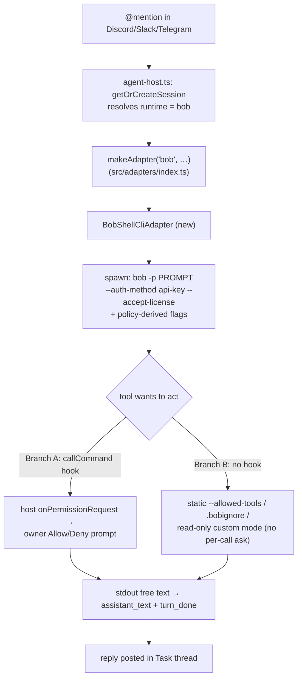
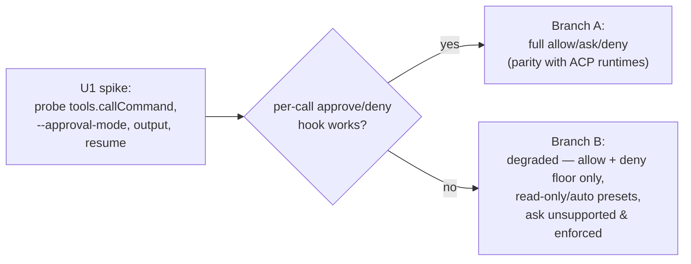

# feat: Add IBM Bob Shell as a knock-knock agent runtime

## Summary

Add `bob` as a selectable agent runtime so a knock-knock bot can run **IBM Bob Shell** (the terminal coding agent at bob.ibm.com) the same way it already runs Claude, Codex, OpenCode, or Gemini. Each bot speaks to its runtime through one seam — `AgentAdapter` in `src/agent-adapter.ts` — so the work is: write a Bob adapter, register the runtime, add a preflight check, and document it.

The catch, and the reason this plan is **spike-gated**: Bob Shell does *not* expose what knock-knock's safety model depends on. There is no ACP support, no documented programmatic per-tool approval hook, no structured/streamed output, and no documented session resume. knock-knock's whole guarantee is that *every action passes through your own allow/ask/deny rules* — and Bob's only documented controls are coarse (`--yolo` approve-all, a static `--allowed-tools` allowlist, a `.bobignore` file denylist, or interactive terminal prompts). One underdocumented config field, `tools.callCommand`, *might* be a real interception hook. **A throwaway spike (U1) settles that empirically and chooses the build branch** before any production code is written. The rest of the plan is conditional on its finding.

This plan covers **only** the Bob Shell coding-agent integration. The HiBob HR-platform webhooks (apidocs.hibob.com) referenced in the original request are a different product and are explicitly out of scope (see Scope Boundaries).

---

## Problem Frame

knock-knock is agent-agnostic by design. `src/agent-adapter.ts:1-5` states the contract: *"No SDK imports here; this module is the contract only. Adding a runtime means writing a new adapter against this interface, nothing else."* Two adapters exist today — `ClaudeSdkAdapter` (in-process, `src/adapters/claude-sdk.ts`) and `AcpAdapter` (generic ACP-over-stdio, `src/adapters/acp.ts`) — and the four ACP runtimes (claude-acp, opencode, codex, gemini) are just launch presets in `src/adapters/index.ts:10-15`. The clean way to add a coding agent is therefore: register a preset (if it speaks ACP) or write one new adapter (if it doesn't).

The whole appeal of running an agent *inside* knock-knock rather than standalone is the permission boundary. Every tool a runtime wants to use is classified against the channel's `allow`/`ask`/`deny` profile; `ask`-tier calls pause and post an **Allow / Deny** prompt to the bot's owner, and `deny` is a hard floor that never runs. The adapter contract encodes this in three methods — `applyPolicy(profile)`, `onPermissionRequest(handler)`, and `prompt({sessionId})` for resumable multi-turn work.

Bob Shell is a strong coding agent but a poor fit for this contract *as documented*. It is non-interactive-capable (`bob -p "..."`) and CI-authable (`BOBSHELL_API_KEY` + `--auth-method api-key`), so it can be *driven* headless. But it offers no per-call approval callback, no resume, and only free-text output. So the real problem this plan solves is not "wire up another ACP agent" — it is "**how much of knock-knock's safety and multi-turn model can we actually honor on top of Bob's coarse surface, and how do we ship the gap honestly rather than silently degrading the core guarantee.**"

---

## Requirements

**Feasibility gate**

- R1. Before building, empirically determine whether `tools.callCommand` (or `--approval-mode`) gives a per-tool interception/approval hook, what `bob -p` output actually looks like, and whether any checkpoint/resume is usable from the CLI. The spike produces a written findings note and a Branch A / Branch B decision.

**Runtime behavior**

- R2. A bot whose runtime is `bob` runs one turn per request via Bob Shell's non-interactive mode and posts the agent's answer back to the thread, like every other runtime.
- R3. Bob authenticates headlessly (no interactive IBMid browser login at relay time) using an API key the owner configured once.
- R4. A turn can be aborted promptly when the owner reacts 🛑 (the `signal` contract).

**Permission model (branch-dependent — this is the safety core)**

- R5. `deny`-tier rules are enforced as a hard floor for the Bob runtime to the maximum extent Bob allows, and any residual leak (e.g. `.bobignore`'s documented write-bypass) is documented as a known limitation, not hidden.
- R6. `allow`-tier rules map onto Bob's static allowlist so safe tools run without prompting.
- R7. `ask`-tier handling: in Branch A (hook exists), each `ask` tool call routes to the owner Allow/Deny prompt via the host handler. In Branch B (no hook), per-call `ask` is **not** supported for Bob; the runtime is restricted to presets that do not require it, and this restriction is enforced and surfaced (doctor + docs + onboarding hint), never silently ignored.

**Registration, onboarding, preflight**

- R8. `bob` appears as a labeled runtime choice in both the web UI and terminal pickers, with an auth hint.
- R9. `knock-knock doctor` reports whether the Bob runtime is usable for a bot configured to use it: `bob` on PATH, a working API key, license accepted — with an actionable fix string when not.
- R10. Setup docs explain Bob's one-time login, API-key creation, and the runtime's permission limitations (especially if Branch B ships).

**Honesty constraint**

- R11. The Bob runtime must never present a weaker permission posture as if it were the full allow/ask/deny guarantee. Wherever Bob cannot honor a tier, that gap is enforced (restricted presets) and visible (doctor warning + docs), per the meta-lesson that an adapter silently dropping a host-policy obligation is a defect.

---

## High-Level Technical Design

### Where a Bob turn sits in the existing seam

### Capability gap that the spike resolves

| knock-knock adapter contract | Bob Shell offers (documented) | Plan response |
|---|---|---|
| `prompt` single turn + exit | ✅ `bob -p "…"` | U2 |
| Headless auth | ✅ `BOBSHELL_API_KEY` + `--auth-method api-key` | U2 |
| `prompt` session **resume** by id | ❌ none documented | U2: synthetic id, no resume; context carried in prompt text |
| `applyPolicy` **allow** | ✅ `--allowed-tools` / `tools.allowed` | U3 |
| `applyPolicy` **deny** hard floor | ⚠️ `.bobignore` + restricted custom mode (docs note write-bypass) | U3 (best-effort) + R5 limitation |
| `onPermissionRequest` per-call **ask** | ❓ only `tools.callCommand` (undocumented) | **U1 decides**; U4 builds the chosen branch |
| `onEvent` structured progress | ❌ free text only, no JSON/stream | U5 (degraded: final text + turn_done) |
| ACP wire path | ❌ not supported | KTD1 (custom adapter, not a preset) |

### Branch decision (output of U1)

These diagrams are authoritative for the integration shape, not sketches; the per-unit Approach fields remain the detailed source.

---

## Key Technical Decisions

- **KTD1 — A new `BobShellCliAdapter`, not an ACP preset or env-override.** Bob has no ACP support (web research; not in changelog, MCP page, or FAQ), so the generic `AcpAdapter` path and the `KNOCK_KNOCK_ACP_COMMAND` override are both out. Bob needs its own adapter class that spawns the `bob` CLI and parses text. It mirrors the shape of the two existing adapters and wires into `makeAdapter` (`src/adapters/index.ts:44-47`).

- **KTD2 — Headless auth via `BOBSHELL_API_KEY` + `--auth-method api-key` + `--accept-license`.** Bob's interactive IBMid login is unusable in a daemon/relay. The documented CI path (API key with "Inference" scope, added v1.0.3) is exactly the inherit-`process.env` model knock-knock already uses for ACP runtimes — the adapter passes the auth flags and relies on the owner having created the key. No new credential-storage code; mirror opencode's "configure auth in the CLI, knock-knock inherits it" posture.

- **KTD3 — Permission fidelity is spike-determined, and the default is safe-not-silent.** If `tools.callCommand` is a true approve/deny interception hook (Branch A), the Bob adapter honors full allow/ask/deny like the ACP adapter. If it is not (Branch B), the adapter maps `allow` → static allowlist and `deny` → `.bobignore`/restricted custom mode, and **refuses `ask`-tier per-call**: Bob is restricted to presets that don't need it, enforced in the runtime/preset validation and surfaced by doctor. We never run Bob with `--yolo` under a profile that contains `ask` or `deny` rules — that would silently void the gate (R11).

- **KTD4 — No session resume; carry context in the prompt.** Bob exposes no `--resume`/`--session-id`. The adapter returns a synthetic local session id and, for follow-up turns in a thread, reconstructs context from the thread history the host already holds rather than relying on agent-side memory. This trades tokens for correctness and is the same fallback `ClaudeSdkAdapter` uses when a resume yields nothing (`src/adapters/claude-sdk.ts:193-202`).

- **KTD5 — Degraded but honest event stream.** With no structured output, `onEvent` emits `session_init`, a single `assistant_text` (the final answer), and `turn_done` without token/cost figures. Per-tool-call progress events are omitted unless U1 finds intermediary output reliably parseable. The renderer already tolerates sparse event streams; this is a quality degradation, not a correctness risk.

- **KTD6 — Deny floor is reinforced by the workspace boundary, not `.bobignore` alone.** Because Bob's docs admit some writes bypass `.bobignore`, the `deny` hard-floor for Bob leans on running Bob in a restricted custom mode (read-only tool group / `command` group excluded for strict presets) layered on top of `.bobignore`, and the residual gap is documented (R5). This is weaker than the SDK/ACP runtimes' floor and must be stated plainly.

---

## Scope Boundaries

**In scope**
- A `bob` agent runtime backed by a new `BobShellCliAdapter`, behind the existing `AgentAdapter` seam.
- Runtime registration, onboarding picker entry, doctor preflight, and setup docs for Bob.
- A compatibility spike that gates and shapes the build.

**Deferred to Follow-Up Work**
- Cross-runtime session sharing/import for Bob (`share session` / `resume session`): requires mapping a `SessionRuntime` in `src/sessions/index.ts`. Bob has no resume, so this is low-value until that changes; Bob simply won't appear in session-sharing flows.
- Per-tool progress events for Bob (richer `onEvent`) if U1 finds intermediary output parseable but brittle — ship final-text-only first.
- Revisiting full per-call `ask` for Bob if/when IBM ships a real permission hook or ACP support (re-run the U1 probe against the new version).

**Out of scope — explicitly not this product**
- **HiBob HR-platform webhooks** (apidocs.hibob.com — employee / time-off / onboarding events, HMAC-`Bob-Signature` callbacks). This is a different company's HR SaaS, unrelated to coding agents, and was a mis-paste in the original request. It would be a wholly separate integration (a webhook receiver + HR-event handling), not a runtime, and is not planned here.
- Exposing knock-knock or Bob as an MCP/ACP *server*.

---

## Implementation Units

### U1. Compatibility spike: probe Bob's real automation surface

- **Goal:** Replace documentation guesses with empirical facts and choose Branch A vs Branch B before writing production code.
- **Requirements:** R1 (and de-risks R5–R7).
- **Dependencies:** none.
- **Files:** a throwaway probe harness (e.g. `scripts/bob-spike.sh` or a scratch dir, not shipped) + a findings note at `docs/solutions/integration-issues/bob-shell-automation-surface.md` (keep — it documents the decision for future readers).
- **Approach:** With a real `BOBSHELL_API_KEY`, run `bob -p` against a scratch project and determine, concretely:
  1. **`tools.callCommand` semantics** — does configuring it cause Bob to delegate each tool call to an external command that can *approve/deny/modify*, or is it only a custom-tool dispatcher? This is the single finding that picks the branch.
  2. **`--approval-mode` accepted values** and behavior (undocumented).
  3. **Output shape of `bob -p`** — with and without `--hide-intermediary-output`: is the final answer cleanly separable from thinking steps? Any machine-readable delimiter?
  4. **Resume/checkpoint** — does `general.checkpointing` plus any flag allow resuming a prior turn from the CLI? Confirm none, or find the mechanism.
  5. **Headless auth end-to-end** — `--auth-method api-key --accept-license` runs with zero interactive prompts in a fresh HOME.
  6. **`.bobignore` + restricted custom mode** — confirm what a denied path/command actually does (and reproduce the documented write-bypass, if present).
- **Execution note:** This is a spike — output is the findings note and a go/no-go, not tests. Time-box it; if Bob is access-gated and a key can't be obtained, record that as the finding and stop the plan here.
- **Verification:** `docs/solutions/integration-issues/bob-shell-automation-surface.md` exists, states the Branch A/B decision with evidence (commands run + observed output), and pins the Bob Shell version probed.
- **Test scenarios:** Test expectation: none — investigative spike; the deliverable is documented findings.

---

### U2. `BobShellCliAdapter`: `prompt()`, headless auth, abort, synthetic session

- **Goal:** A working adapter that runs one Bob turn and returns its text, authenticating headlessly and aborting on signal.
- **Requirements:** R2, R3, R4; KTD1, KTD2, KTD4.
- **Dependencies:** U1 (confirms auth flags and output shape).
- **Files:** `src/adapters/bob-cli.ts` (new); `src/adapters/index.ts` (wire into `makeAdapter`); pure helpers (prompt assembly, output extraction, synthetic-id) added to `src/lib.ts`; tests in `tests/`.
- **Approach:** Spawn `bob -p <prompt> --auth-method api-key --accept-license [policy flags from U3]` with `cwd: workspace`, `env: {...process.env}`; capture stdout, extract the final answer per U1's output finding. Bridge `signal` to killing the child (mirror `AcpAdapter`'s abort at `src/adapters/acp.ts:259-268` / SDK's `AbortController` at `claude-sdk.ts:126-130`), returning partial text. No resume: generate a synthetic session id; for a follow-up turn, prepend the host-supplied thread context to the prompt (KTD4). Keep all string-shaping logic in pure `src/lib.ts` functions so it's testable without spawning Bob.
- **Patterns to follow:** `ClaudeSdkAdapter` and `AcpAdapter` structure (store handlers; `prompt` does the work); the "no SDK type crosses the seam" rule (`src/agent-adapter.ts:1-5`) — keep CLI specifics inside the adapter.
- **Execution note:** Implement the pure helpers test-first.
- **Test scenarios:**
  - Prompt assembly: a first turn produces the bare prompt; a follow-up turn prepends prior thread context in the expected order and delimiter.
  - Output extraction: given a captured `bob -p` stdout sample (from U1) with thinking + answer, returns only the final answer; given answer-only output, returns it unchanged; given empty output, returns empty string (not a crash).
  - Synthetic session id: `prompt` with no `sessionId` returns a fresh id; passing it back is accepted without error (even though no real resume happens).
  - Abort: when `signal` is already aborted, `prompt` resolves with partial/empty text and does not hang; the child is killed.
  - Auth flags: the spawned argv includes `--auth-method api-key` and `--accept-license` (assert via the pure argv-builder).

---

### U3. `applyPolicy`: map allow/ask/deny onto Bob's controls

- **Goal:** Translate a knock-knock `PermissionProfile` into the Bob flags/config the adapter launches with.
- **Requirements:** R5, R6; KTD3, KTD6.
- **Dependencies:** U1 (which controls exist and what they do).
- **Files:** pure mapping function in `src/lib.ts` (e.g. `bobPolicyToLaunch(profile)`); consumed by `src/adapters/bob-cli.ts`; tests in `tests/`.
- **Approach:** `allow` → `--allowed-tools` / `tools.allowed` entries. `deny` → `.bobignore` entries for file paths plus a restricted custom mode that excludes the relevant tool groups (KTD6), layered so a denied command/path is blocked pre-launch. Never emit `--yolo` when the profile carries `ask` or `deny` rules (KTD3). The function returns a structured launch descriptor (flags + any temp config/`.bobignore` content), not raw argv, so it stays pure and testable.
- **Patterns to follow:** `classifyTool(profile, descriptor)` in `src/lib.ts:1556` is the existing allow/ask/deny classifier — reuse its tier semantics rather than reinventing them; this unit is the inverse (profile → launch config).
- **Test scenarios:**
  - allow-only profile → allowlist flags present, no `--yolo`, no ask wiring.
  - profile with deny paths → `.bobignore` content includes them and restricted mode excludes the matching tool group.
  - profile containing `ask` rules under Branch B → mapping refuses (returns an error/marker the adapter turns into a clear "Bob can't honor ask-tier" failure), never `--yolo`.
  - empty deny → no `.bobignore` emitted (no spurious file).
  - `Covers R5 / R6.` a representative `strict` preset maps to read-only Bob with the deny floor applied.

---

### U4. `onPermissionRequest`: build the chosen branch

- **Goal:** Wire (Branch A) or honestly constrain (Branch B) per-call approval.
- **Requirements:** R7, R11; KTD3.
- **Dependencies:** U1 (branch decision), U3 (policy mapping).
- **Files:** `src/adapters/bob-cli.ts`; possibly a small `tools.callCommand` shim invoked by Bob (Branch A only); preset/runtime validation in `src/lib.ts`; tests in `tests/`.
- **Approach:**
  - **Branch A:** configure `tools.callCommand` to point at a shim the adapter controls; the shim forwards each tool request to the registered host `permHandler` and returns approve/deny, exactly as `AcpAdapter.onRequestPermission` routes `ask` to the host (`src/adapters/acp.ts:411-423`). `deny`/`allow` tiers resolve inside the adapter without bothering the owner.
  - **Branch B:** `onPermissionRequest` stores the handler but documents that Bob cannot consult it per-call; the runtime is constrained to presets without `ask` (enforced in validation), and any attempt to use Bob with an `ask`-bearing preset fails fast with a clear message pointing at the limitation. No silent `--yolo`.
- **Patterns to follow:** `AcpAdapter`'s deny-floor-never-shown-to-owner discipline (`src/adapters/acp.ts:407`); the meta-lesson from `docs/solutions/integration-issues/telegram-peer-bot-handoff-dropped-at-channel-scope.md` — no adapter silently drops a host-policy obligation.
- **Test scenarios:**
  - Branch A: a tool request routed through the shim invokes the host handler and an `allow` verdict lets it proceed; a `deny` verdict blocks it; a `deny`-floor tool never reaches the handler.
  - Branch B: constructing a Bob runtime against an `ask`-bearing preset raises a clear, actionable error; against an allow/deny-only preset it succeeds.
  - `Covers R11.` Bob is never launched with approve-all under a profile containing `ask`/`deny` rules (assert on the argv-builder across preset fixtures).

---

### U5. `onEvent`: degraded progress translation

- **Goal:** Emit the progress events the host renderer and owner-DM courier need, within Bob's text-only output.
- **Requirements:** R2 (visible turn lifecycle); KTD5.
- **Dependencies:** U2.
- **Files:** `src/adapters/bob-cli.ts`; event-shaping helpers in `src/lib.ts`; tests in `tests/`.
- **Approach:** Emit `session_init` at spawn (with cwd, no real model/tool counts unless U1 surfaces them), one `assistant_text` with the extracted answer, and `turn_done` (omit token/cost). If U1 found intermediary output parseable, optionally emit coarse `tool_call`/`tool_result` events; otherwise skip (deferred per Scope Boundaries). Map non-zero Bob exit / spawn failure to a failed turn the host can react ⚠️ on.
- **Patterns to follow:** `ClaudeSdkAdapter.translate()` (`src/adapters/claude-sdk.ts:212-266`) and `AcpAdapter.onSessionUpdate` (`src/adapters/acp.ts:330-382`) — same `AgentEvent` union (`src/agent-adapter.ts:28-52`), fewer fields populated.
- **Test scenarios:**
  - A normal run emits exactly `session_init` → `assistant_text` → `turn_done` in order.
  - A spawn failure (bad/missing `bob`) surfaces as a failed turn, not an unhandled throw.
  - A non-zero exit with partial stdout still emits `assistant_text` with what was captured, then a failed `turn_done`.

---

### U6. Register the `bob` runtime and onboarding picker

- **Goal:** Make `bob` a first-class, labeled runtime choice everywhere a runtime is selected.
- **Requirements:** R8.
- **Dependencies:** U2 (adapter exists).
- **Files:** `src/lib.ts` (`RUNTIME_VALUES` at `:1997`; `RUNTIMES` label list at `:350-357`; `!config agent` help string at `:2035`); `src/adapters/index.ts` (`makeAdapter` already routes via the new class from U2 — confirm `runtimeSelfArmsWatches('bob')` returns the correct value). Web UI (`src/settings-ui.ts`) and terminal picker (`src/relay-startup.ts`) are data-driven and need no code change beyond the list edits.
- **Approach:** Add `'bob'` to `RUNTIME_VALUES` and a `{value:'bob', label:'IBM Bob Shell', hint:'create a Bob API key, set BOBSHELL_API_KEY'}` row to `RUNTIMES`. Verify the web UI `<select>` (`src/settings-ui.ts:521-532`) and terminal `p.select` (`src/relay-startup.ts:50-58`) render it. Confirm an unknown-runtime no longer silently falls through to `claude-sdk` for `bob` (it now resolves to `BobShellCliAdapter`).
- **Test scenarios:**
  - `Covers R8.` `RUNTIME_VALUES` includes `bob` and `!config agent bob` is accepted (and an invalid value still rejected).
  - `makeAdapter('bob', …)` returns a `BobShellCliAdapter`, not `ClaudeSdkAdapter`.
  - `runtimeSelfArmsWatches('bob')` returns the intended value (Bob has no in-process watch tool → expect `false`-equivalent handling; assert the chosen contract).

---

### U7. Doctor preflight + preset restriction for Bob

- **Goal:** Tell the owner, before a turn fails, whether their Bob bot is actually runnable — and enforce Branch B's preset restriction.
- **Requirements:** R7, R9, R11.
- **Dependencies:** U2, U3, U4, U6.
- **Files:** `src/doctor.ts` (net-new per-runtime check — no existing table to extend; introduce the pattern with a `DoctorCheck` per `src/doctor.ts:27-28`); validation hook in `src/lib.ts`.
- **Approach:** For each bot/channel whose resolved runtime is `bob`, check: `bob` resolves on PATH; `BOBSHELL_API_KEY` is set; a cheap `bob --version` (or equivalent) succeeds; license accepted. Emit an actionable `fix` string for each failure ("create a Bob API key with Inference scope, then `export BOBSHELL_API_KEY=…`"). Under Branch B, also flag any `bob` bot configured with an `ask`-bearing preset as a hard error with the limitation explained (R11).
- **Patterns to follow:** existing `DoctorCheck` shape and `runDoctor` structure (`src/doctor.ts:139-266`). Note: doctor currently probes *no* runtime CLIs, so keep the new check cheap and only run it for bots that actually use `bob`.
- **Test scenarios:**
  - Bob bot with key set + `bob` present → check passes.
  - Bob bot with missing key → fails with the API-key fix string.
  - Bob bot with `bob` not on PATH → fails with an install fix string.
  - `Covers R11.` (Branch B) Bob bot on an `ask`-bearing preset → doctor reports a hard error naming the unsupported tier.
  - A non-Bob bot → the Bob check does not run (no spurious failures).

---

### U8. Documentation: Bob setup and permission limitations

- **Goal:** A reader can set up a Bob bot and understands exactly what permission guarantees do and don't hold.
- **Requirements:** R10, R11.
- **Dependencies:** U1–U7 (final behavior known).
- **Files:** `README.md` (runtime mention in the agent-agnostic line / install prerequisites); a new `docs/runtime-bob-shell.md` (setup + limitations); `CONCEPTS.md` only if a new domain term is introduced.
- **Approach:** Document: creating a Bob API key (Inference scope), `BOBSHELL_API_KEY`, first-run `--accept-license`, choosing the `bob` runtime in setup, and — prominently — the permission posture that shipped (Branch A parity, or Branch B's allow + deny-floor-only with no per-call ask and the `.bobignore` write-bypass caveat). Frame the limitation honestly per R11; do not imply Bob has the full allow/ask/deny guarantee if it doesn't.
- **Test scenarios:** Test expectation: none — documentation. Verify by review against the shipped behavior from U4/U7.

---

## Risks & Mitigations

- **R-A (high) — Core safety guarantee partially unmet (Branch B).** If no per-call hook exists, Bob can't honor `ask`-tier, weakening knock-knock's defining promise for this runtime. *Mitigation:* restrict Bob to allow/deny-only presets, enforce in doctor (U7), document loudly (U8), and keep `ask`-tier parity as deferred follow-up tied to a future Bob version (Scope Boundaries). Surface, never hide (R11).
- **R-B (high) — `deny` floor leaks via `.bobignore` write-bypass.** Bob's docs admit some writes bypass `.bobignore`. *Mitigation:* layer a restricted custom mode + workspace boundary (KTD6) and document the residual gap (R5); never claim an airtight floor.
- **R-C (medium) — Brittle text parsing.** No structured output means the answer-extraction in U2/U5 can break across Bob versions. *Mitigation:* pin the probed version in U1, keep extraction tolerant (fall back to whole stdout), and isolate parsing in tested pure functions.
- **R-D (medium) — Multi-turn cost/coherence without resume.** Re-sending thread context every turn (KTD4) costs tokens and can drift. *Mitigation:* bound the carried context; accept fresh-turn semantics for long threads; document.
- **R-E (medium) — Bob docs/access gating.** Bob Shell is recent (v1.0.x, 2026) and may be access-gated; the spike could conclude "can't obtain a key." *Mitigation:* U1 is time-boxed and explicitly allowed to halt the plan with that finding rather than guessing.
- **R-F (low) — `tools.callCommand` is a custom-tool dispatcher, not an approval hook.** Then Branch A is impossible. *Mitigation:* this is precisely U1's primary question; the plan already carries Branch B as the fallback.

---

## Alternative Approaches Considered

- **Wire Bob via the generic `acp` env-override (`KNOCK_KNOCK_ACP_COMMAND=bob`).** Rejected: Bob does not speak ACP, so the ACP client would never complete initialization. Zero-code only works for genuine ACP agents.
- **Run Bob with `--yolo` and rely on knock-knock's outer message gate.** Rejected: `--yolo` approves every tool inside Bob, voiding the per-action boundary that is the product's whole point (R11). The outer gate controls *messages*, not the agent's internal file/command actions.
- **Skip the spike; build Branch A and hope `callCommand` works.** Rejected by the chosen spike-first posture: if the hook doesn't exist, every Branch A unit is wasted. A time-boxed probe is far cheaper than the rework.
- **Build Bob as an MCP server knock-knock connects to.** Rejected: Bob is an MCP *client*, not a server, and exposes no such surface.

---

## Sources & Research

- knock-knock seam and integration points: `src/agent-adapter.ts`, `src/adapters/index.ts`, `src/adapters/claude-sdk.ts`, `src/adapters/acp.ts`, `src/lib.ts` (`RUNTIME_VALUES:1997`, `RUNTIMES:350-357`, `classifyTool:1556`), `src/agent-host.ts:1834-1860`, `src/doctor.ts`, `src/settings-ui.ts:521-532`, `src/relay-startup.ts:50-58`, `src/state.ts`.
- Bob Shell automation surface (external, web research, Bob Shell v1.0.x docs at bob.ibm.com): non-interactive `bob -p` and flags ([non-interactive](https://bob.ibm.com/docs/shell/getting-started/start-bobshell-non-interactive), [examples](https://bob.ibm.com/docs/shell/getting-started/bobshell-examples)); headless auth `BOBSHELL_API_KEY` + `--auth-method api-key` ([install-and-setup](https://bob.ibm.com/docs/shell/getting-started/install-and-setup)); permission controls and `tools.callCommand`/`--approval-mode`/`.bobignore` ([configuring](https://bob.ibm.com/docs/shell/configuration/configuring), [security](https://bob.ibm.com/docs/shell/security/bob-security-guidance), [sandboxing](https://bob.ibm.com/docs/shell/security/sandboxing)); custom modes ([custom-modes](https://bob.ibm.com/docs/shell/configuration/custom-modes-bobshell)); no ACP ([MCP](https://bob.ibm.com/docs/shell/configuration/mcp/mcp-bobshell), [agentclientprotocol.com](https://agentclientprotocol.com)).
- Prior learnings: none in `docs/solutions/` cover agent-runtime adapters/ACP/permissions — this is undocumented territory, so the live source is ground truth. The one transferable meta-lesson (an adapter must not silently drop a host-policy obligation) is reflected in R11 and U4. Strong `/ce-compound` candidate once U1 lands.
- HiBob HR webhooks (apidocs.hibob.com) reviewed and ruled **out of scope** — different product (HR SaaS), not a coding agent.
